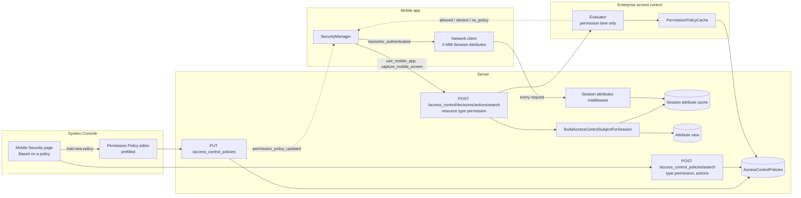

# Mobile Security Controls Governed by Permission Policies

> Remember to get familiarised with Reliability Manifesto and Production Readiness Review

## Background

The Mobile Security page controls the mobile app with site-wide switches: `MobileEnableBiometrics` and `MobilePreventScreenCapture` give every user on every device the same answer. An administrator who wants biometrics only on unmanaged devices, or screen capture only on MDM-enrolled devices, cannot express it, and because these rules live only in the mobile app they cannot be combined with anything the server knows about the user or the session. Permission policies already govern actions (file upload, file download, burn-on-read posts) by system role, user attributes and session attributes, but opening the app and capturing the screen are not actions the policy engine knows about, so administrators end up with two unrelated systems deciding what the mobile app may do.

This spec makes those two mobile behaviours permission-policy actions, evaluated by the same engine and delivered to the mobile app through the render-decision API the web app already uses for file actions. The mobile app reports whether the current session has passed biometric authentication as a session attribute, so biometrics becomes a condition any permission policy can require. The Mobile Security page gains a "Based on a policy" option that hands each setting to Permission Policies and starts a policy with the rule and permission already filled in.

## Vocabulary

| Term | Definition |
|------|------------|
| Permission policy | A system-wide ABAC policy (type `permission`) that grants a set of actions to one system role when its rule matches. Once any permission policy carries an action, the action is governed: users without a matching policy are denied. |
| Session attribute | A per-session value a client reports on its requests and that policy rules reference as `user.session.<name>`. Values live in an in-memory cache with a TTL and are dropped when stale. |
| Render decision | The server's non-authoritative answer to "which of these actions may the current user perform right now", used by clients to decide what to show or enable. |

## Design Goals

1. Let administrators decide who may open a server in the mobile app, and who may capture its screen, with the same permission policies, roles and attributes used for every other governed action, instead of one site-wide switch per setting.
2. Make biometric authentication a condition any permission policy can require, by having the mobile app report whether the current session has passed it.
3. Preserve today's behaviour wherever policies are not used: the existing Mobile Security switches keep working, and a server with no governing policy behaves exactly as it does now, for new and old mobile clients alike.
4. Let an administrator set this up from the Mobile Security page without learning the policy editor first: "Based on a policy" shows the policies that govern the setting and starts a new one with the rule and permission already filled in.

## Scope

**Out of scope:**

- **Server-side enforcement of the mobile actions.** The mobile app is the enforcement point for `use_mobile_app` and `capture_mobile_screen`, as it is for every Mobile Security setting today. The server records the grant and answers render decisions; it does not reject API requests from a denied app.
- **Server-verified biometrics.** The biometric result is attested by the client, like every other client-collected session attribute. Hardening it with a device-bound key that signs a server challenge is a separate project; see Other Proposals.
- **Biometric prompts for other actions.** A policy on `download_file_attachment` can require `biometric_authenticated`, but the mobile app only prompts for biometrics when opening a server. A server-denied download does not trigger a prompt.
- **The other Mobile Security settings.** Jailbreak protection, Secure File Preview and PDF link navigation keep their switches. `jailbreak_detected` is already a session attribute, so a `use_mobile_app` policy can still require it.
- **Pre-login behaviour.** Before a session exists there is no subject to evaluate, so the server screen and login flow keep following the switches.
- **Desktop app.** `biometric_authenticated` is a mobile-only attribute and the actions are mobile-only.

## Background Reading

- [Session attributes](https://docs.mattermost.com/administration-guide/manage/admin/session-attributes) — how session attributes are enabled, reported and evaluated, including the "missing attribute denies" rule this design relies on.
- [System-wide attribute-based access policies](https://docs.mattermost.com/administration-guide/manage/admin/abac-system-wide-policies) — permission policies as they exist today for file upload and download.
- [Mobile Security](https://docs.mattermost.com/security-guide/mobile-security.html) — the current biometric, screen capture and Intune MAM behaviour of the mobile app.
- Session Attributes v1.0 (MVF) tech spec — the client-to-server delivery channel and cache this spec builds on. <!-- TODO: link the Confluence page -->

## Other Proposals

### Biometrics as a server-verified authentication step

The mobile app would hold a hardware-backed key (Secure Enclave, Android Keystore) that can only be used after a successful biometric prompt, sign a server-issued challenge with it, and the server would mark the session as biometric-verified for a period.

**Why it was rejected:** Mattermost has no device key registration or attestation today, so this needs a new enrollment flow, a challenge endpoint and native work on both platforms before a single policy can use it, and a rooted device can still defeat it. The session attribute gives policies the same condition now, and can be hardened later by having the server set the attribute itself, the way `tls_device_id` is set from the proxy header rather than from the client.

### A three-state setting (`always`, `policy`, `off`)

Change `MobileEnableBiometrics` and `MobilePreventScreenCapture` from booleans to enums and persist "Based on a policy".

**Why it was rejected:** Every shipped mobile client reads these keys with `=== 'true'`, so a string value would turn biometrics off on old clients. The state the enum would record is already implied by whether a policy carries the action, which is what the page needs to show the lock.

### A mobile-specific policy type

A new policy type with its own editor and endpoint for mobile rules.

**Why it was rejected:** Permission policies already express role, attributes and actions, the Permission Policies list already shows them, and the render-decision API already delivers them. A second type would give administrators two lists for the same kind of rule.

### Enforcing `use_mobile_app` on every mobile API request

A middleware that evaluates the action for mobile sessions and returns 403 when denied.

**Why it was rejected:** It adds a subject build and a CEL evaluation to every request from the mobile app, and a denied app could not fetch the decision, the config or anything else it needs to tell the user why it is blocked. The Mobile Security settings are client-enforced today and this keeps that boundary.

## Design Summary

Two new permission-policy actions, `use_mobile_app` and `capture_mobile_screen`, join the closed set of actions a permission policy may carry. They are system-level: a request for them has no resource, so the engine evaluates only the permission-policy lane, with the same role fallback and deny-wins rules as the file actions. When no policy carries an action the engine answers with the existing `no_policy` reason, and the render-decision API passes that reason to the client so it can fall back to the setting instead of treating the allow as a grant.

A new built-in session attribute, **`biometric_authenticated`**, is reported by the mobile app alongside its other session attributes, true while the current session has passed the biometric prompt and false otherwise. It is seeded disabled like every other session attribute, and a policy can reference it once an administrator enables it for mobile.

The mobile app asks the render-decision API for both actions when it activates a server and when it returns to the foreground, with its current attributes on the same request. A decision with the `no_policy` reason means the setting decides, as today. Otherwise the decision decides: a denied `use_mobile_app` prompts for biometrics once, re-asks, and blocks the server if still denied; `capture_mobile_screen` turns the blur on or off. The last decision is cached per server so the app behaves the same offline.

The Mobile Security page shows a third radio, "Based on a policy", on the two settings when permission policies are available. It lists the permission policies that carry the setting's action and locks the radios while any exist. "Add new policy" opens the policy editor with the role, the rule and the permission already filled in; the policy itself is an ordinary permission policy that appears in the Permission Policies list and is edited and deleted there.

## Design Details

### System Diagram



### High-level Architecture

The mobile app reports `biometric_authenticated` the same way it reports `jailbreak_detected` or `client_version`: the network client puts it in the `X-MM-Session-Attributes` header on requests to that server, re-sending it when its TTL lapses, and the session attributes middleware validates it against the schema and merges it into the per-session cache before the handler runs. The value is per server, because the app tracks biometric state per server and each server should only see the state of its own session.

When the app activates a server it calls the render-decision endpoint with resource type `permission` and the two mobile actions. Because the attributes travel on the same request, the subject the server builds already carries the biometric state the app just reported, and there is no race between reporting and deciding. The subject is built as for any session-bound evaluation: the user's attributes from the attribute view, the system role from the session, and the session attributes from the cache.

The evaluator recognises the system-level request by its resource type and runs only the permission-policy lane. That lane already behaves the way the Mobile Security page describes: the first role in the fallback chain with a policy for the action wins, every matching policy must allow, and if some other role has a policy for the action but this one does not, the action is denied. The one change is that an action no policy carries is reported as `no_policy` rather than as a plain allow, so the client can tell "nobody governs this" from "a policy let you in".

The client applies the decision where it applies the setting today. `no_policy` means the setting decides, which is also what every older mobile client does, so a server that never creates a policy behaves exactly as before. Otherwise the decision decides, and a change to a permission policy reaches the app through the existing `permission_policy_updated` event, after which it asks again.

On the console side, "Based on a policy" is not stored anywhere. The page searches permission policies by action; finding one is what locks the radios, and deleting the last one is what unlocks them. "Add new policy" opens the same editor administrators use for file policies, with the role, rule and permission filled in, so the common case needs no understanding of CEL or attributes, while anything else is edited in Permission Policies like any other policy.

### Permission System

Two new action constants join the closed set in `server/public/model/access_policy.go`, alongside `upload_file_attachment`, `download_file_attachment` and `create_burn_on_read_post`:

```go
AccessControlPolicyActionUseMobileApp        = "use_mobile_app"
AccessControlPolicyActionCaptureMobileScreen = "capture_mobile_screen"

// systemLevelActions have no resource instance: a request for one carries an
// empty resource ID and only the permission-policy lane applies. They are valid
// on permission policies only, never on channel, team or parent policies.
var systemLevelActions = map[string]bool{
	AccessControlPolicyActionUseMobileApp:        true,
	AccessControlPolicyActionCaptureMobileScreen: true,
}
```

Both are added to `allowedActionsV0_3`, which is what permission policies validate against, and the v0.3 and v0.4 validators reject a system-level action on any policy type other than `permission`. `IsPermissionAction` and `allowedPermissionActionsV0_4` are left alone: those describe channel-scoped rules that need a channel role, which these actions never have.

A policy that grants the app to biometric-authenticated members is an ordinary v0.3 permission policy:

```json
{
  "name": "Biometric authentication for mobile access",
  "type": "permission",
  "roles": ["system_user"],
  "rules": [
    {
      "actions": ["use_mobile_app"],
      "expression": "user.session.biometric_authenticated == \"true\""
    }
  ]
}
```

On the enterprise side, `Evaluator.Evaluate` skips the resource-policy lane when the request's resource type is `permission`, and `evaluatePermissionPolicy` returns `model.NewNoPolicyAccessDecision()` instead of a bare allow when no policy of any role carries the action:

```go
// evaluatePermissionPolicy, where no rule resolves for the role:
if governed {
	return model.AccessDecision{Decision: false}, nil
}
// No policy of any role carries this action. Report it so callers can apply
// their own default instead of reading the allow as a grant.
return model.NewNoPolicyAccessDecision(), nil
```

Existing callers only read `Decision`, so the file actions are unaffected. The simulate workflow needs no change: it collects system permission contributions per action and the new actions are opaque strings to it.

### Session Attribute

`biometric_authenticated` is added to `SessionAttributeSystemFields` as a mobile-only select with the values `true` and `false`, using the posture TTL and grace period (60 seconds each) so a session that stops reporting goes stale within two minutes:

```go
sessionAttributeField(groupID, SessionAttributesPropertyFieldBiometricAuthenticated, SessionAttributesDisplayNameBiometricAuthenticated, PropertyFieldTypeSelect, mobileOnly, SessionAttributeDefaultTTLPosture, SessionAttributeDefaultGracePosture, boolSelectOptions),
```

The field is seeded on startup, so existing installs get it disabled like every other built-in attribute. It appears in the mobile manifest once an administrator enables it, and until then `CheckExpression` rejects any rule that references it, which is the existing rule for all session attributes.

### REST API

`POST /api/v4/access_control/decisions/actions/search` accepts resource type `permission` with an empty resource ID. The handler today rejects every type except `channel`; it gains a `permission` case with no further permission check, since the subject is always the session user and system-level actions have no resource to authorise against. The two mobile actions are registered in `renderableABACActions` with resource type `permission`, default allowed when ABAC is inactive, and fail closed on evaluation errors, matching the file actions.

The response carries the reason through on allows. A request for both actions returns, for a session that no policy governs:

```json
{
  "resource": {"type": "permission", "id": ""},
  "results": [{"action": {"name": "capture_mobile_screen"}}, {"action": {"name": "use_mobile_app"}}],
  "decisions": {
    "use_mobile_app": {"allowed": true, "evaluated": true, "reason": "no_policy"},
    "capture_mobile_screen": {"allowed": true, "evaluated": true, "reason": "no_policy"}
  }
}
```

`reason` is `no_policy` both when the engine reports it and when ABAC is inactive or unlicensed, because in both cases nothing governs the action. A denial keeps the only denial reason exposed today, `restricted_by_policy`.

`POST /api/v4/access_control_policies/search` already filters permission policies by action through `AccessControlPolicySearch.Actions`; the Mobile Security page uses it with `{"type": "permission", "actions": ["use_mobile_app"]}` and needs no API change.

### System Console

The two settings on the Mobile Security page become custom settings backed by one component that takes the config key, the action it governs and the prefill for "Add new policy". It renders the radios Always on, Based on a policy and Off. "Based on a policy" appears only when permission policies are available to this administrator: Enterprise Advanced, `EnableAttributeBasedAccessControl`, the `PermissionPolicies` feature flag, and `manage_system`. Without it the component behaves like the boolean setting it replaces.

When the component loads it searches permission policies carrying its action. If any exist, the radio is locked on "Based on a policy" and the component lists each policy's name and role, linking to the editor. If none exist and the administrator picks "Based on a policy", the component shows "No policies apply to this setting yet" with "Add new policy", and sets the setting's value to `true` so that saving the page leaves older mobile clients, which only understand the switch, on the stricter behaviour. The footer under the radios states what happens when no policy matches: the app stays closed and asks for biometrics, or screen capture stays blocked.

"Add new policy" opens the Permission Policy editor with a prefilled draft: role Members, the permission for the setting, and for biometrics a rule row `biometric_authenticated is true`; for screen capture it prefills `mdm_enrolled is true`, which is the example in the design, but no rule is implied by the setting and the administrator can change it. Before the editor shows, a modal names the rule and permission in plain words and says nothing is saved yet. If `biometric_authenticated` is disabled, continuing from the modal enables it for mobile, since the policy cannot be saved otherwise; the modal says so. <!-- TODO: confirm with UX whether enabling the attribute from the modal is acceptable, or whether the editor should send the admin to Session Attributes instead -->

The editor adds the two actions to its permission picker with the labels "Use this server in the mobile app" and "Screen capture on mobile" and matching descriptions, and the Permission Policies list adds the same labels to its Permissions column.

### Mobile Client

The network client gets a per-server value API next to the existing global stable values: `setSessionAttributesServerValues(serverUrl, values)`. The native collector checks per-server values before stable values and native collection, and setting a value clears the field's last-sent time so the next request to that server carries it, rather than waiting out the TTL. `SecurityManager` already tracks biometric state per server in `serverConfig[server].authenticated`; wherever that flag changes it writes `biometric_authenticated` for that server as `"true"` or `"false"`.

A new client method calls the render-decision endpoint, and a remote action stores the result in the server's `System` table so it survives restarts and is available offline. The app only asks when the server's client config has `FeatureFlagPermissionPolicies` on; an older server never sees the call. The flow when a server becomes active, after the existing MAM enrollment and jailbreak checks:

1. Ask for `use_mobile_app` and `capture_mobile_screen`. The request carries the current `biometric_authenticated` value.
2. If the request fails and a cached decision exists, use it; if none exists, treat both actions as `no_policy`.
3. `use_mobile_app` with `no_policy`: run today's check, prompting for biometrics when `MobileEnableBiometrics` is on and the window has lapsed.
4. `use_mobile_app` allowed: open the server without a prompt.
5. `use_mobile_app` denied: prompt for biometrics if this session has not passed it yet, then ask once more. If still denied, show the blocked alert with Retry, Switch server and Log out, built from the same options as the jailbreak alert.
6. `capture_mobile_screen` with `no_policy`: follow `MobilePreventScreenCapture`. Otherwise blur when denied and allow capture when allowed. An Intune MAM policy that forbids capture still wins, as it does over the setting today.

The same flow runs when the app returns to the foreground after the re-prompt window, and when `permission_policy_updated` arrives for the active server.

### Configuration

No new keys. Without an Enterprise Advanced licence, with `EnableAttributeBasedAccessControl` off, or with the `PermissionPolicies` feature flag off, the Mobile Security page shows the two switches as it does today, the decision endpoint reports `no_policy` for both actions, and the mobile app follows the switches. `biometric_authenticated` additionally requires the `SessionAttributes` feature flag and must be enabled for mobile on the Session Attributes page before a policy can use it.

### Platform

<!-- TODO: Address this section -->

### Scalability

<!-- TODO: Address this section -->

### Plugins

<!-- TODO: Address this section -->

### CLI

<!-- TODO: Address this section -->

## Operational Risk Assessment

**Administrator error:** The first permission policy that carries `use_mobile_app` governs the action for every role. A Members-only policy locks guests out of the mobile app, and system administrators fall back to the Members policy unless they have their own. The Mobile Security footer and the role picker's existing descriptions are what tell the administrator this; the risk is accepted as the existing behaviour of permission policies.

**Older mobile clients:** A client that predates this change follows the switches and ignores policies. The page sets the switch to `true` when a setting goes to "Based on a policy", so those clients keep prompting for biometrics and keep blocking capture. A policy created directly in Permission Policies leaves the switch as it was, and the locked page gives the administrator no way to change it until the policy is removed.

**Rollback:** Reverting the server change leaves the new actions in stored policies, which the old validator rejects on the next save of that policy, and leaves the `biometric_authenticated` field row, which is inert while disabled. Reverting the mobile client puts users back on the switches. Turning the `PermissionPolicies` flag off has the same effect on all clients without a deploy.

## Database

No schema change. The attribute is one more `PropertyFields` row in the session attributes group and a policy is one more `AccessControlPolicies` row, bounded by what administrators create.

## Security & Compliance

The biometric result is attested by the client. A modified app can report `biometric_authenticated` as true without a prompt, exactly as it can report `jailbreak_detected` as false today; this is the accepted trust boundary for client-collected session attributes and this spec does not move it. What the attribute adds is a condition the server can evaluate, record in a policy and simulate, and that any permission policy can require. Product Security should review the attribute and the two actions, since both change what an administrator can express about mobile access.

The mobile actions are enforced by the mobile app from a render decision the server explicitly treats as non-authoritative. This is the same trust level as the switches they extend: a client that ignores them could already ignore `MobileEnableBiometrics`. Nothing server-side becomes more permissive because of a client's claim, and a policy on a server-enforced action such as `download_file_attachment` that requires `biometric_authenticated` is enforced by the server on every request as before.

The design fails closed on the server. A missing or stale `biometric_authenticated` denies any rule that references it, so a client that stops reporting is treated as not authenticated within two minutes. An evaluation error on the decision endpoint returns a denial for both actions, and the mobile app then prompts, blocks and offers Retry rather than opening without a prompt.

No new logging. Decision failures log as they do today, with user, action and resource IDs only; the attribute value is a boolean and never includes biometric data of any kind.

## Performance

A server activation costs one decision request: a subject build (one attribute-view read, one cached user read, one session-cache read) and two CEL evaluations against policies the permission cache already holds compiled per role. The same request runs on foreground return after the five-minute window and on `permission_policy_updated`, so the rate is bounded by user activity and policy edits, not by message traffic. `biometric_authenticated` adds one short field to the attributes header at most once per 60 seconds per server. The console's policy search by action is one JSONB query against `AccessControlPolicies` when the page loads.

## Monitoring and Alerts

<!-- TODO: Address this section -->

## Responsibility

<!-- TODO: Address this section -->

## Testing & Qualification

- **Action validation** — the new actions are accepted on permission policies, rejected on channel, team and parent policies, and `IsPermissionAction` stays false for them.
- **No-policy reporting** — the permission lane returns `no_policy` when nothing carries an action, a bare allow when a policy matches, deny when another role's policy carries it, and the file actions keep their current results.
- **Decision endpoint** — resource type `permission` is accepted with an empty ID, `reason` is `no_policy` when ungoverned and when ABAC is inactive, and errors produce `restricted_by_policy`.
- **Session attribute** — the field is seeded disabled on an existing install, appears in the mobile manifest only when enabled, is rejected by `CheckExpression` while disabled, and goes stale after TTL plus grace.
- **Mobile flow** — each branch of the activation flow: no policy with the switch on and off, allowed, denied then allowed after the prompt, denied twice, request failure with and without a cached decision, and `permission_policy_updated` re-asking.
- **Mobile attribute reporting** — the per-server value reaches the header on the next request after the biometric state changes, and other servers' requests are unaffected.
- **Console page** — the radio hidden without permission policies, locked with a governing policy, "Add new policy" prefilling the editor, the switch written as `true`, and the attribute enabled from the modal.
- **Compatibility** — an old mobile client against a new server follows the switches; a new mobile client against an old server never calls the endpoint.

## Cost Breakdown

<!-- TODO: Address this section -->

## Communication Plan

<!-- TODO: Address this section -->

## Credits

<!-- TODO: Address this section -->

## History

| Date | Change |
|------|--------|
| 2 October 2026 | First draft |

## Wording

The key words "MUST", "MUST NOT", "REQUIRED", "SHALL", "SHALL NOT", "SHOULD", "SHOULD NOT", "RECOMMENDED", "MAY", and "OPTIONAL" in this document are to be interpreted as described in [RFC 2119](https://www.rfc-editor.org/rfc/rfc2119).

## Sign Offs

| Date | Approved By |
|------|-------------|
| | |
| | |
