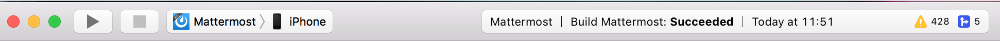

We provide a set of scripts to help you run the app for the different platforms that are executed with `npm`:

* **npm start**: Start the React Native packager. The packager has to be running in order to build the JavaScript code that powers the app.
* **npm run android**: Compile and run the mobile app on Android.
* **npm run ios**: Compile and run the mobile app on iOS.


<Note>
To speed up development, only compile and run the apps in the following cases:
- You have not deployed the app to a device or simulator with the `npm run <platform>` command.
- There have been changes in the native code.
- A new library has been added or updated that has native code.

If none of the above cases apply, you could just simply start the React Native packager with `npm start` and launch the app you have already deployed to the device or simulator.
</Note>


The above commands are shortcuts for the `react-native` CLI.  You can append `-- --help` to the above commands to see available options, for example:

```sh
npm run android -- --help
```

Make sure you are adding `--` before the options you want to include or run the `react-native` CLI directly:

```sh
npx react-native run-android --help
```


<Note title="The first build takes a long time">
The first `npm run android` compiles the app's native dependencies from scratch and can take upwards of 45 minutes before the app appears in the emulator. It looks like it has hung, but it hasn't — let it finish. Later builds reuse the Gradle cache and are far quicker.
</Note>


## Connect to a local Mattermost server

If you're running a Mattermost server on your development machine, the address to enter on the app's server selection screen is not `http://localhost:8065`. That address means something different inside an emulator or simulator, and there's a server-side setting you'll need to change as well.

<Tabs>
<TabItem value="url-android" label="Android">
Use `http://10.0.2.2:8065`.

Inside the Android emulator, `localhost` refers to the virtual device itself, not your workstation. `10.0.2.2` is the alias the emulator provides for the host machine's loopback interface.
</TabItem>

<TabItem value="url-ios" label="iOS">
Use `http://127.0.0.1:8065`, in that IPv4 form rather than `localhost`. The iOS simulator shares the host's network, so it reaches your server directly, but `localhost` has been observed to leave the websocket connection failing even when the app otherwise signs in successfully.
</TabItem>
</Tabs>

### Allow the websocket connection

With a stock server configuration, the app will sign in and load channels, but nothing will update live — new messages appear only when you pull to refresh. That's the websocket connection being rejected, and the app gives no direct indication of it.

The server checks the `Origin` header on the websocket upgrade request. When `ServiceSettings.AllowCorsFrom` is empty, which is the default, it requires the origin's host and scheme to match `ServiceSettings.SiteURL`, which defaults to `http://localhost:8065`. The address the emulator or simulator connects from isn't that address, so the upgrade is refused while ordinary REST requests continue to work.

Set one of the following in your server's `config.json`, then restart the server:

- `ServiceSettings.AllowCorsFrom` to `"*"`. This covers both platforms at once and doesn't need changing when you switch between them.
- Or `ServiceSettings.SiteURL` to the exact address the device connects to, such as `http://10.0.2.2:8065`.


<Note title="Development servers only">
`AllowCorsFrom` set to `"*"` removes cross-origin restrictions for the entire server. Only do this on a local development server, never on one that's reachable by anyone else.
</Note>


## Run on a device

By default, running the app will launch an Android emulator (if you created one) or an iOS simulator.

If you want to test the performance of the app or if you want to make a contribution it is always a good idea to run the app on an actual device.
This will let you ensure that the app is working correctly and in a performant way before submitting a pull request.

<Tabs>
<TabItem value="mobile-android" label="Android">
To be able to run the app on an Android device you'll need to follow these steps:

1. **Enable debugging over USB**

   Most Android devices can only install and run apps downloaded from Google Play by default. In order to be able to install the Mattermost Mobile app in the device during development you will need to enable USB Debugging on your device in the **Developer options** menu by going to **Settings > About phone** and then tap the Build number row at the bottom seven times, then go back to **Settings > Developer options** and enable **USB debugging**.

2. **Plug in your device via USB**

   Plug in your Android device in any available USB port in your development machine (try to avoid hubs and plug it directly into your computer) and check that your device is properly connecting to ADB (Android Debug Bridge) by running `adb devices`.

   ```
   $ adb devices
   List of devices attached
   42006fb3e4fb25b8    device
   ```

   If you see **device** in the right column that means that the device is connected. You can have multiple devices attached and the app will be deployed to **all of them**.

3. **Compile and run**

   With your device connected to the USB port execute the following in your command prompt to install and launch the app on the device:

   ```sh
   npm run android
   ```


<Note title="Note">
If you don't see a bar at the top loading the JavaScript code then it's possible that the device is not connected to the development server. See [Using adb reverse](http://reactnative.dev/docs/running-on-device.html#method-1-using-adb-reverse-recommended).
</Note>
</TabItem>

<TabItem value="mobile-ios" label="iOS">
To be able to run the app on an iOS device you'll need to have [Xcode](https://developer.apple.com/xcode/) installed on a Mac computer and follow this steps:

1. **Get an Apple Developer account**

   The apps that run on an iOS device must be signed. To sign it, you'll need a set of provisioning profiles. If you already have an Apple Developer account enrolled in the Apple Developer program you can skip this step. If you don't have an account yet you'll need to [create one](https://appleid.apple.com/account?appId=632&returnUrl=https%3A%2F%2Fdeveloper.apple.com%2Faccount%2F#!&page=create) and enroll in the [Apple Developer Program](https://developer.apple.com/programs/).

2. **Open the project in Xcode**

   Navigate to the `ios` folder in your `mattermost-mobile` project, then open the file `Mattermost.xcworkspace` in Xcode.

3. **Configure code signing and capabilities**

   Select the **Mattermost** project in the Xcode Project Navigator, then select the **Mattermost** target. Look for the **Signing & Capabilities** tab.

   - Go to the **Signing** section and make sure your Apple developer account or team is selected under the Team dropdown and change the [Bundle Identifier](https://developer.apple.com/documentation/appstoreconnectapi/bundle_ids).
     Xcode will register your provisioning profiles in your account for the Bundle Identifier you've entered if it doesn't exist.
   - Go to the **App Groups** section and change the [App Groups](https://developer.apple.com/documentation/bundleresources/entitlements/com_apple_security_application-groups?language=objc).
     Xcode will register your AppGroupId and update the provision profile.
   - Go to the **iCloud** section and change the [Containers](https://developer.apple.com/documentation/bundleresources/entitlements/com_apple_developer_icloud-container-identifiers?language=objc).
     Xcode will register your iCloud container and update the provision profile.
   - Go to the **Keychain Sharing** section and change the [Keychain Groups](https://developer.apple.com/documentation/bundleresources/entitlements/keychain-access-groups?language=objc).
     Xcode will register your Keychain access groups and update the provision profile.

   
<Note title="Important">
Repeat the steps for the `MattermostShare` and `NotificationService` targets. Each target must use a **different** *Bundle Identifier*.
</Note>


4. **Compile and run**

   Plug in your iOS device in any available USB port in your development computer.

   If everything is set up correctly, your device will be listed as the build target in the Xcode toolbar, and it will also appear in the Devices Pane (<kbd><kbd>⇧</kbd><kbd>⌘</kbd><kbd>2</kbd></kbd>). You can press the **Build and run** button (<kbd><kbd>⌘</kbd><kbd>R</kbd></kbd>) or select **Run** from the Product menu to run the app.

   

   As an alternative you can select the targeted device by opening the **Product** menu in Xcode menu bar, then go to **Destination** and look for your device to select from the list.


<Note>
If you run into any issues, please take a look at Apple's [Launching Your App on a Device](https://developer.apple.com/library/content/documentation/IDEs/Conceptual/AppDistributionGuide/LaunchingYourApponDevices/LaunchingYourApponDevices.html#//apple_ref/doc/uid/TP40012582-CH27-SW4) documentation.
If the app fails to build, go to the **Product** menu and select **Clean Build Folder** before trying to build the app again.
Also, be sure that your iOS device is trusted so app deployments can proceed.
</Note>
</TabItem>
</Tabs>
