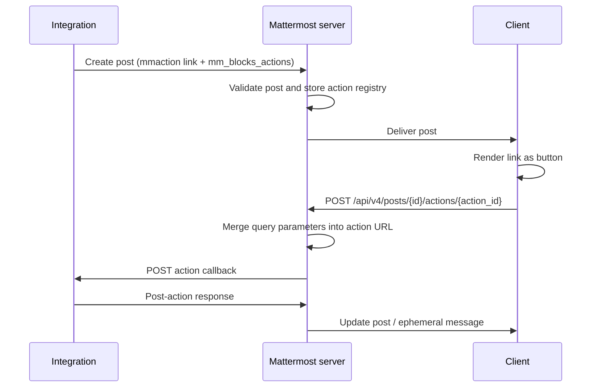

:::note[Part of the Interactive Messages framework]
Markdown action buttons are one binding surface in the Interactive Messages framework alongside [Mattermost Blocks](/developers/integrate/reference/mm-blocks). All surfaces share the same `mm_blocks_actions` action registry.
:::

Use markdown action buttons to add inline, in-text affordances to a post — without using a message attachment. They're useful when:

- A short message reads naturally with an "Approve" or "Reject" inline link.
- An integration wants to mix narrative text and action affordances in the same post body.
- The visual weight of a full message attachment isn't warranted.

For block-style buttons and menus, see [Mattermost Blocks](/developers/integrate/reference/mm-blocks). For legacy attachment actions, see [interactive messages](/developers/integrate/plugins/interactive-messages).

## How it works

A markdown action has two parts:

1. A markdown link in the post body using the `mmaction://` scheme, where the link host is the action ID:

   ```text
   [Approve](mmaction://approve?ticket=ISS-101)
   ```

2. A matching entry in the post's `props.mm_blocks_actions` registry that tells the server what to do when the link is clicked:

   ```json
   {
     "mm_blocks_actions": {
       "approve": {
         "type": "external",
         "url": "https://integration.example.com/hook/approve",
         "context": {"project": "Demo Project"}
       }
     }
   }
   ```

The client renders the link as a button. Clicking it dispatches a request to the Mattermost server, which forwards the call to the integration's `url` along with merged query parameters and any server-side context.

## Example post payload

The following payload posts a message with two markdown action buttons. The body markdown references action IDs defined in `mm_blocks_actions`.

```json
{
  "channel_id": "qmd5oqtwoibz8cuzxzg5ekshgr",
  "message": "Ticket ISS-101 needs review: [Approve](mmaction://approve?ticket=ISS-101) [Reject](mmaction://reject?ticket=ISS-101)",
  "props": {
    "mm_blocks_actions": {
      "approve": {
        "type": "external",
        "url": "https://integration.example.com/hook/approve",
        "context": {"project": "Demo Project"}
      },
      "reject": {
        "type": "external",
        "url": "https://integration.example.com/hook/reject",
        "context": {"project": "Demo Project"}
      }
    }
  }
}
```

You can send this payload using the [create post REST API](https://api.mattermost.com/#operation/CreatePost), an [incoming webhook](/developers/integrate/webhooks/incoming), or from a [plugin](/developers/integrate/plugins/components/server).

### Submit using the REST API

```bash
curl -X POST $MM_URL/api/v4/posts \
  -H "Authorization: Bearer $BOT_TOKEN" \
  -H "Content-Type: application/json" \
  -d '{
    "channel_id": "'$CHANNEL_ID'",
    "message": "Ticket ISS-101 needs review: [Approve](mmaction://approve?ticket=ISS-101) [Reject](mmaction://reject?ticket=ISS-101)",
    "props": {
      "mm_blocks_actions": {
        "approve": {
          "type": "external",
          "url": "https://integration.example.com/hook/approve",
          "context": {"project": "Demo Project"}
        },
        "reject": {
          "type": "external",
          "url": "https://integration.example.com/hook/reject",
          "context": {"project": "Demo Project"}
        }
      }
    }
  }'
```

### Submit from a plugin

A server-side plugin creates posts with markdown actions through the existing `API.CreatePost` / `API.UpdatePost` interfaces. The action `url` typically points at the plugin's own HTTP handler.

```go
post := &model.Post{
    ChannelId: channelID,
    UserId:    p.botID,
    Message: "Ticket ISS-101 needs review: " +
        "[Approve](mmaction://approve?ticket=ISS-101) " +
        "[Reject](mmaction://reject?ticket=ISS-101)",
    Props: model.StringInterface{
        "mm_blocks_actions": map[string]any{
            "approve": map[string]any{
                "type":    "external",
                "url":     fmt.Sprintf("/plugins/%s/inline_action/approve", manifest.Id),
                "context": map[string]any{"project": "Demo Project"},
            },
            "reject": map[string]any{
                "type":    "external",
                "url":     fmt.Sprintf("/plugins/%s/inline_action/reject", manifest.Id),
                "context": map[string]any{"project": "Demo Project"},
            },
        },
    },
}
_, err := p.API.CreatePost(post)
```

A plugin can also change markdown actions later via `API.UpdatePost`. See [Updating and removing actions](#updating-and-removing-actions) for who may change `mm_blocks_actions` and how actions are removed.

## Link syntax

```text
[<label>](mmaction://<action_id>?<query_string>)
```

**`<label>`**<br/>
The link text rendered as the button label.

**`<action_id>`**<br/>
The host portion of the URL. Must match a key in `props.mm_blocks_actions`. Must contain only letters, numbers, underscores, or hyphens (`[A-Za-z0-9_-]+`), matched case-sensitively, and may be up to 64 characters long.

**`<query_string>`** (optional)<br/>
`key=value` pairs that are forwarded with the dispatched action and merged into the target URL's query string by the server. Link-supplied values override registry-supplied values on key conflict. Up to 50 entries; each key may be up to 128 characters and each value up to 2048 characters.

## The `mm_blocks_actions` registry

The `mm_blocks_actions` post prop is a map keyed by action ID. Each entry describes how the server should handle clicks on that action. The registry supports up to 50 action entries.

```json
{
  "mm_blocks_actions": {
    "<action_id>": {
      "type": "<action_type>",
      "url": "...",
      "context": { ... },
      "query": { ... }
    }
  }
}
```

| Field | Required | Description |
| --- | --- | --- |
| `type` | yes | Action type. See [Action types](#action-types) below. |
| `url` | depends on type | Target URL for the integration's callback endpoint. Required for `external`. |
| `context` | no | Object of server-side context values forwarded to the integration in the post-action request body. Not visible to the client. Up to 50 entries; each key may be up to 128 characters. |
| `query` | no | Static `string -> string` map merged into the target URL's query string by the server. Combined with any query parameters supplied in the `mmaction://` link — link values win on key conflict. Up to 50 entries; each key may be up to 128 characters and each value up to 2048 characters. |

### Action types

| Type | Behaviour |
| --- | --- |
| `external` | The server sends a POST request to `url` with the dispatched action, including `context`, `query` (after merging), and any link-supplied query parameters. The integration responds with a standard post-action response. |

Additional action types may be introduced as the broader Interactive Messages framework lands. Entries with an unknown `type` value are rejected at post-create time.

## Click dispatch flow

The diagram below describes the lifecycle of a single click on a markdown action button.



1. **Integration** creates a post with an `mmaction://<id>` link and a matching `mm_blocks_actions[<id>]` entry.
2. **Mattermost server** validates the post (`mm_blocks_actions` schema and limits) and stores it.
3. **Client** renders the link as a button. Clicking it dispatches `POST /api/v4/posts/{post_id}/actions/{action_id}` with the link's query string in the request body.
4. **Mattermost server** looks up `mm_blocks_actions[<id>]`, merges the registry's static `query` with the request body's query (request body wins on conflict), merges the result into the action URL's query string, and POSTs the integration endpoint.
5. **Integration** responds with a standard post-action response.

## Receiving action callbacks

When a user clicks a markdown action button, the Mattermost server sends an HTTP POST request to the `url` configured in the matching `mm_blocks_actions` entry. The request body follows the same `PostActionIntegrationRequest` shape used by [Mattermost Blocks](/developers/integrate/reference/mm-blocks) and legacy [message attachment](/developers/integrate/reference/message-attachments) buttons — the integration responds with the same post-action response format.

## Updating and removing actions

- An integration session (bot account, personal access token, or OAuth app) may add, replace, or remove `mm_blocks_actions` on a post **it authored**, via the update and patch post endpoints. Other sessions can edit the message but not another author's actions.
- `mm_blocks_actions` is an exception to the usual update rule that omitted fields are cleared: the server preserves the post's existing actions when an update leaves the prop out, so a message-only edit never wipes buttons. (Sending an empty or altered value still replaces them.)
- Removing a button's `mmaction://` link from the message revokes its action: the entry is pruned and later clicks return a not-found error.

## Validation limits

Posts that exceed any of the following limits are rejected at create or update time.

| Limit | Value |
| --- | --- |
| Maximum entries in `mm_blocks_actions` | 50 |
| Maximum length of an action ID (map key) | 64 characters |
| Action ID character set | `[A-Za-z0-9_-]+` |
| Maximum entries in `query` (link or registry) | 50 |
| Maximum length of a query key | 128 characters |
| Maximum length of a query value | 2048 characters |

## Error reference

The following error IDs may be returned by the post-action and post-create APIs when processing markdown action requests.

| Error ID | Cause |
| --- | --- |
| `api.post.do_action.query.app_error` | The query parameters supplied with the action click exceeded one of the limits described in [Link syntax](#link-syntax) or [The `mm_blocks_actions` registry](#the-mm_blocks_actions-registry). |
| `api.post.do_action.merge_query.app_error` | The server could not merge the supplied query parameters into the action's target URL — typically because the URL is malformed. |

## Security considerations

Markdown action buttons follow the same security model as message attachment actions:

- The action `url` is invoked server-to-server, never directly from the client.
- `context` values are server-only and are not exposed to the rendering client.
- Action IDs must match the pattern `[A-Za-z0-9_-]+` — alphanumerics, underscore, and hyphen — and are matched case-sensitively.
- Action entries with malformed or unknown `type` values are rejected at post-create time and never reach the click-dispatch path.

## See also

- [Mattermost Blocks](/developers/integrate/reference/mm-blocks) — block-based buttons, menus, and layout.
- [Interactive messages](/developers/integrate/plugins/interactive-messages) — overview and legacy attachment actions.
- [Message attachments](/developers/integrate/reference/message-attachments) — broader message format reference.
- [Incoming webhooks](/developers/integrate/webhooks/incoming) — submitting posts via webhooks.
- [REST API: create post](https://api.mattermost.com/#operation/CreatePost)
