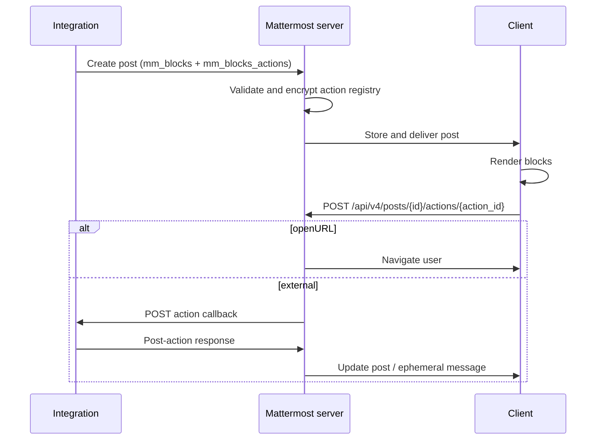

Mattermost Blocks are the structured post format for integration messages. An integration sends a block tree in `props.mm_blocks` to define layout, text, images, buttons, and menus, and registers action handlers in `props.mm_blocks_actions` so the server can dispatch clicks and menu selections back to the integration.

:::note[Feature flag]
Mattermost Blocks are controlled by the `MmBlocksEnabled` feature flag (enabled by default). When disabled, Mattermost Blocks payloads are not rendered and Mattermost Blocks action cookies are rejected.
:::

## How it works

An interactive Mattermost Blocks post has two parts:

1. **`props.mm_blocks`** — an array of block objects that define layout, text, images, buttons, and menus. A post may contain up to 100 blocks in total, counting nested blocks throughout the tree.
2. **`props.mm_blocks_actions`** — a map keyed by action ID. Each entry tells the server what to do when a user clicks a button, selects a menu option, or activates a [markdown action button](/developers/integrate/reference/markdown-actions).

When the post is stored, the server validates that every referenced action ID has a matching registry entry (and no unused entries remain). It then encrypts the action registry into an opaque cookie string that clients send back when dispatching actions.

## Example post payload

The following payload posts a message with text, a primary button, and a static select menu:

```json
{
  "channel_id": "qmd5oqtwoibz8cuzxzg5ekshgr",
  "message": "Deployment #42 finished.",
  "props": {
    "mm_blocks": [
      {
        "type": "text",
        "text": "Deployed `main` to **staging**. Choose a follow-up action:"
      },
      {
        "type": "container",
        "flow": "horizontal",
        "gap": "small",
        "content": [
          {
            "type": "button",
            "text": "View logs",
            "style": "primary",
            "action_id": "view_logs"
          },
          {
            "type": "button",
            "text": "Rollback",
            "style": "danger",
            "action_id": "rollback"
          },
          {
            "type": "static_select",
            "action_id": "next_step",
            "placeholder": "Select next step…",
            "options": [
              {"text": "Promote to production", "value": "promote"},
              {"text": "Run smoke tests", "value": "smoke"}
            ]
          }
        ]
      }
    ],
    "mm_blocks_actions": {
      "view_logs": {
        "type": "external",
        "url": "https://integration.example.com/actions/view-logs",
        "context": {"deployment_id": "42"}
      },
      "rollback": {
        "type": "external",
        "url": "https://integration.example.com/actions/rollback",
        "context": {"deployment_id": "42"}
      },
      "next_step": {
        "type": "external",
        "url": "https://integration.example.com/actions/next-step",
        "context": {"deployment_id": "42"}
      }
    }
  }
}
```

You can send this payload using the [create post REST API](https://api.mattermost.com/#operation/CreatePost), an [incoming webhook](/developers/integrate/webhooks/incoming), a [custom slash command](/developers/integrate/slash-commands/custom), or from a [plugin](/developers/integrate/plugins/components/server).

### Submit using an incoming webhook

```bash
curl -X POST $MM_URL/hooks/$WEBHOOK_ID \
  -H "Content-Type: application/json" \
  -d '{
    "text": "Deployment #42 finished.",
    "props": {
      "mm_blocks": [
        {"type": "text", "text": "Deployed `main` to **staging**."},
        {
          "type": "button",
          "text": "View logs",
          "style": "primary",
          "action_id": "view_logs"
        }
      ],
      "mm_blocks_actions": {
        "view_logs": {
          "type": "external",
          "url": "https://integration.example.com/actions/view-logs",
          "context": {"deployment_id": "42"}
        }
      }
    }
  }'
```

For webhook payloads, place `mm_blocks` and `mm_blocks_actions` inside `props`. The top-level `attachments` array remains available for legacy integrations.

### Submit from a plugin

```golang
post := &model.Post{
    ChannelId: channelID,
    UserId:    p.botID,
    Message:   "Deployment #42 finished.",
    Props: model.StringInterface{
        "mm_blocks": []any{
            map[string]any{
                "type": "text",
                "text": "Deployed `main` to **staging**.",
            },
            map[string]any{
                "type":      "button",
                "text":      "View logs",
                "style":     "primary",
                "action_id": "view_logs",
            },
        },
        "mm_blocks_actions": map[string]any{
            "view_logs": map[string]any{
                "type":    "external",
                "url":     fmt.Sprintf("/plugins/%s/actions/view-logs", manifest.Id),
                "context": map[string]any{"deployment_id": "42"},
            },
        },
    },
}
_, err := p.API.CreatePost(post)
```

## Block types

Each element of `props.mm_blocks` is an object with a required `type` field. The supported block types are:

| Type | Purpose |
| --- | --- |
| [`text`](#text) | Markdown-formatted text |
| [`image`](#image) | Remote image with optional sizing and alignment |
| [`divider`](#divider) | Horizontal rule between blocks |
| [`button`](#button) | Interactive button |
| [`static_select`](#static-select) | Dropdown menu with static options or dynamic data sources |
| [`container`](#container) | Groups blocks with optional border, accent bar, background, and layout flow |
| [`collapsible`](#collapsible) | Expandable section with separate header and content block arrays |
| [`column_set`](#column-set-and-column) | Horizontal row of columns |
| [`column`](#column-set-and-column) | Column inside a `column_set` (not valid as a top-level block) |

Nested layout blocks (`container`, `collapsible`, `column_set`, and `column`) may nest up to 32 levels deep.

Malformed blocks are omitted at render time; valid sibling blocks still display.

### Text

```json
{
  "type": "text",
  "text": "Hello **from** Mattermost Blocks.",
  "is_subtle": false,
  "size": "default"
}
```

| Field | Required | Description |
| --- | --- | --- |
| `text` | yes | Markdown-formatted content. Supports @mentions. All `text` and [button](#button) `text` fields in a post share a combined limit of 16,000 characters. |
| `is_subtle` | no | When `true`, renders in a muted color. Does not change font size. |
| `size` | no | Typography scale: `small` or `default`. Omitted is equivalent to `default`. |

### Image

```json
{
  "type": "image",
  "url": "https://example.com/logo.png",
  "alt_text": "Company logo",
  "title": "Logo",
  "size": "medium",
  "max_width": 400,
  "max_height": 300,
  "image_style": "default",
  "horizontal_alignment": "center"
}
```

| Field | Required | Description |
| --- | --- | --- |
| `url` | yes | Image URL (GIF, JPEG, PNG, BMP, or SVG). |
| `alt_text` | no | Accessible description. |
| `title` | no | Plain-text tooltip shown on hover. |
| `size` | no | Preset sizing: `auto`, `xsmall`, `small`, `medium`, `large`, or `stretch`. Defaults to `stretch`. |
| `max_width` | no | Maximum width in pixels. |
| `max_height` | no | Maximum height in pixels. |
| `image_style` | no | `default` or `person` (avatar-style crop). |
| `horizontal_alignment` | no | `left`, `center`, or `right`. |

### Divider

```json
{"type": "divider"}
```

### Button

```json
{
  "type": "button",
  "text": "Approve",
  "action_id": "approve",
  "style": "primary",
  "tooltip": "Approve this change",
  "disabled": false,
  "query": {"ticket": "ISS-101"}
}
```

| Field | Required | Description |
| --- | --- | --- |
| `text` | yes | Button label. Supports Markdown. Counts toward the combined 16,000-character limit for [text](#text) and button blocks. |
| `action_id` | yes | Must match a key in `mm_blocks_actions`. |
| `style` | no | Semantic color: `default`, `primary`, `danger`, `good`, `success`, or `warning`. Hex colors such as `#2d81ff` are also accepted. |
| `tooltip` | no | Help text shown on hover. |
| `disabled` | no | When `true`, the button renders but cannot be clicked. |
| `query` | no | Static query parameters merged into the action URL when clicked. Up to 50 entries; each key may be up to 128 characters and each value up to 2048 characters. |

### Static select

```json
{
  "type": "static_select",
  "action_id": "pick_region",
  "placeholder": "Pick a region",
  "options": [
    {"text": "North", "value": "north"},
    {"text": "South", "value": "south"}
  ],
  "initial_option": "north",
  "disabled": false,
  "data_source": "channels"
}
```

| Field | Required | Description |
| --- | --- | --- |
| `action_id` | yes | Must match a key in `mm_blocks_actions`. |
| `placeholder` | yes | Placeholder text for the menu. |
| `options` | depends on | Array of `{text, value}` pairs. Required unless `data_source` is set. |
| `initial_option` | no | Pre-selected option value. |
| `disabled` | no | When `true`, the menu renders but cannot be used. |
| `data_source` | no | Dynamic option source: `channels` or `users`. When set, `options` is optional. Users can only select public channels in their teams. |

When a user selects an option, the integration callback receives `selected_option` in the request `context` with the chosen value (or user/channel ID for dynamic data sources).

### Container

```json
{
  "type": "container",
  "content": [
    {"type": "text", "text": "Container title"},
    {"type": "divider"},
    {"type": "text", "text": "Body copy", "is_subtle": true, "size": "small"}
  ],
  "border": true,
  "accent_color": "primary",
  "background": "gray",
  "flow": "vertical",
  "gap": "small",
  "max_height": "medium"
}
```

| Field | Required | Description |
| --- | --- | --- |
| `content` | yes | Array of nested blocks. |
| `border` | no | When `true`, draws a border around the container. |
| `accent_color` | no | Left accent bar color. Semantic values: `default`, `primary`, `good`, `warning`, or `danger`. CSS colors such as `#439FE0` are also accepted. |
| `background` | no | `none` (default) or `gray`. |
| `flow` | no | Child layout direction: `horizontal` or `vertical`. Defaults to `vertical`. |
| `gap` | no | Spacing between children: `none`, `small`, `medium`, `large`, or `xlarge`. Defaults to `none`. |
| `max_height` | no | Maximum height preset: `none`, `small`, `medium`, or `large`. Overflowing content scrolls inside the container. On mobile, users can open scrollable content in a dedicated full-screen view. |

### Collapsible

```json
{
  "type": "collapsible",
  "collapsed": false,
  "header": [
    {"type": "text", "text": "**Details**"}
  ],
  "content": [
    {"type": "text", "text": "Expanded content goes here."}
  ]
}
```

| Field | Required | Description |
| --- | --- | --- |
| `header` | yes | Blocks shown in the always-visible header row. |
| `content` | yes | Blocks shown when expanded. |
| `collapsed` | no | Initial collapsed state. Defaults to `false`. |

### Column set and column

```json
{
  "type": "column_set",
  "gap": "medium",
  "columns": [
    {
      "type": "column",
      "width": "stretch",
      "gap": "small",
      "items": [
        {"type": "text", "text": "Left column"}
      ]
    },
    {
      "type": "column",
      "width": "auto",
      "items": [
        {"type": "text", "text": "Right column"}
      ]
    }
  ]
}
```

`column` blocks are only valid inside a `column_set`. Each column has an `items` array of nested blocks.

## The `mm_blocks_actions` registry

The `mm_blocks_actions` post prop is a map keyed by action ID. Each entry describes how the server handles clicks on that action. The registry supports up to 50 action entries. Each action ID must match `[A-Za-z0-9_-]+`, may be up to 64 characters long, and is matched case-sensitively.

```json
{
  "mm_blocks_actions": {
    "<action_id>": {
      "type": "<action_type>",
      "url": "...",
      "context": { ... },
      "query": { ... }
    }
  }
}
```

| Field | Required | Description |
| --- | --- | --- |
| `type` | yes | Action type. See [Action types](#action-types) below. |
| `url` | depends on type | Target URL. Required for `external` and `openURL`. |
| `context` | no | Server-side context forwarded to the integration in the post-action request body. Not visible to clients. Up to 50 entries; each key may be up to 128 characters. |
| `query` | no | Static `string → string` map merged into the target URL's query string. Combined with any per-control `query` on the block — block values win on key conflict. Up to 50 entries; each key may be up to 128 characters and each value up to 2048 characters. |

Every action ID referenced by interactive content — Mattermost Blocks controls, markdown `mmaction://` links, Block Kit actions, or Adaptive Card actions — must have a matching registry entry. Unused registry entries are rejected at post-create time.

After the post is stored, clients receive an encrypted cookie string in place of the plaintext registry map.

### Action types

| Type | Behavior |
| --- | --- |
| `external` | The server sends an HTTP POST request to `url` with the standard post-action request body. The integration responds with a post-action response (update, ephemeral message, or navigation). Relative plugin paths such as `/plugins/myplugin/action` are supported. |
| `openURL` | Navigates the user without calling an integration. Relative paths (for example `/myteam/channels/off-topic`) navigate inside Mattermost. `http://` and `https://` URLs open in a new browser tab. Plugin paths are not allowed. |

Additional action types may be introduced in future releases. Entries with an unknown `type` value are rejected at post-create time.

## Action dispatch flow



1. **Integration** creates a post with `mm_blocks` controls and matching `mm_blocks_actions` entries.
2. **Mattermost server** validates the pairing, encrypts the action registry, and stores the post.
3. **Client** renders the blocks. When the user clicks a button or selects a menu option, the client sends `POST /api/v4/posts/{post_id}/actions/{action_id}` with the encrypted cookie, optional `query`, `selected_option` (for menus), and `integration_format: "mm_block"`.
4. **Mattermost server** decrypts the cookie, resolves the action, merges query parameters, and either navigates (`openURL`) or POSTs to the integration endpoint (`external`).
5. **Integration** responds with a standard post-action response.

Action IDs in the URL path must match `[A-Za-z0-9_-]+`.

## Receiving action callbacks

When a user activates an `external` action, the Mattermost server sends an HTTP POST request to the configured `url`. The request body uses the same `PostActionIntegrationRequest` shape as [legacy message attachment](/developers/integrate/reference/message-attachments) buttons:

```json
{
  "user_id": "rd49ehbqyjytddasoownkuqrxe",
  "user_name": "alice",
  "channel_id": "j6j53p28k6urx15fpcgsr20psq",
  "channel_name": "town-square",
  "team_id": "5xxzt146eax4tul69409opqjlf",
  "team_domain": "myteam",
  "post_id": "gqrnh3675jfxzftnjyjfe4udeh",
  "trigger_id": "...",
  "type": "button",
  "context": {
    "deployment_id": "42",
    "selected_option": "promote"
  }
}
```

For static select menus, the selected value is added to `context.selected_option`.

Integrations respond with the same post-action response format used by attachment actions:

```json
{
  "update": {
    "message": "Updated!",
    "props": {
      "mm_blocks": [
        {"type": "text", "text": "Deployment promoted to production."}
      ]
    }
  },
  "ephemeral_text": "Promotion started.",
  "goto_location": "/myteam/channels/releases"
}
```

| Response field | Description |
| --- | --- |
| `update` | Replaces the original post message and props. Use `update.props.mm_blocks` to refresh the block layout. |
| `ephemeral_text` | Sends a private message visible only to the user who clicked. |
| `goto_location` | Navigates the user to a URL after the action completes. Supports in-app paths and external URLs. |
| `error` | Returns a custom error message displayed below the interactive content. |
| `skip_slack_parsing` | Set to `true` to bypass Slack-compatibility parsing of `ephemeral_text`. |

See [interactive messages](/developers/integrate/plugins/interactive-messages) for error handling details and `update.props` semantics.

## Legacy format compatibility

Mattermost continues to accept these older payload formats:

| Prop | Format | Notes |
| --- | --- | --- |
| `attachments` | Legacy [message attachments](/developers/integrate/reference/message-attachments) | Attachment `actions` arrays are translated into Mattermost Blocks buttons and selects at render time. |
| `blocks` | Slack Block Kit | Translated into Mattermost Blocks. Interactive Block Kit elements require matching `mm_blocks_actions` entries keyed by `action_id`. |
| `cards` | Microsoft Adaptive Cards | Translated into Mattermost Blocks. Interactive card actions require matching `mm_blocks_actions` entries keyed by action `id`. |

New integrations should prefer native `mm_blocks` for full control over layout and action registration.

## Security considerations

Mattermost Blocks follow the same security model as legacy interactive messages:

- Integration `url` values are invoked server-to-server, never directly from the client.
- `context` values are server-only and are not exposed to rendering clients.
- After create, the plaintext `mm_blocks_actions` map is replaced with an encrypted cookie.
- Action IDs are validated and must match referenced interactive content exactly.
- `openURL` actions reject plugin paths and path-traversal segments.

## See also

- [Troubleshoot Mattermost Blocks](/developers/integrate/reference/mm-blocks/troubleshooting) — common rendering, action, and mobile issues.
- [Interactive messages](/developers/integrate/plugins/interactive-messages) — overview, error handling, and legacy attachment actions.
- [Markdown action buttons](/developers/integrate/reference/markdown-actions) — inline `mmaction://` links using the same action registry.
- [Message attachments](/developers/integrate/reference/message-attachments) — legacy attachment format reference.
- [Incoming webhooks](/developers/integrate/webhooks/incoming) — submitting posts via webhooks.
- [REST API: create post](https://api.mattermost.com/#operation/CreatePost)
