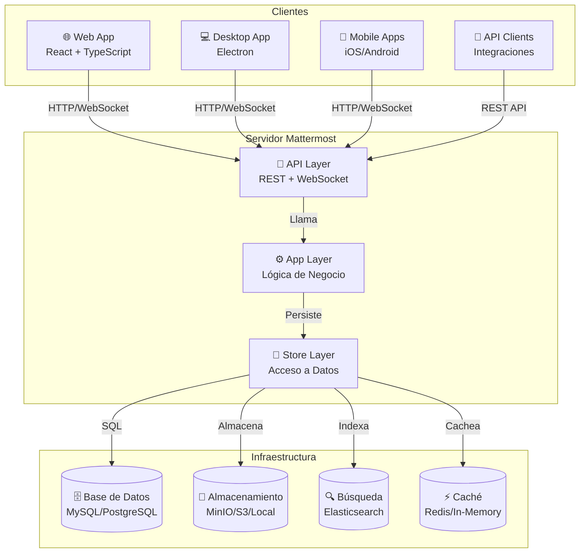
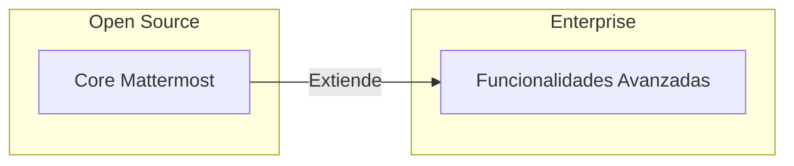
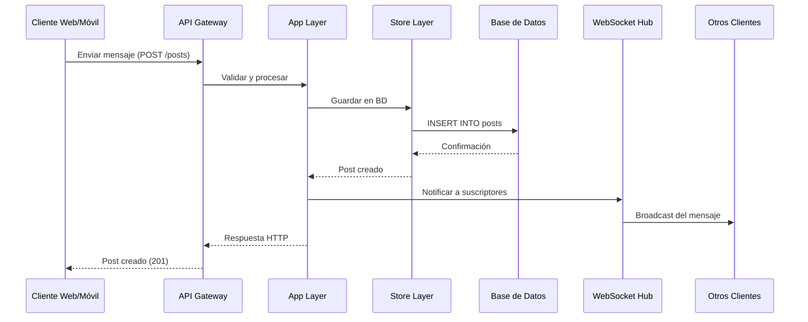

# 01 - Introducción y Visión General

## ¿Qué es Mattermost?

**Mattermost** es una plataforma de colaboración empresarial de código abierto diseñada para equipos de trabajo. Proporciona mensajería en tiempo real, compartición de archivos, búsqueda avanzada e integraciones con herramientas de desarrollo y productividad.

### Características Principales

- **💬 Mensajería en Tiempo Real**: Canales públicos, privados y mensajes directos
- **📎 Compartición de Archivos**: Soporte para imágenes, documentos y multimedia
- **🔍 Búsqueda Avanzada**: Indexación completa con Elasticsearch
- **🔗 Integraciones**: Webhooks, slash commands y plugins personalizados
- **🔐 Seguridad Enterprise**: Cumplimiento, eDiscovery y controles avanzados
- **📱 Multiplataforma**: Web, desktop (Windows/Mac/Linux) y móvil (iOS/Android)

---

## Historia y Evolución

| Año | Hitos |
|-----|-------|
| 2015 | Lanzamiento inicial como alternativa open source a Slack |
| 2016 | Introducción de la versión Enterprise |
| 2018 | Arquitectura de plugins introducida |
| 2020 | Soporte mejorado para trabajo remoto |
| 2022 | Reescritura del frontend a TypeScript |
| 2024 | Arquitectura modular con workspaces npm |

---

## Arquitectura de Alto Nivel



---

## Tecnologías Utilizadas

### Backend (Servidor)

| Tecnología | Versión | Propósito |
|------------|---------|-----------|
| **Go** | 1.21+ | Lenguaje principal del servidor |
| **Gorilla Mux** | v1.8+ | Router HTTP |
| **Gorilla WebSocket** | v1.5+ | Comunicación en tiempo real |
| **SQLx** | v1.3+ | Abstracción de base de datos |
| **MySQL/PostgreSQL** | 8.0/13+ | Base de datos principal |
| **MinIO/S3** | - | Almacenamiento de archivos |
| **Elasticsearch** | 7.x+ | Motor de búsqueda |
| **Redis** | 6.x+ | Caché distribuida (Enterprise) |

### Frontend (Webapp)

| Tecnología | Versión | Propósito |
|------------|---------|-----------|
| **React** | 17.x | Framework UI |
| **TypeScript** | 5.x | Tipado estático |
| **Redux** | 4.x | Gestión de estado |
| **Webpack** | 5.x | Bundler |
| **Sass/SCSS** | - | Estilos |
| **Jest** | 29.x | Testing |

---

## Estructura del Monorepo

```
mattermost/
├── 📁 server/              # Backend Go (módulo: v8)
│   ├── channels/          # Core del servidor
│   │   ├── api4/         # Handlers API REST
│   │   ├── app/          # Lógica de negocio
│   │   ├── store/        # Capa de datos
│   │   ├── db/           # Migraciones BD
│   │   └── wsapi/        # API WebSocket
│   ├── public/           # API pública y modelos
│   ├── platform/         # Servicios compartidos
│   └── cmd/              # Entry points
│
├── 📁 webapp/            # Frontend React
│   ├── channels/         # Aplicación principal
│   │   ├── src/
│   │   │   ├── actions/  # Redux actions
│   │   │   ├── components/ # React components
│   │   │   ├── reducers/ # Redux reducers
│   │   │   └── selectors/# State selectors
│   │   └── package.json
│   └── platform/         # Componentes compartidos
│
├── 📁 api/               # Especificaciones OpenAPI
│   └── v4/source/       # Definiciones YAML
│
├── 📁 e2e-tests/         # Pruebas end-to-end
│   ├── cypress/         # Tests Cypress
│   └── playwright/      # Tests Playwright
│
└── 📁 tools/            # Utilidades de desarrollo
    └── mmgotool/        # Herramienta i18n
```

---

## Modelo de Licenciamiento

### Mattermost Team Edition (Open Source)
- **Licencia**: MIT License
- **Código**: Disponible públicamente
- **Características**: Funcionalidades core de mensajería
- **Uso**: Ilimitado, sin costo

### Mattermost Enterprise Edition
- **Licencia**: Comercial
- **Código**: En repositorio separado (`../enterprise`)
- **Características adicionales**:
  - Autenticación SAML/LDAP avanzada
  - Cumplimiento y eDiscovery
  - Alta disponibilidad
  - Elasticsearch avanzado
  - Permisos personalizados
  - Soporte empresarial



---

## Componentes Principales del Sistema

### 1. Sistema de Mensajería
- Canales públicos y privados
- Mensajes directos (DM) y grupales (GM)
- Hilos de conversación (Threads)
- Mensajes efímeros y programados

### 2. Gestión de Usuarios y Equipos
- Registro y autenticación
- Perfiles de usuario
- Equipos (Teams) con múltiples canales
- Roles y permisos granulares

### 3. Compartición de Archivos
- Subida y descarga de archivos
- Previsualización de imágenes
- Almacenamiento local o en la nube (S3/MinIO)
- Límites de tamaño configurables

### 4. Búsqueda y Descubrimiento
- Búsqueda full-text en mensajes
- Filtros avanzados (autor, fecha, canal)
- Indexación con Elasticsearch
- Historial de mensajes

### 5. Integraciones
- **Incoming Webhooks**: Recibir mensajes externos
- **Outgoing Webhooks**: Enviar eventos a sistemas externos
- **Slash Commands**: Comandos personalizados
- **Plugins**: Extensiones del servidor y cliente
- **Apps**: Aplicaciones interactivas

### 6. Notificaciones
- Notificaciones push (móvil)
- Notificaciones de escritorio
- Notificaciones por email
- Menciones y palabras clave

---

## Flujo de Datos General



---

## Escalabilidad y Rendimiento

### Escalabilidad Horizontal
- **Servidores API**: Stateless, pueden escalarse horizontalmente
- **WebSocket Hub**: Clustering soportado con Redis (Enterprise)
- **Base de Datos**: Réplicas de lectura soportadas
- **Almacenamiento**: S3-compatible para archivos

### Optimizaciones de Rendimiento
- Caché en memoria LRU para datos frecuentes
- Caché distribuida con Redis (Enterprise)
- Conexiones pool a la base de datos
- Consultas preparadas y optimizadas
- Indexación con Elasticsearch

---

## Seguridad y Cumplimiento

### Características de Seguridad
- Autenticación multifactor (MFA)
- Sesiones con expiración configurable
- Cifrado en tránsito (TLS)
- Cifrado en reposo para archivos
- Auditoría completa de acciones
- Prevención CSRF
- Content Security Policy (CSP)

### Cumplimiento (Enterprise)
- eDiscovery y exportación de datos
- Retención de datos configurable
- Cumplimiento HIPAA y FINRA
- Registro de auditoría avanzado

---

## Comunidad y Soporte

### Recursos de la Comunidad
- [Foro de la Comunidad](https://forum.mattermost.com/)
- [GitHub Issues](https://github.com/mattermost/mattermost/issues)
- [Documentación Oficial](https://docs.mattermost.com/)
- [Mattermost Handbook](https://handbook.mattermost.com/)

### Contribuir al Proyecto
Mattermost acepta contribuciones de la comunidad. Consulta el archivo [`CONTRIBUTING.md`](../CONTRIBUTING.md) para más información sobre:
- Cómo reportar bugs
- Cómo proponer nuevas características
- Guías de código y estilo
- Proceso de pull requests

---

## Próximos Pasos

Para profundizar en la arquitectura de Mattermost, continúa con:

1. **[Arquitectura del Sistema](02-Arquitectura_del_Sistema.md)** - Detalles de la arquitectura de capas
2. **[Backend Go](03-Backend_Go.md)** - Estructura del servidor
3. **[Frontend React](04-Frontend_React.md)** - Aplicación web

---

*Documentación basada en el código fuente de Mattermost v8.x*
