# 02 - Arquitectura del Sistema

## Visión General de la Arquitectura

Mattermost sigue una **arquitectura de capas (Layered Architecture)** con patrones de diseño bien definidos. Esta sección describe la estructura arquitectónica completa del sistema.

---

## Arquitectura de Capas del Servidor

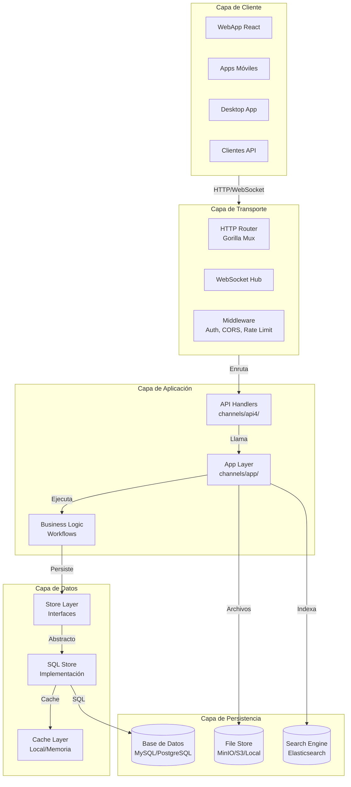

---

## Flujo de una Petición HTTP

### Diagrama de Secuencia - Request Lifecycle

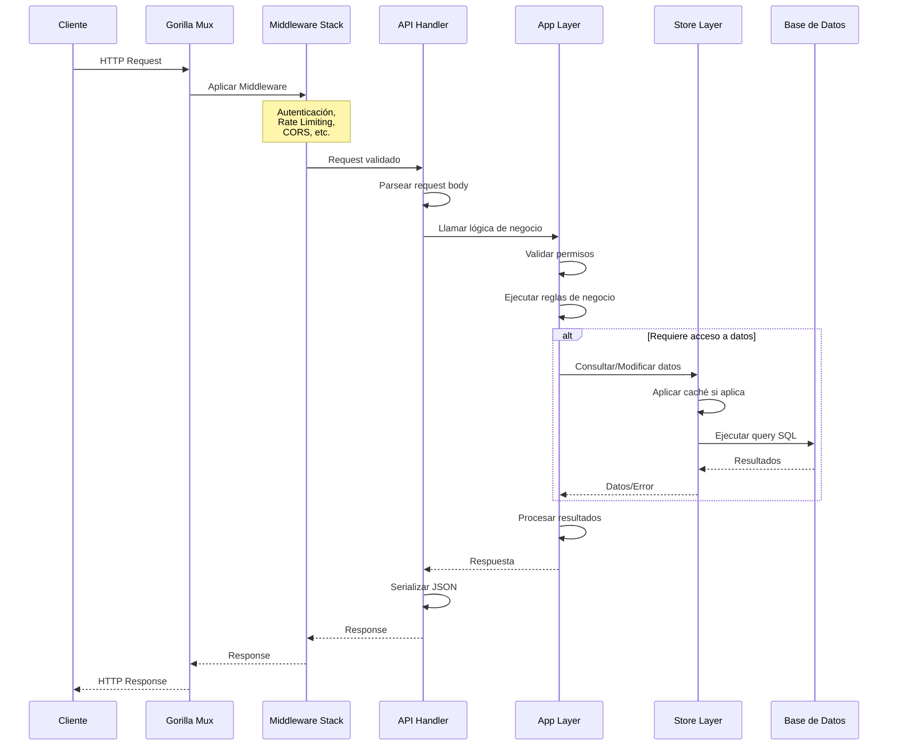

### Pasos Detallados

| Paso | Componente | Descripción |
|------|------------|-------------|
| 1 | **Router** ([`api4/api.go`](server/channels/api4/api.go)) | El router Gorilla Mux recibe la petición y la enruta al handler correspondiente |
| 2 | **Middleware** | Se aplican capas de: autenticación, CORS, rate limiting, CSRF protection |
| 3 | **Handler** ([`api4/*.go`](server/channels/api4/)) | Parsea el request, valida parámetros, llama a la capa App |
| 4 | **App Layer** ([`app/`](server/channels/app/)) | Contiene la lógica de negocio, orquesta llamadas al store |
| 5 | **Store Layer** ([`store/`](server/channels/store/)) | Abstrae el acceso a datos, implementa caché y métricas |
| 6 | **Base de Datos** | Ejecuta queries SQL contra MySQL o PostgreSQL |

---

## Patrones de Diseño Utilizados

### 1. Repository Pattern (Store Layer)

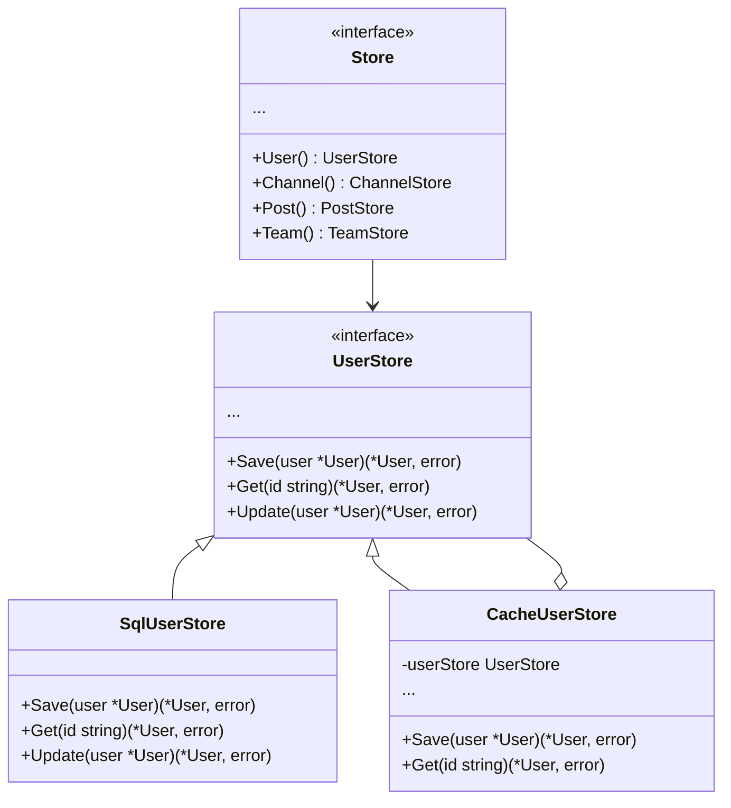

**Ubicación**: [`server/channels/store/store.go`](server/channels/store/store.go)

### 2. Layered Architecture con Decoradores

El Store implementa múltiples capas generadas automáticamente:

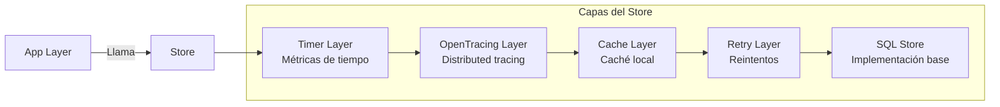

**Generación de capas**: [`server/channels/store/layer_generators/`](server/channels/store/layer_generators/)

### 3. Dependency Injection

Los servicios se inyectan a través de la estructura `App`:

```go
// Simplificación del patrón
type App struct {
    store        store.Store
    config       *model.Config
    cluster      einterfaces.ClusterInterface
    searchEngine *searchengine.Broker
    ...
}
```

### 4. Observer Pattern (WebSocket Events)

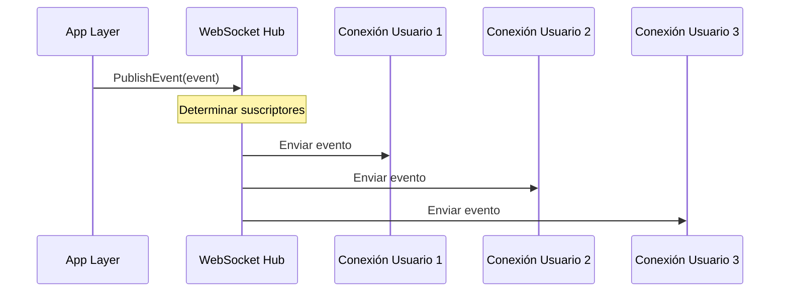

---

## Arquitectura WebSocket para Tiempo Real

### Componentes del Sistema WebSocket

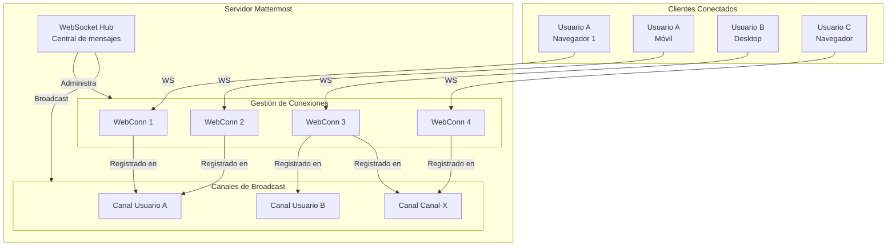

### Tipos de Eventos WebSocket

| Categoría | Eventos | Descripción |
|-----------|---------|-------------|
| **Mensajes** | `posted`, `post_edited`, `post_deleted` | Actividad de posts |
| **Canales** | `channel_created`, `channel_deleted`, `user_added` | Cambios en canales |
| **Usuarios** | `status_change`, `typing`, `user_updated` | Actividad de usuarios |
| **Equipos** | `leave_team`, `update_team` | Cambios en equipos |
| **Sistema** | `config_changed`, `plugin_enabled` | Eventos del sistema |

**Implementación**: [`server/channels/app/web_hub.go`](server/channels/app/web_hub.go)

---

## Arquitectura de Plugins

### Modelo de Plugins

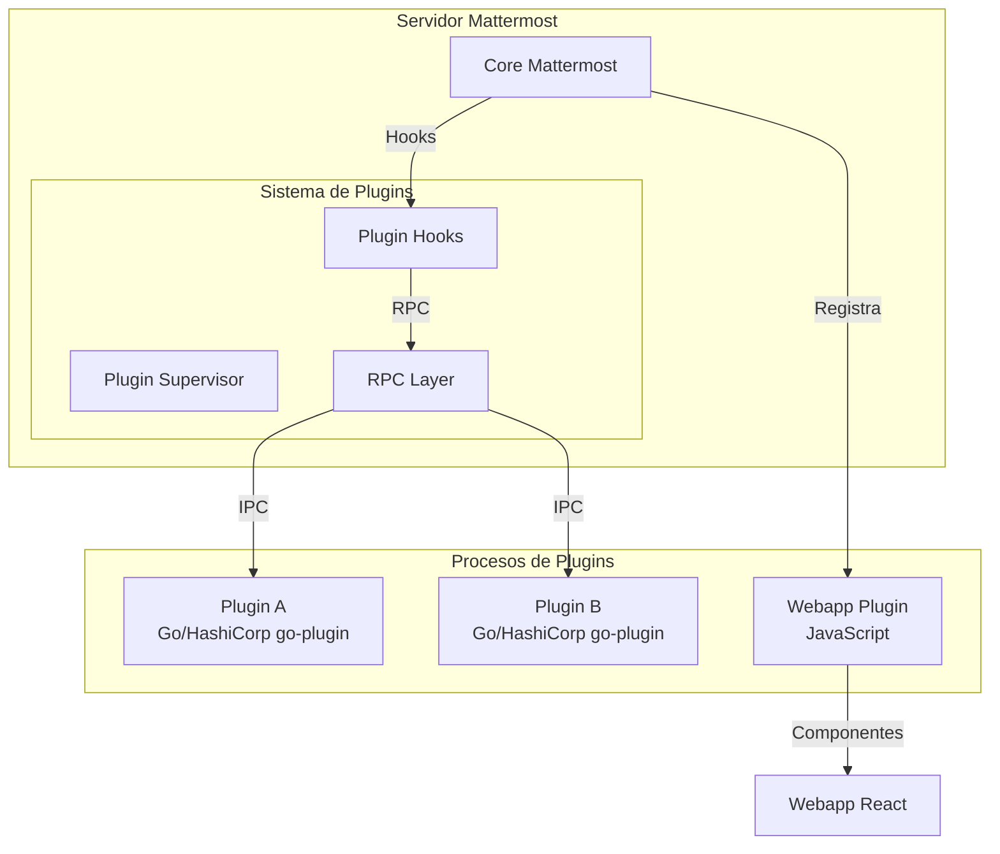

### API de Plugins

Los plugins pueden interactuar con Mattermost a través de:

| API | Descripción |
|-----|-------------|
| **Hooks** | Interceptar eventos del ciclo de vida |
| **API** | Llamar a funciones del servidor |
| **Webapp** | Extender la interfaz de usuario |

**Documentación**: [`server/public/plugin/`](server/public/plugin/)

---

## Arquitectura Enterprise

### Separación de Código

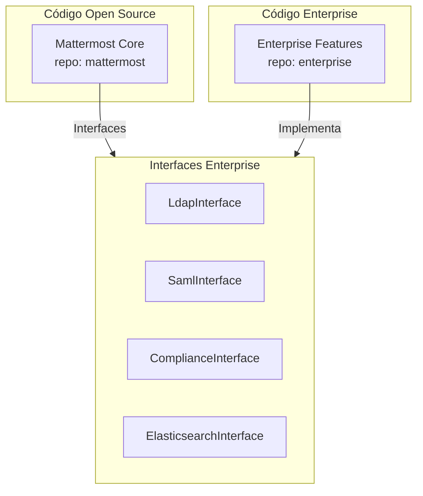

Las funcionalidades Enterprise se activan mediante **build tags**:

```go
//go:build enterprise
```

**Ubicación de interfaces**: [`server/einterfaces/`](server/einterfaces/)

---

## Arquitectura del Frontend (Webapp)

### Arquitectura Redux

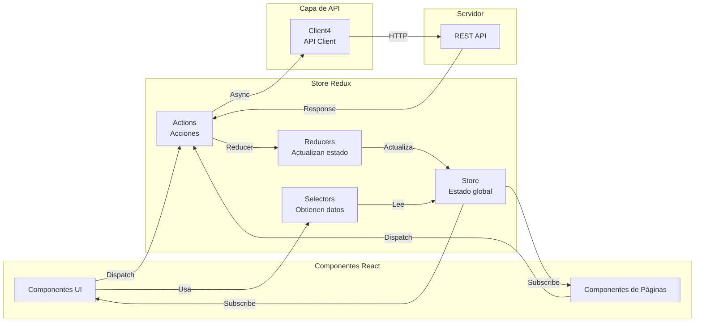

### Estructura de Carpetas del Webapp

```
webapp/channels/src/
├── actions/           # Redux actions (thunks)
│   ├── posts.ts      # Acciones de posts
│   ├── users.ts      # Acciones de usuarios
│   └── channels.ts   # Acciones de canales
├── components/        # Componentes React
│   ├── common/       # Componentes compartidos
│   ├── post_view/    # Vista de posts
│   └── sidebar/      # Barra lateral
├── reducers/          # Redux reducers
│   ├── entities/     # Entidades (users, posts, channels)
│   └── requests/     # Estado de requests
├── selectors/         # Selectores memoizados
│   ├── entities.ts   # Selectores de entidades
│   └── general.ts    # Selectores generales
├── stores/            # Configuración de stores
├── types/             # Tipos TypeScript
└── utils/             # Utilidades
```

---

## Comunicación entre Componentes

### Flujo de Datos en el Sistema

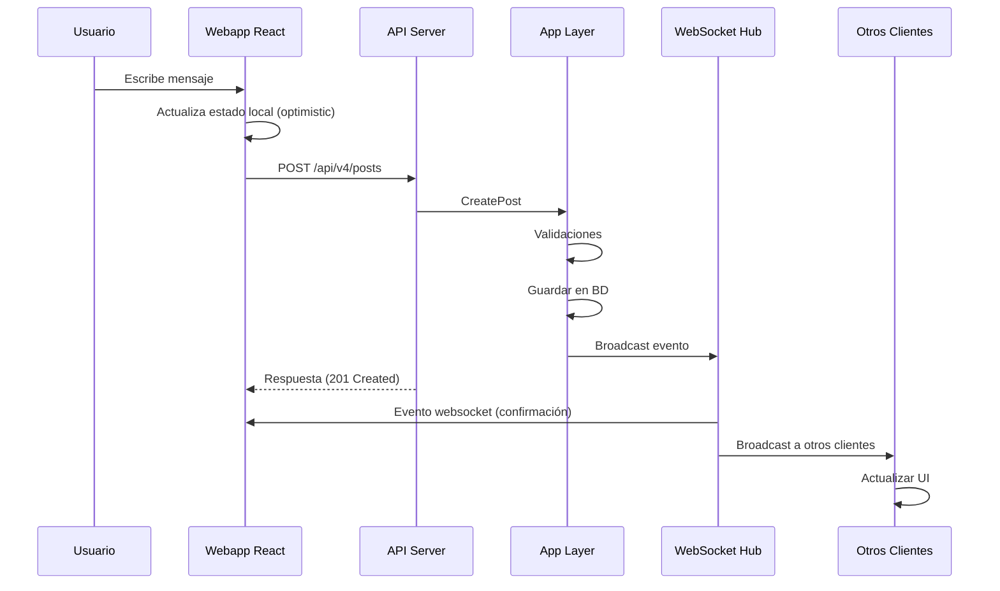

---

## Consideraciones de Escalabilidad

### Escalabilidad Horizontal

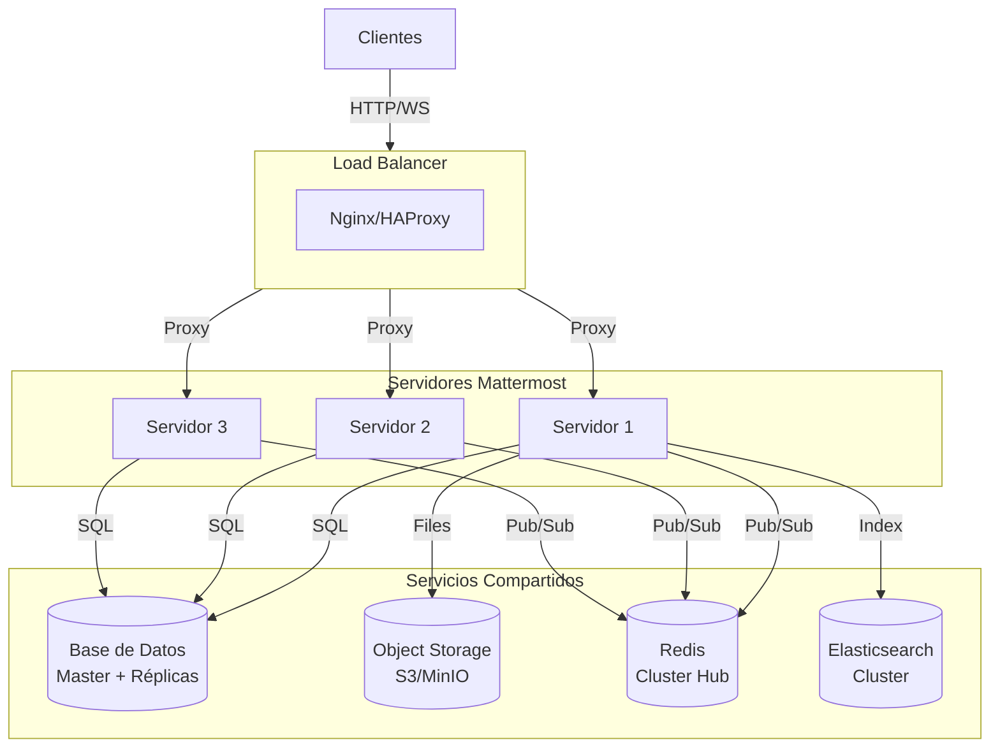

### Stateless Design

Los servidores Mattermost son **stateless**, lo que permite:
- Escalado horizontal sin configuración compleja
- Balanceo de carga round-robin
- Recuperación automática de fallos

La única excepción es el **WebSocket Hub**, que requiere:
- Sesiones "sticky" o
- Clustering con Redis (Enterprise)

---

## Resumen de Componentes Clave

| Componente | Ubicación | Responsabilidad |
|------------|-----------|-----------------|
| **API Handlers** | [`channels/api4/`](server/channels/api4/) | HTTP routing, validación, serialización |
| **App Layer** | [`channels/app/`](server/channels/app/) | Lógica de negocio, orquestación |
| **Store Layer** | [`channels/store/`](server/channels/store/) | Abstracción de datos, caché |
| **WebSocket Hub** | [`app/web_hub.go`](server/channels/app/web_hub.go) | Mensajería en tiempo real |
| **Jobs** | [`channels/jobs/`](server/channels/jobs/) | Procesamiento en background |
| **Platform** | [`platform/`](server/platform/) | Servicios compartidos |
| **Models** | [`public/model/`](server/public/model/) | Definición de entidades |

---

## Próximos Pasos

Para profundizar en componentes específicos:

1. **[Backend Go](03-Backend_Go.md)** - Detalles del servidor
2. **[Frontend React](04-Frontend_React.md)** - Arquitectura del cliente
3. **[Base de Datos](05-Base_de_Datos.md)** - Modelo de datos

---

*Documentación basada en el código fuente de Mattermost v8.x*
