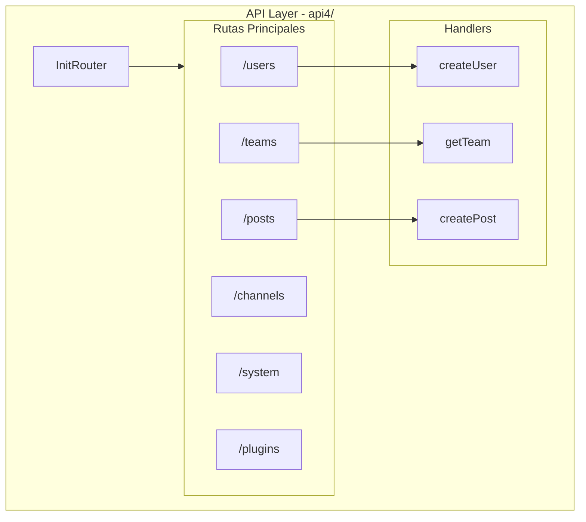
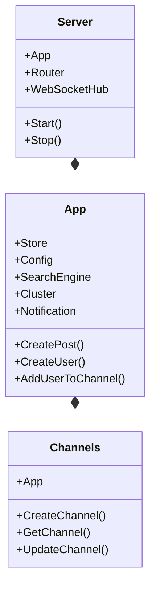
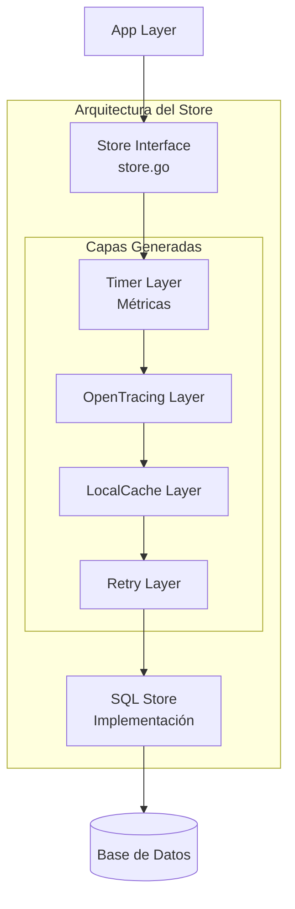
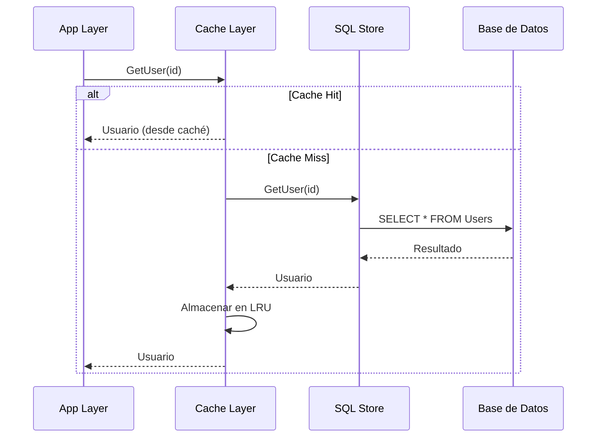
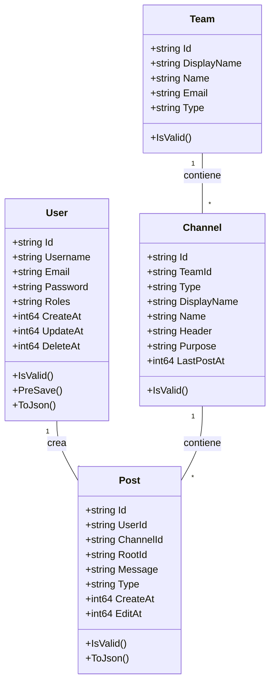
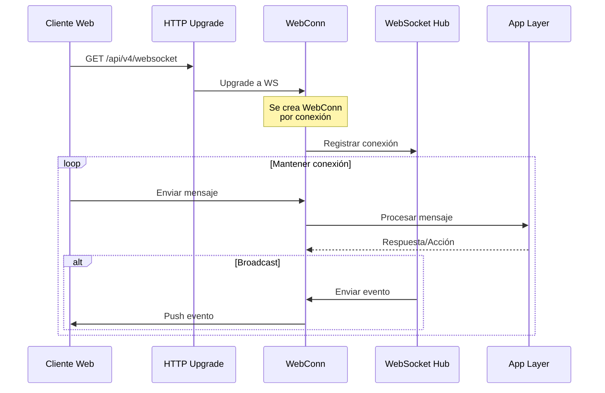
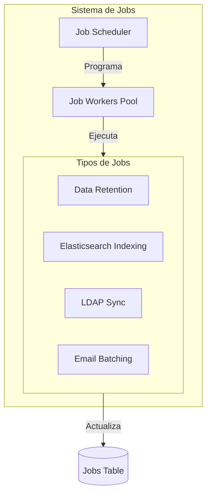
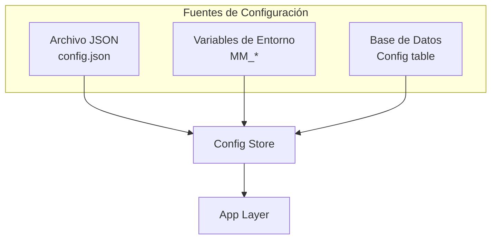

# 03 - Backend Go

## Visión General del Backend

El backend de Mattermost está desarrollado en **Go 1.21+** y sigue una arquitectura modular y limpia. Este documento detalla la estructura, componentes y flujo de trabajo del servidor.

---

## Estructura del Proyecto Go

```
server/
├── 📁 channels/           # Core del servidor de canales
│   ├── api4/             # API REST handlers (v4)
│   ├── app/              # Lógica de aplicación
│   ├── store/            # Capa de acceso a datos
│   ├── db/               # Migraciones de base de datos
│   ├── jobs/             # Trabajos en segundo plano
│   ├── wsapi/            # WebSocket API
│   ├── web/              # Servidor web estático
│   └── testlib/          # Utilidades de testing
│
├── 📁 public/            # API pública y modelos
│   ├── model/            # Modelos de datos compartidos
│   ├── plugin/           # API para plugins
│   └── shared/           # Utilidades compartidas
│
├── 📁 platform/          # Servicios de plataforma
│   ├── services/         # Servicios individuales
│   └── shared/           # Código compartido
│
├── 📁 cmd/               # Entry points
│   └── mattermost/       # Comando principal
│
├── 📁 einterfaces/       # Interfaces Enterprise
├── 📁 config/            # Gestión de configuración
├── 📁 i18n/              # Traducciones
└── 📁 templates/         # Templates de email
```

---

## Módulos y Dependencias Principales

### go.mod

El proyecto utiliza **Go Modules** con el path:
```
github.com/mattermost/mattermost/server/v8
```

### Dependencias Clave

| Paquete | Versión | Propósito |
|---------|---------|-----------|
| [`gorilla/mux`](https://github.com/gorilla/mux) | v1.8.1 | Router HTTP |
| [`gorilla/websocket`](https://github.com/gorilla/websocket) | v1.5.1 | WebSocket server |
| [`jmoiron/sqlx`](https://github.com/jmoiron/sqlx) | v1.3.5 | Extensión de database/sql |
| [`go-sql-driver/mysql`](https://github.com/go-sql-driver/mysql) | v1.7.1 | Driver MySQL |
| [`lib/pq`](https://github.com/lib/pq) | v1.10.9 | Driver PostgreSQL |
| [`blevesearch/bleve`](https://github.com/blevesearch/bleve) | v2.3.10 | Búsqueda full-text |
| [`mattermost/squirrel`](https://github.com/mattermost/squirrel) | v0.4.0 | Constructor de queries SQL |

**Archivo completo**: [`server/go.mod`](server/go.mod)

---

## Capa de API (api4/)

### Estructura de Routing



### Ejemplo de Handler

```go
// channels/api4/user.go
func createUser(c *Context, w http.ResponseWriter, r *http.Request) {
    // 1. Parsear request body
    user := model.UserFromJson(r.Body)
    
    // 2. Validar datos
    if err := user.IsValid(); err != nil {
        c.SetInvalidParam("user")
        return
    }
    
    // 3. Verificar permisos
    if !c.App.SessionHasPermissionTo(...)
    
    // 4. Llamar a App Layer
    ruser, err := c.App.CreateUser(c.AppContext, user)
    if err != nil {
        c.Err = err
        return
    }
    
    // 5. Responder
    w.WriteHeader(http.StatusCreated)
    w.Write([]byte(ruser.ToJson()))
}
```

### Endpoints Principales

| Recurso | Archivo | Descripción |
|---------|---------|-------------|
| Users | [`user.go`](server/channels/api4/user.go) | Gestión de usuarios |
| Teams | [`team.go`](server/channels/api4/team.go) | Gestión de equipos |
| Channels | [`channel.go`](server/channels/api4/channel.go) | Gestión de canales |
| Posts | [`post.go`](server/channels/api4/post.go) | Gestión de posts |
| Files | [`file.go`](server/channels/api4/file.go) | Subida/descarga de archivos |
| System | [`system.go`](server/channels/api4/system.go) | Configuración del sistema |
| Plugins | [`plugin.go`](server/channels/api4/plugin.go) | Gestión de plugins |

---

## Capa de Aplicación (app/)

### Responsabilidades

La capa App contiene la **lógica de negocio** del sistema:
- Validaciones de negocio
- Orquestación de operaciones
- Gestión de permisos
- Integración con servicios externos

### Estructura



### Flujo de Creación de Post

```go
// Simplificación de app/post.go
func (a *App) CreatePost(c request.CTX, post *model.Post) (*model.Post, error) {
    // 1. Validaciones previas
    post.PreSave()
    
    // 2. Verificar permisos del usuario
    if !a.HasPermissionToChannel(c, userId, channelId, model.PermissionCreatePost) {
        return nil, model.NewAppError(...)
    }
    
    // 3. Verificar si el canal existe
    channel, err := a.GetChannel(c, channelId)
    
    // 4. Aplicar lógica de negocio
    // - Menciones
    // - Hashtags
    // - Archivos adjuntos
    
    // 5. Guardar en base de datos
    savedPost, err := a.Srv().Store().Post().Save(c, post)
    
    // 6. Indexar para búsqueda
    a.Srv().SearchEngine.IndexPost(savedPost)
    
    // 7. Enviar notificaciones
    a.sendNotification(c, savedPost, channel, mentions)
    
    // 8. Notificar por WebSocket
    a.Srv().WebSocketHub.BroadcastPost(savedPost)
    
    return savedPost, nil
}
```

### Archivos Principales de App

| Archivo | Responsabilidad |
|---------|-----------------|
| [`app/post.go`](server/channels/app/post.go) | Lógica de posts |
| [`app/user.go`](server/channels/app/user.go) | Lógica de usuarios |
| [`app/channel.go`](server/channels/app/channel.go) | Lógica de canales |
| [`app/team.go`](server/channels/app/team.go) | Lógica de equipos |
| [`app/authorization.go`](server/channels/app/authorization.go) | Permisos y autorización |
| [`app/notification.go`](server/channels/app/notification.go) | Sistema de notificaciones |
| [`app/web_hub.go`](server/channels/app/web_hub.go) | WebSocket Hub |

---

## Capa de Store (store/)

### Arquitectura del Store



### Interfaces del Store

```go
// channels/store/store.go
type Store interface {
    User() UserStore
    Channel() ChannelStore
    Post() PostStore
    Team() TeamStore
    Session() SessionStore
    // ... más stores
}

type UserStore interface {
    Save(user *model.User) (*model.User, error)
    Get(id string) (*model.User, error)
    GetByUsername(username string) (*model.User, error)
    GetByEmail(email string) (*model.User, error)
    Update(user *model.User) (*model.User, error)
    Delete(userId string) error
    // ... más métodos
}
```

### Implementación SQL

Ubicación: [`channels/store/sqlstore/`](server/channels/store/sqlstore/)

```go
// channels/store/sqlstore/user_store.go
type SqlUserStore struct {
    *SqlStore
}

func (us SqlUserStore) Get(id string) (*model.User, error) {
    query := "SELECT * FROM Users WHERE Id = ?"
    user := &model.User{}
    
    if err := us.GetReplica().Get(user, query, id); err != nil {
        return nil, errors.Wrap(err, "failed to get user")
    }
    
    return user, nil
}
```

### Sistema de Caché



**Caché implementada en**: [`channels/store/localcachelayer/`](server/channels/store/localcachelayer/)

---

## Modelos de Datos (public/model/)

### Estructura de Modelos

Ubicación: [`server/public/model/`](server/public/model/)



### Ejemplo de Modelo

```go
// public/model/user.go
type User struct {
    Id          string    `json:"id"`
    CreateAt    int64     `json:"create_at,omitempty"`
    UpdateAt    int64     `json:"update_at,omitempty"`
    DeleteAt    int64     `json:"delete_at"`
    Username    string    `json:"username"`
    Password    string    `json:"password,omitempty"`
    AuthData    *string   `json:"auth_data,omitempty"`
    AuthService string    `json:"auth_service"`
    Email       string    `json:"email"`
    Nickname    string    `json:"nickname"`
    FirstName   string    `json:"first_name"`
    LastName    string    `json:"last_name"`
    Roles       string    `json:"roles"`
    Props       StringMap `json:"props,omitempty"`
    NotifyProps StringMap `json:"notify_props,omitempty"`
    Locale      string    `json:"locale"`
    Timezone    StringMap `json:"timezone"`
    MfaActive   bool      `json:"mfa_active,omitempty"`
}

func (u *User) IsValid() *AppError {
    // Validaciones de negocio
    if len(u.Id) != 26 {
        return NewAppError("User.IsValid", "model.user.is_valid.id.app_error", ...)
    }
    // ... más validaciones
}

func (u *User) PreSave() {
    u.Id = NewId()
    u.CreateAt = GetMillis()
    u.UpdateAt = u.CreateAt
    // ... más preparaciones
}
```

---

## WebSocket API (wsapi/)

### Arquitectura WebSocket



### Tipos de Mensajes

```go
// Mensajes del cliente al servidor
const (
    WebsocketAuthenticationChallenge = "authentication_challenge"
)

// Mensajes del servidor al cliente  
const (
    WebsocketPosted           = "posted"
    WebsocketPostEdited       = "post_edited"
    WebsocketPostDeleted      = "post_deleted"
    WebsocketChannelConverted = "channel_converted"
    WebsocketUserAdded        = "user_added"
    WebsocketUserRemoved      = "user_removed"
    WebsocketUserUpdated      = "user_updated"
    WebsocketStatusChange     = "status_change"
    // ... más eventos
)
```

**Implementación**: [`channels/wsapi/`](server/channels/wsapi/)

---

## Trabajos en Segundo Plano (jobs/)

### Sistema de Jobs



### Tipos de Jobs

| Job | Descripción | Ubicación |
|-----|-------------|-----------|
| **Data Retention** | Eliminación de datos antiguos | [`jobs/data_retention/`](server/channels/jobs/data_retention/) |
| **Elasticsearch** | Indexación de posts | [`jobs/indexes/`](server/channels/jobs/indexes/) |
| **LDAP Sync** | Sincronización con LDAP | (Enterprise) |
| **Email Batching** | Envío batch de emails | [`jobs/email_batching/`](server/channels/jobs/email_batching/) |
| **Migrations** | Migraciones de datos | [`jobs/migrations/`](server/channels/jobs/migrations/) |

---

## Servicios de Plataforma (platform/)

### Servicios Disponibles

```
platform/
├── services/           # Servicios individuales
│   ├── config/        # Gestión de configuración
│   ├── filestore/     # Almacenamiento de archivos
│   ├── searchlayer/   # Capa de búsqueda
│   ├── searchengine/  # Motores de búsqueda
│   ├── notify/        # Notificaciones
│   ├── image/         # Procesamiento de imágenes
│   ├── cache/         # Servicio de caché
│   └── ...
└── shared/            # Código compartido
    ├── driver/        # Driver de BD compartido
    ├── i18n/          # Internacionalización
    └── markdown/      # Parser de Markdown
```

### Servicios Clave

| Servicio | Descripción |
|----------|-------------|
| **Filestore** | Abstracción para almacenamiento de archivos (Local/S3/MinIO) |
| **SearchEngine** | Interfaz para Elasticsearch/Bleve |
| **Config** | Gestión dinámica de configuración |
| **Notify** | Servicio de notificaciones (email, push) |

---

## Configuración

### Fuentes de Configuración



### Estructura de Config

```go
// public/model/config.go
type Config struct {
    ServiceSettings       ServiceSettings
    TeamSettings          TeamSettings
    ClientRequirements    ClientRequirements
    SqlSettings           SqlSettings
    LogSettings           LogSettings
    FileSettings          FileSettings
    EmailSettings         EmailSettings
    PluginSettings        PluginSettings
    // ... más secciones
}
```

---

## Internacionalización (i18n)

### Sistema de i18n

Mattermost soporta múltiples idiomas:

```
server/i18n/
├── en.json    # Inglés (default)
├── es.json    # Español
├── de.json    # Alemán
├── fr.json    # Francés
└── ...        # Más idiomas
```

### Uso en Código

```go
import "github.com/mattermost/mattermost/server/public/shared/i18n"

func (a *App) DoSomething() {
    T := i18n.GetUserTranslations(user.Locale)
    
    // Traducir mensaje
    message := T("api.command_do_something.success")
}
```

---

## Testing

### Estructura de Tests

```go
// channels/api4/user_test.go
func TestCreateUser(t *testing.T) {
    th := Setup(t).InitBasic()
    defer th.TearDown()
    
    user := &model.User{
        Email:    "test@example.com",
        Username: "testuser",
        Password: "password123",
    }
    
    ruser, resp, err := th.Client.CreateUser(user)
    require.NoError(t, err)
    require.Equal(t, http.StatusCreated, resp.StatusCode)
    require.NotNil(t, ruser)
}
```

### Helpers de Testing

| Helper | Ubicación | Descripción |
|--------|-----------|-------------|
| `TestHelper` | [`api4/apitestlib.go`](server/channels/api4/apitestlib.go) | Setup de tests de API |
| `TestStore` | [`store/storetest/`](server/channels/store/storetest/) | Mocks del store |

---

## Próximos Pasos

Para continuar explorando:

1. **[Frontend React](04-Frontend_React.md)** - Arquitectura del cliente
2. **[Base de Datos](05-Base_de_Datos.md)** - Modelo de datos y migraciones
3. **[APIs y WebSockets](06-APIs_y_WebSockets.md)** - Documentación de APIs

---

*Documentación basada en Mattermost Server v8.x*
