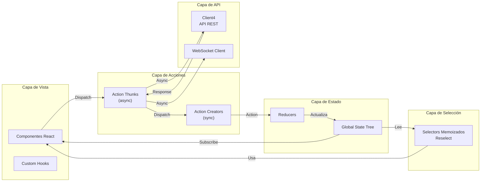
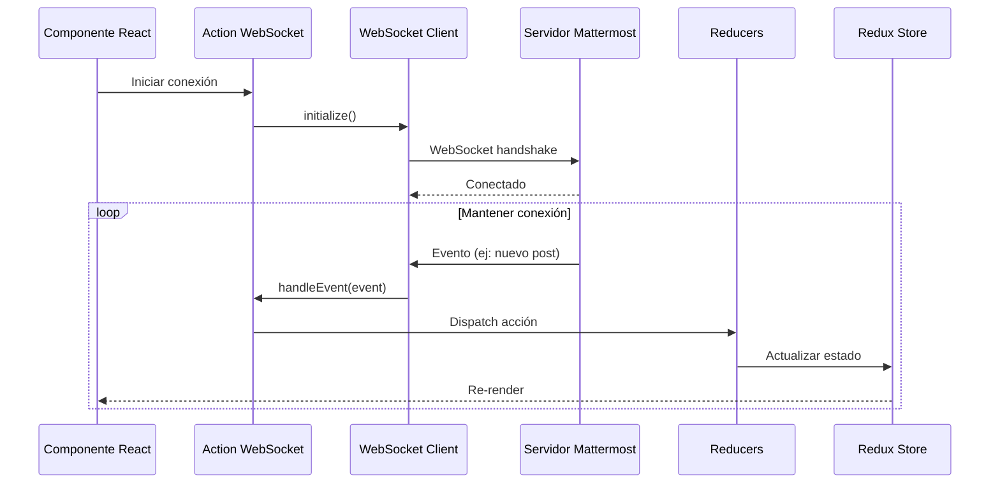

# 04 - Frontend React

## Visión General del Frontend

El frontend de Mattermost está construido con **React 17**, **TypeScript 5**, y **Redux** para la gestión de estado. Esta sección describe la arquitectura, estructura de carpetas y flujo de datos del cliente web.

---

## Stack Tecnológico

| Tecnología | Versión | Propósito |
|------------|---------|-----------|
| **React** | 17.x | Framework UI |
| **TypeScript** | 5.x | Tipado estático |
| **Redux** | 4.x | Gestión de estado global |
| **React-Redux** | 8.x | Bindings React-Redux |
| **Redux Thunk** | 2.x | Middleware para acciones async |
| **Webpack** | 5.x | Bundler y dev server |
| **Sass/SCSS** | - | Preprocesador CSS |
| **Jest** | 29.x | Framework de testing |
| **React Testing Library** | 14.x | Testing de componentes |

---

## Estructura del Proyecto Webapp

```
webapp/
├── 📁 channels/           # Aplicación principal de Mattermost
│   ├── src/
│   │   ├── 📁 actions/    # Redux actions (thunks)
│   │   ├── 📁 components/ # Componentes React
│   │   ├── 📁 reducers/   # Redux reducers
│   │   ├── 📁 selectors/  # Selectores memoizados
│   │   ├── 📁 stores/     # Configuración de stores
│   │   ├── 📁 types/      # Tipos TypeScript
│   │   ├── 📁 utils/      # Utilidades
│   │   ├── 📁 packages/   # Módulos locales
│   │   ├── 📁 i18n/       # Traducciones
│   │   ├── 📁 sass/       # Estilos globales
│   │   ├── entry.tsx      # Punto de entrada
│   │   └── root.tsx       # Componente raíz
│   ├── package.json       # Dependencias
│   └── webpack.config.js  # Configuración Webpack
│
├── 📁 platform/           # Componentes y utilidades compartidas
│   ├── components/        # Componentes reutilizables
│   ├── types/             # Tipos compartidos
│   └── client/            # Cliente HTTP
│
└── 📁 package.json        # Workspace root
```

---

## Arquitectura Redux

### Flujo de Datos Redux



### Estructura del Store

```typescript
// Estado global de la aplicación
interface GlobalState {
    entities: {
        users: UsersState;
        teams: TeamsState;
        channels: ChannelsState;
        posts: PostsState;
        preferences: PreferencesState;
        // ... más entidades
    };
    requests: {
        users: RequestStatus;
        teams: RequestStatus;
        channels: RequestStatus;
        // ... más requests
    };
    errors: ErrorState;
    websocket: WebSocketState;
    // ... más slices
}
```

---

## Actions (Acciones)

Ubicación: [`webapp/channels/src/actions/`](webapp/channels/src/actions/)

### Tipos de Acciones

```typescript
// actions/posts.ts

// Action Types
export const PostTypes = {
    CREATE_POST: 'CREATE_POST',
    RECEIVED_POST: 'RECEIVED_POST',
    RECEIVED_POSTS: 'RECEIVED_POSTS',
    EDIT_POST: 'EDIT_POST',
    DELETE_POST: 'DELETE_POST',
    // ... más tipos
} as const;

// Action Creator síncrono
export function receivedPost(post: Post) {
    return {
        type: PostTypes.RECEIVED_POST,
        data: post,
    };
}

// Action Thunk asíncrono
export function createPost(post: Post, files: FileInfo[]) {
    return async (dispatch: DispatchFunc, getState: GetStateFunc) => {
        dispatch({ type: PostTypes.CREATE_POST_REQUEST });
        
        try {
            // Llamada a API
            const created = await Client4.createPost(post, files);
            
            dispatch({
                type: PostTypes.RECEIVED_POST,
                data: created,
            });
            
            return { data: created };
        } catch (error) {
            dispatch({
                type: PostTypes.CREATE_POST_FAILURE,
                error,
            });
            return { error };
        }
    };
}
```

### Acciones Principales

| Archivo | Entidad | Descripción |
|---------|---------|-------------|
| [`posts.ts`](webapp/channels/src/actions/posts.ts) | Posts | Crear, editar, eliminar posts |
| [`users.ts`](webapp/channels/src/actions/users.ts) | Users | Gestión de usuarios |
| [`channels.ts`](webapp/channels/src/actions/channels.ts) | Channels | Gestión de canales |
| [`teams.ts`](webapp/channels/src/actions/teams.ts) | Teams | Gestión de equipos |
| [`websocket.ts`](webapp/channels/src/actions/websocket.ts) | WebSocket | Manejo de conexión WS |

---

## Reducers

Ubicación: [`webapp/channels/src/reducers/`](webapp/channels/src/reducers/)

### Estructura de Reducers

```typescript
// reducers/entities/posts.ts

const initialState: PostsState = {
    posts: {},
    postsInChannel: {},
    postsInThread: {},
    pendingPostIds: [],
};

export default function postsReducer(
    state = initialState,
    action: GenericAction
): PostsState {
    switch (action.type) {
        case PostTypes.RECEIVED_POST: {
            const post = action.data;
            return {
                ...state,
                posts: {
                    ...state.posts,
                    [post.id]: post,
                },
            };
        }
        
        case PostTypes.RECEIVED_POSTS: {
            const posts = action.data;
            const nextPosts = { ...state.posts };
            
            posts.forEach((post: Post) => {
                nextPosts[post.id] = post;
            });
            
            return {
                ...state,
                posts: nextPosts,
            };
        }
        
        // ... más casos
        
        default:
            return state;
    }
}
```

### Normalización de Datos

Mattermost utiliza **normalización de estado** para entidades:

```typescript
// Estado normalizado
{
    entities: {
        posts: {
            byId: {
                'post_1': { id: 'post_1', message: 'Hola', ... },
                'post_2': { id: 'post_2', message: 'Mundo', ... },
            },
            allIds: ['post_1', 'post_2'],
            postsInChannel: {
                'channel_1': ['post_1', 'post_2'],
            },
        },
        users: {
            byId: {
                'user_1': { id: 'user_1', username: 'john', ... },
            },
        },
    },
}
```

---

## Selectors

Ubicación: [`webapp/channels/src/selectors/`](webapp/channels/src/selectors/)

### Selectores Memoizados

```typescript
// selectors/entities/posts.ts
import { createSelector } from 'reselect';

// Selector base
const getPosts = (state: GlobalState) => state.entities.posts.posts;
const getCurrentChannelId = (state: GlobalState) => state.entities.channels.currentChannelId;

// Selector memoizado
export const getPostsInCurrentChannel = createSelector(
    [getPosts, getPostsInChannel, getCurrentChannelId],
    (posts, postsInChannel, channelId) => {
        const postIds = postsInChannel[channelId] || [];
        return postIds.map(id => posts[id]).filter(Boolean);
    }
);

// Selector compuesto
export const makeGetPostsInChannel = () => {
    return createSelector(
        [getPosts, getPostsInChannel, (state, channelId) => channelId],
        (posts, postsInChannel, channelId) => {
            const postIds = postsInChannel[channelId] || [];
            return postIds.map(id => posts[id]);
        }
    );
};
```

### Uso en Componentes

```typescript
// Componente conectado
import { useSelector, useDispatch } from 'react-redux';

function PostList({ channelId }: Props) {
    const posts = useSelector((state: GlobalState) =>
        getPostsInChannel(state, channelId)
    );
    const currentUser = useSelector(getCurrentUser);
    
    return (
        <div className="post-list">
            {posts.map(post => (
                <Post key={post.id} post={post} />
            ))}
        </div>
    );
}
```

---

## Componentes React

### Estructura de Componentes

```
components/
├── 📁 common/                 # Componentes reutilizables
│   ├── avatar/
│   ├── loading_spinner/
│   ├── markdown/
│   └── ...
│
├── 📁 post_view/              # Vista de posts
│   ├── post/
│   ├── post_list/
│   └── ...
│
├── 📁 sidebar/                # Barra lateral
│   ├── sidebar_channel/
│   ├── sidebar_team/
│   └── ...
│
├── 📁 channel_layout/         # Layout de canales
│   ├── center_channel/
│   └── ...
│
└── 📁 ...                     # Más categorías
```

### Ejemplo de Componente

```typescript
// components/post_view/post/post.tsx
import React, { useCallback } from 'react';
import { useDispatch, useSelector } from 'react-redux';

import { deletePost } from 'actions/posts';
import { getCurrentUser } from 'selectors/entities/users';

interface PostProps {
    post: Post;
    teamName: string;
}

export default function Post({ post, teamName }: PostProps) {
    const dispatch = useDispatch();
    const currentUser = useSelector(getCurrentUser);
    
    const isOwner = currentUser.id === post.user_id;
    
    const handleDelete = useCallback(() => {
        dispatch(deletePost(post));
    }, [dispatch, post]);
    
    return (
        <div className="post" data-testid="post">
            <div className="post__content">
                <PostHeader post={post} />
                <PostBody message={post.message} />
                <PostReactions postId={post.id} />
            </div>
            {isOwner && (
                <PostActions
                    onDelete={handleDelete}
                    onEdit={() => {}}
                />
            )}
        </div>
    );
}
```

### Componentes de Clase vs Funcionales

Mattermost utiliza una mezcla de ambos enfoques:

- **Componentes funcionales**: Para componentes nuevos y simples
- **Componentes de clase**: Para componentes legacy complejos con lifecycle methods

```typescript
// Componente funcional moderno (hooks)
function ChannelHeader({ channelId }: Props) {
    const channel = useSelector(state => getChannel(state, channelId));
    const [isEditing, setIsEditing] = useState(false);
    
    useEffect(() => {
        // Effect logic
    }, [channelId]);
    
    return <div>...</div>;
}

// Componente de clase (legacy)
class LegacyComponent extends React.PureComponent<Props, State> {
    componentDidMount() {
        // Lifecycle
    }
    
    render() {
        return <div>...</div>;
    }
}
```

---

## WebSocket en el Cliente

### Arquitectura WebSocket



### Manejo de Eventos

```typescript
// actions/websocket.ts

export function handleWebSocketEvent(msg: WebSocketMessage) {
    return (dispatch: DispatchFunc, getState: GetStateFunc) => {
        switch (msg.event) {
            case SocketEvents.POSTED:
                dispatch(handleNewPostEvent(msg));
                break;
            case SocketEvents.POST_EDITED:
                dispatch(handlePostEditEvent(msg));
                break;
            case SocketEvents.USER_ADDED:
                dispatch(handleUserAddedEvent(msg));
                break;
            // ... más eventos
        }
    };
}

function handleNewPostEvent(msg: WebSocketMessage) {
    return (dispatch: DispatchFunc) => {
        const post = JSON.parse(msg.data.post);
        
        dispatch(receivedPost(post));
        
        // Notificaciones, sonidos, etc.
        if (shouldNotify(post)) {
            dispatch(sendDesktopNotification(post));
        }
    };
}
```

---

## Cliente API (Client4)

### Configuración

Ubicación: [`webapp/platform/client/`](webapp/platform/client/)

```typescript
// platform/client/client4.ts

export default class Client4 {
    private url: string;
    private token: string;
    
    constructor() {
        this.url = window.basename || '';
    }
    
    // Autenticación
    async login(email: string, password: string): Promise<UserProfile> {
        const response = await fetch(`${this.url}/api/v4/users/login`, {
            method: 'POST',
            headers: {
                'Content-Type': 'application/json',
            },
            body: JSON.stringify({ email, password }),
        });
        
        const token = response.headers.get('Token');
        this.token = token || '';
        
        return response.json();
    }
    
    // Posts
    async createPost(post: Post): Promise<Post> {
        return this.doFetch(
            `${this.url}/api/v4/posts`,
            { method: 'POST', body: JSON.stringify(post) }
        );
    }
    
    async getPosts(channelId: string, page = 0, perPage = 30): Promise<PostList> {
        return this.doFetch(
            `${this.url}/api/v4/channels/${channelId}/posts?page=${page}&per_page=${perPage}`,
            { method: 'GET' }
        );
    }
    
    // Método base para fetch
    private async doFetch<T>(url: string, options: RequestInit): Promise<T> {
        const headers = {
            ...options.headers,
            'Authorization': `Bearer ${this.token}`,
            'X-Requested-With': 'XMLHttpRequest',
        };
        
        const response = await fetch(url, { ...options, headers });
        
        if (!response.ok) {
            throw await response.json();
        }
        
        return response.json();
    }
}

// Singleton
export const Client4Singleton = new Client4();
```

---

## Estilos y Theming

### Sistema de Estilos

```
sass/
├── components/          # Estilos por componente
├── layouts/            # Layouts generales
├── utils/              # Variables y mixins
├── base/               # Estilos base
└── styles.scss         # Entry point
```

### Variables SCSS

```scss
// sass/utils/_variables.scss

// Colores del tema
$primary-color: var(--button-bg);
$primary-color--hover: var(--button-bg-80);
$secondary-color: var(--center-channel-color);
$bg-color: var(--center-channel-bg);

// Breakpoints
$breakpoint-sm: 768px;
$breakpoint-md: 1024px;
$breakpoint-lg: 1440px;

// Espaciado
$spacing-xs: 4px;
$spacing-sm: 8px;
$spacing-md: 16px;
$spacing-lg: 24px;
$spacing-xl: 32px;
```

### Sistema de Temas

Mattermost soporta temas personalizables:

```typescript
// types/themes.ts
export interface Theme {
    sidebarBg: string;
    sidebarText: string;
    sidebarUnreadText: string;
    sidebarTextHoverBg: string;
    sidebarTextActiveBorder: string;
    sidebarTextActiveColor: string;
    sidebarHeaderBg: string;
    sidebarTeamBarBg: string;
    onlineIndicator: string;
    awayIndicator: string;
    dndIndicator: string;
    mentionBg: string;
    // ... más propiedades
}
```

Los temas se aplican mediante **CSS Custom Properties** (variables CSS):

```scss
:root {
    --sidebar-bg: #145dbf;
    --sidebar-text: #ffffff;
    // ... más variables
}
```

---

## Internacionalización (i18n)

### Sistema de Traducciones

```
i18n/
├── en.json        # Inglés (default)
├── es.json        # Español
├── de.json        # Alemán
└── ...            # Más idiomas
```

### Uso en Componentes

```typescript
import { useIntl } from 'react-intl';

function MyComponent() {
    const { formatMessage } = useIntl();
    
    return (
        <button>
            {formatMessage({
                id: 'component.button.submit',
                defaultMessage: 'Submit',
            })}
        </button>
    );
}
```

### Archivo de Traducciones

```json
{
    "component.button.submit": "Enviar",
    "component.button.cancel": "Cancelar",
    "post.create.placeholder": "Escribe un mensaje..."
}
```

---

## Testing

### Testing con Jest y React Testing Library

```typescript
// components/post_view/post/post.test.tsx
import React from 'react';
import { render, screen, fireEvent } from '@testing-library/react';
import { Provider } from 'react-redux';
import configureStore from 'redux-mock-store';

import Post from './post';

const mockStore = configureStore();

const mockPost = {
    id: 'post_1',
    user_id: 'user_1',
    channel_id: 'channel_1',
    message: 'Test message',
    create_at: Date.now(),
};

describe('Post', () => {
    it('should render post message', () => {
        const store = mockStore({
            entities: {
                users: {
                    currentUserId: 'user_1',
                    profiles: {
                        user_1: { id: 'user_1', username: 'testuser' },
                    },
                },
            },
        });
        
        render(
            <Provider store={store}>
                <Post post={mockPost} teamName="testteam" />
            </Provider>
        );
        
        expect(screen.getByText('Test message')).toBeInTheDocument();
    });
    
    it('should dispatch delete action when delete clicked', () => {
        const store = mockStore({ ... });
        const { getByTestId } = render(...);
        
        fireEvent.click(getByTestId('post-delete-button'));
        
        const actions = store.getActions();
        expect(actions[0].type).toBe('DELETE_POST');
    });
});
```

### Configuración de Tests

Ubicación: [`webapp/channels/jest.config.js`](webapp/channels/jest.config.js)

```javascript
module.exports = {
    testEnvironment: 'jsdom',
    setupFilesAfterEnv: ['<rootDir>/src/tests/setup.ts'],
    moduleNameMapper: {
        '^@/(.*)$': '<rootDir>/src/$1',
        '^mattermost-redux(.*)$': '<rootDir>/src/packages/mattermost-redux$1',
    },
    transform: {
        '^.+\\.tsx?$': 'ts-jest',
    },
    testMatch: [
        '**/*.test.{ts,tsx}',
    ],
};
```

---

## Build y Desarrollo

### Scripts NPM

```bash
# Desarrollo
npm run dev-server      # Servidor de desarrollo con HMR
npm run run            # Webpack watch mode

# Build
npm run build          # Build de producción
npm run build:dev      # Build de desarrollo

# Testing
npm test               # Ejecutar tests
npm run test:watch     # Tests en modo watch
npm run test:coverage  # Tests con cobertura

# Linting
npm run check          # ESLint + stylelint
npm run fix            # Auto-fix issues
npm run check-types    # TypeScript type checking
```

### Configuración Webpack

Ubicación: [`webapp/channels/webpack.config.js`](webapp/channels/webpack.config.js)

```javascript
module.exports = {
    entry: './src/entry.tsx',
    output: {
        path: path.resolve(__dirname, 'dist'),
        filename: '[name].[contenthash].js',
    },
    module: {
        rules: [
            {
                test: /\.tsx?$/,
                use: 'ts-loader',
                exclude: /node_modules/,
            },
            {
                test: /\.scss$/,
                use: ['style-loader', 'css-loader', 'sass-loader'],
            },
        ],
    },
    resolve: {
        extensions: ['.tsx', '.ts', '.js'],
        alias: {
            '@': path.resolve(__dirname, 'src'),
            'components': path.resolve(__dirname, 'src/components'),
            'actions': path.resolve(__dirname, 'src/actions'),
        },
    },
    devServer: {
        port: 9005,
        proxy: {
            '/api': 'http://localhost:8065',
            '/ws': 'ws://localhost:8065',
        },
    },
};
```

---

## Próximos Pasos

Para continuar explorando:

1. **[Base de Datos](05-Base_de_Datos.md)** - Modelo de datos del sistema
2. **[APIs y WebSockets](06-APIs_y_WebSockets.md)** - Documentación completa de APIs
3. **[Flujos de Negocio](08-Flujos_de_Negocio.md)** - Procesos principales

---

*Documentación basada en Mattermost Webapp v8.x*
