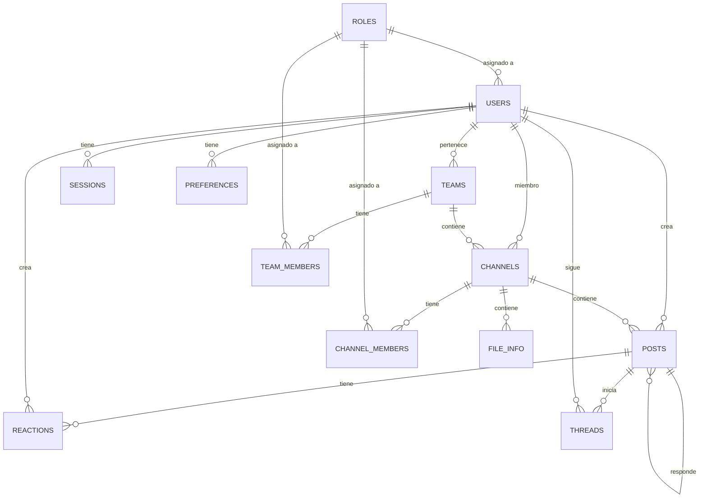
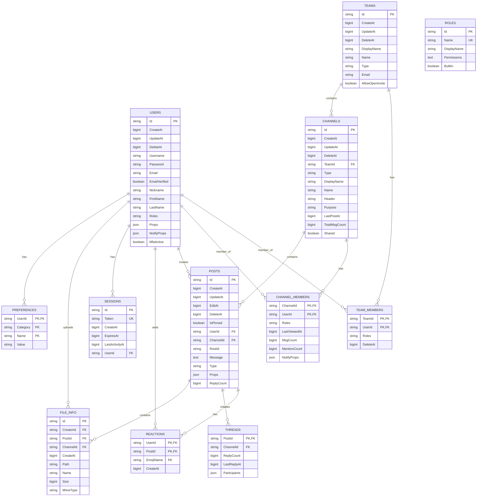

# 05 - Base de Datos

## Visión General

Mattermost soporta **MySQL 8.0+** y **PostgreSQL 13+** como sistemas de base de datos principales. La arquitectura de datos está diseñada para soportar millones de usuarios y mensajes con alta disponibilidad y rendimiento.

---

## Diagrama Entidad-Relación de Alto Nivel



---

## Entidades Principales

### 1. Usuarios (Users)

```sql
-- Tabla principal de usuarios
CREATE TABLE Users (
    Id VARCHAR(26) PRIMARY KEY,
    CreateAt BIGINT NOT NULL,
    UpdateAt BIGINT NOT NULL,
    DeleteAt BIGINT DEFAULT 0,
    Username VARCHAR(64) NOT NULL,
    Password VARCHAR(128) NOT NULL,
    AuthData VARCHAR(128),
    AuthService VARCHAR(32),
    Email VARCHAR(128) NOT NULL,
    EmailVerified TINYINT(1) DEFAULT 0,
    Nickname VARCHAR(64),
    FirstName VARCHAR(64),
    LastName VARCHAR(64),
    Position VARCHAR(128),
    Roles VARCHAR(256),
    Props JSON,
    NotifyProps JSON,
    LastPasswordUpdate BIGINT,
    LastPictureUpdate BIGINT,
    FailedAttempts INT DEFAULT 0,
    Locale VARCHAR(5) DEFAULT 'en',
    Timezone JSON,
    MfaActive TINYINT(1) DEFAULT 0,
    MfaSecret VARCHAR(128),
    RemoteId VARCHAR(26),
    
    UNIQUE INDEX idx_users_email (Email),
    UNIQUE INDEX idx_users_username (Username),
    INDEX idx_users_authdata (AuthData),
    INDEX idx_users_remote_id (RemoteId)
);
```

**Ubicación del modelo**: [`server/public/model/user.go`](server/public/model/user.go)

**Campos clave:**
| Campo | Descripción |
|-------|-------------|
| `Id` | Identificador único de 26 caracteres (cuid de Go) |
| `AuthService` | Tipo de autenticación: email, ldap, saml, oauth |
| `Roles` | Roles del usuario (system_admin, system_user, etc.) |
| `Props` | Propiedades personalizadas JSON |
| `NotifyProps` | Preferencias de notificación JSON |

---

### 2. Equipos (Teams)

```sql
CREATE TABLE Teams (
    Id VARCHAR(26) PRIMARY KEY,
    CreateAt BIGINT NOT NULL,
    UpdateAt BIGINT NOT NULL,
    DeleteAt BIGINT DEFAULT 0,
    DisplayName VARCHAR(64) NOT NULL,
    Name VARCHAR(64) NOT NULL,
    Description VARCHAR(255),
    Email VARCHAR(128) NOT NULL,
    Type VARCHAR(255) DEFAULT 'O', -- 'O' (open) o 'I' (invite-only)
    CompanyName VARCHAR(128),
    AllowedDomains VARCHAR(1000),
    InviteId VARCHAR(32),
    AllowOpenInvite TINYINT(1) DEFAULT 0,
    LastTeamIconUpdate BIGINT DEFAULT 0,
    SchemeId VARCHAR(26),
    GroupConstrained TINYINT(1),
    
    UNIQUE INDEX idx_teams_name (Name),
    INDEX idx_teams_invite_id (InviteId),
    INDEX idx_teams_update_at (UpdateAt)
);

-- Relación muchos-a-muchos: Usuarios-Equipos
CREATE TABLE TeamMembers (
    TeamId VARCHAR(26) NOT NULL,
    UserId VARCHAR(26) NOT NULL,
    Roles VARCHAR(256),
    DeleteAt BIGINT DEFAULT 0,
    SchemeUser TINYINT(1) DEFAULT NULL,
    SchemeAdmin TINYINT(1) DEFAULT NULL,
    ExplicitRoles VARCHAR(256),
    CreateAt BIGINT,
    
    PRIMARY KEY (TeamId, UserId),
    FOREIGN KEY (TeamId) REFERENCES Teams(Id),
    FOREIGN KEY (UserId) REFERENCES Users(Id),
    INDEX idx_teammembers_delete_at (DeleteAt)
);
```

---

### 3. Canales (Channels)

```sql
CREATE TABLE Channels (
    Id VARCHAR(26) PRIMARY KEY,
    CreateAt BIGINT NOT NULL,
    UpdateAt BIGINT NOT NULL,
    DeleteAt BIGINT DEFAULT 0,
    TeamId VARCHAR(26) NOT NULL,
    Type VARCHAR(1) NOT NULL, -- 'O'=Open, 'P'=Private, 'D'=Direct, 'G'=Group
    DisplayName VARCHAR(64) NOT NULL,
    Name VARCHAR(64) NOT NULL,
    Header TEXT,
    Purpose VARCHAR(250),
    LastPostAt BIGINT DEFAULT 0,
    TotalMsgCount BIGINT DEFAULT 0,
    ExtraUpdateAt BIGINT DEFAULT 0,
    CreatorId VARCHAR(26),
    SchemeId VARCHAR(26),
    Props JSON,
    GroupConstrained TINYINT(1),
    Shared TINYINT(1) DEFAULT 0,
    TotalMsgCountRoot BIGINT DEFAULT 0,
    PolicyID VARCHAR(26),
    LastRootPostAt BIGINT DEFAULT 0,
    
    INDEX idx_channels_team_id (TeamId),
    INDEX idx_channels_name (Name),
    INDEX idx_channels_update_at (UpdateAt),
    INDEX idx_channels_delete_at (DeleteAt)
);

-- Miembros de canales
CREATE TABLE ChannelMembers (
    ChannelId VARCHAR(26) NOT NULL,
    UserId VARCHAR(26) NOT NULL,
    Roles VARCHAR(256),
    LastViewedAt BIGINT DEFAULT 0,
    MsgCount BIGINT DEFAULT 0,
    MentionCount BIGINT DEFAULT 0,
    NotifyProps JSON,
    LastUpdateAt BIGINT DEFAULT 0,
    SchemeUser TINYINT(1),
    SchemeAdmin TINYINT(1),
    ExplicitRoles VARCHAR(256),
    
    PRIMARY KEY (ChannelId, UserId),
    FOREIGN KEY (ChannelId) REFERENCES Channels(Id),
    FOREIGN KEY (UserId) REFERENCES Users(Id),
    INDEX idx_channelmembers_user_id (UserId),
    INDEX idx_channelmembers_channel_id (ChannelId)
);
```

**Tipos de Canales:**
| Tipo | Descripción |
|------|-------------|
| `O` (Open) | Canal público visible para todos en el equipo |
| `P` (Private) | Canal privado, solo por invitación |
| `D` (Direct) | Mensaje directo entre 2 usuarios |
| `G` (Group) | Mensaje grupal entre 3-8 usuarios |

---

### 4. Mensajes (Posts)

```sql
CREATE TABLE Posts (
    Id VARCHAR(26) PRIMARY KEY,
    CreateAt BIGINT NOT NULL,
    UpdateAt BIGINT NOT NULL,
    EditAt BIGINT DEFAULT 0,
    DeleteAt BIGINT DEFAULT 0,
    IsPinned TINYINT(1) DEFAULT 0,
    UserId VARCHAR(26) NOT NULL,
    ChannelId VARCHAR(26) NOT NULL,
    RootId VARCHAR(26) DEFAULT '', -- Para hilos (threads)
    OriginalId VARCHAR(26), -- Para mensajes editados
    Message TEXT,
    Type VARCHAR(26) DEFAULT '', -- Tipo de post (system_join_channel, etc.)
    Props JSON, -- Propiedades adicionales
    Hashtags TEXT,
    PendingPostId VARCHAR(26),
    ReplyCount BIGINT DEFAULT 0,
    LastReplyAt BIGINT DEFAULT 0,
    Participants JSON, -- Usuarios participantes en el hilo
    
    INDEX idx_posts_channel_id (ChannelId),
    INDEX idx_posts_channel_id_update_at (ChannelId, UpdateAt),
    INDEX idx_posts_channel_id_delete_at_create_at (ChannelId, DeleteAt, CreateAt),
    INDEX idx_posts_user_id (UserId),
    INDEX idx_posts_root_id (RootId),
    INDEX idx_posts_create_at_id (CreateAt, Id)
);

-- Prioridad de posts (Enterprise)
CREATE TABLE PostsPriority (
    PostId VARCHAR(26) PRIMARY KEY,
    ChannelId VARCHAR(26) NOT NULL,
    Priority VARCHAR(20) NOT NULL, -- 'urgent', 'important'
    StandardizedPriority VARCHAR(20),
    RequestedAck TINYINT(1) DEFAULT 0,
 
    FOREIGN KEY (PostId) REFERENCES Posts(Id),
    INDEX idx_postspriority_channel_id (ChannelId)
);
```

**Campo `Type` (tipos de posts del sistema):**
```go
const (
    PostTypeDefault              = ""
    PostTypeJoinChannel          = "system_join_channel"
    PostTypeLeaveChannel         = "system_leave_channel"
    PostTypeAddToChannel         = "system_add_to_channel"
    PostTypeRemoveFromChannel    = "system_remove_from_channel"
    PostTypeHeaderChange         = "system_header_change"
    PostTypeDisplaynameChange    = "system_displayname_change"
    PostTypePurposeChange        = "system_purpose_change"
    PostTypeChannelDeleted       = "system_channel_deleted"
    // ... más tipos
)
```

---

### 5. Reacciones (Reactions)

```sql
CREATE TABLE Reactions (
    UserId VARCHAR(26) NOT NULL,
    PostId VARCHAR(26) NOT NULL,
    EmojiName VARCHAR(64) NOT NULL,
    CreateAt BIGINT NOT NULL,
    ChannelId VARCHAR(26),
    
    PRIMARY KEY (UserId, PostId, EmojiName),
    FOREIGN KEY (PostId) REFERENCES Posts(Id),
    INDEX idx_reactions_post_id (PostId),
    INDEX idx_reactions_channel_id (ChannelId)
);
```

---

### 6. Hilos (Threads)

```sql
-- Información de hilos (respuestas a posts)
CREATE TABLE Threads (
    PostId VARCHAR(26) PRIMARY KEY, -- ID del post raíz
    ChannelId VARCHAR(26) NOT NULL,
    ReplyCount BIGINT DEFAULT 0,
    LastReplyAt BIGINT DEFAULT 0,
    Participants JSON, -- Array de IDs de usuarios
    
    FOREIGN KEY (PostId) REFERENCES Posts(Id),
    INDEX idx_threads_channel_id (ChannelId)
);

-- Suscripciones de usuarios a hilos
CREATE TABLE ThreadMemberships (
    PostId VARCHAR(26) NOT NULL,
    UserId VARCHAR(26) NOT NULL,
    Following TINYINT(1) DEFAULT 1,
    LastViewed BIGINT DEFAULT 0,
    UnreadMentions BIGINT DEFAULT 0,
    LastUpdated BIGINT,
    
    PRIMARY KEY (PostId, UserId),
    FOREIGN KEY (PostId) REFERENCES Posts(Id),
    FOREIGN KEY (UserId) REFERENCES Users(Id),
    INDEX idx_threadmemberships_user_id (UserId)
);
```

---

### 7. Sesiones

```sql
CREATE TABLE Sessions (
    Id VARCHAR(26) PRIMARY KEY,
    Token VARCHAR(26) NOT NULL,
    CreateAt BIGINT NOT NULL,
    ExpiresAt BIGINT NOT NULL,
    LastActivityAt BIGINT NOT NULL,
    UserId VARCHAR(26) NOT NULL,
    DeviceId TEXT,
    Roles VARCHAR(256),
    IsOAuth TINYINT(1) DEFAULT 0,
    ExpiredNotify TINYINT(1) DEFAULT 0,
    Props JSON,
    TeamMembers JSON,
    Local TINYINT(1) DEFAULT 0,
    
    UNIQUE INDEX idx_sessions_token (Token),
    INDEX idx_sessions_user_id (UserId),
    INDEX idx_sessions_expires_at (ExpiresAt),
    INDEX idx_sessions_create_at (CreateAt)
);
```

---

### 8. Archivos (FileInfo)

```sql
CREATE TABLE FileInfo (
    Id VARCHAR(26) PRIMARY KEY,
    CreatorId VARCHAR(26) NOT NULL,
    PostId VARCHAR(26),
    ChannelId VARCHAR(26),
    CreateAt BIGINT NOT NULL,
    UpdateAt BIGINT NOT NULL,
    DeleteAt BIGINT DEFAULT 0,
    Path TEXT NOT NULL, -- Ruta en storage
    ThumbnailPath TEXT,
    PreviewPath TEXT,
    Name VARCHAR(256) NOT NULL,
    Extension VARCHAR(64),
    Size BIGINT NOT NULL,
    MimeType TEXT,
    Width INT,
    Height INT,
    HasPreviewImage TINYINT(1) DEFAULT 0,
    MiniPreview BLOB, -- Miniatura en bytes
    Content TEXT,
    RemoteId VARCHAR(26),
    Archived TINYINT(1) DEFAULT 0,
    
    INDEX idx_fileinfo_post_id (PostId),
    INDEX idx_fileinfo_channel_id (ChannelId),
    INDEX idx_fileinfo_creator_id (CreatorId),
    INDEX idx_fileinfo_update_at (UpdateAt)
);
```

---

### 9. Roles y Permisos

```sql
CREATE TABLE Roles (
    Id VARCHAR(26) PRIMARY KEY,
    Name VARCHAR(64) NOT NULL,
    DisplayName VARCHAR(128),
    Description TEXT,
    CreateAt BIGINT NOT NULL,
    UpdateAt BIGINT NOT NULL,
    DeleteAt BIGINT DEFAULT 0,
    Permissions TEXT, -- Lista separada por espacios
    SchemeManaged TINYINT(1) DEFAULT 0,
    BuiltIn TINYINT(1) DEFAULT 0,
    
    UNIQUE INDEX idx_roles_name (Name)
);

-- Schemes (conjuntos de roles)
CREATE TABLE Schemes (
    Id VARCHAR(26) PRIMARY KEY,
    Name VARCHAR(128) NOT NULL,
    DisplayName VARCHAR(256) NOT NULL,
    Description TEXT,
    CreateAt BIGINT NOT NULL,
    UpdateAt BIGINT NOT NULL,
    DeleteAt BIGINT DEFAULT 0,
    Scope VARCHAR(32) NOT NULL, -- 'team' o 'channel'
    DefaultTeamAdminRole VARCHAR(26),
    DefaultTeamUserRole VARCHAR(26),
    DefaultChannelAdminRole VARCHAR(26),
    DefaultChannelUserRole VARCHAR(26),
    
    INDEX idx_schemes_scope (Scope)
);
```

---

## Diagrama ER Detallado



---

## Sistema de Migraciones

### Ubicación

Las migraciones se encuentran en:
- MySQL: [`server/channels/db/migrations/mysql/`](server/channels/db/migrations/mysql/)
- PostgreSQL: [`server/channels/db/migrations/postgres/`](server/channels/db/migrations/postgres/)

### Formato de Migraciones

```sql
-- Formato: YYYYMMDDHHMMSS_descripcion.up.sql
-- Ejemplo: 000001_create_teams.up.sql

-- 000001_create_teams.up.sql
CREATE TABLE IF NOT EXISTS Teams (
    Id VARCHAR(26) PRIMARY KEY,
    -- ... columnas
);

-- 000001_create_teams.down.sql
DROP TABLE IF EXISTS Teams;
```

### Ejecutar Migraciones

```bash
cd server/
make new-migration name=nombre_migracion  # Crear nueva migración
```

---

## Índices de Rendimiento

### Estrategia de Indexación

Mattermost utiliza índices estratégicos para optimizar consultas frecuentes:

| Tabla | Índice | Propósito |
|-------|--------|-----------|
| `Posts` | `(ChannelId, DeleteAt, CreateAt)` | Lista de posts por canal |
| `Posts` | `(RootId)` | Consultas de hilos |
| `Posts` | `(CreateAt, Id)` | Paginación de posts |
| `ChannelMembers` | `(UserId)` | Canales del usuario |
| `Sessions` | `(ExpiresAt)` | Limpieza de sesiones expiradas |
| `Users` | `(Email)` | Búsqueda por email |
| `Users` | `(Username)` | Búsqueda por username |

---

## Particionamiento y Archivado

### Políticas de Retención (Enterprise)

```sql
-- Tabla para IDs de retención
CREATE TABLE RetentionIdsForDeletion (
    Id BIGINT AUTO_INCREMENT PRIMARY KEY,
    TableName VARCHAR(64) NOT NULL,
    Ids JSON NOT NULL,
    DeleteAt BIGINT NOT NULL
);
```

El sistema de retención permite:
- Configurar políticas de retención por equipo/canal
- Archivar mensajes antiguos automáticamente
- Cumplimiento normativo (compliance)

---

## Conexión y Pooling

### Configuración de Base de Datos

```go
// Configuración típica en config.json
{
    "SqlSettings": {
        "DriverName": "mysql",
        "DataSource": "user:password@tcp(localhost:3306)/mattermost?charset=utf8mb4",
        "MaxIdleConns": 20,
        "MaxOpenConns": 300,
        "ConnMaxLifetimeMilliseconds": 3600000,
        "ConnMaxIdleTimeMilliseconds": 300000,
        "QueryTimeout": 30,
        "ReplicaLagTime": ""
    }
}
```

### Pool de Conexiones

- **MaxIdleConns**: Conexiones inactivas mantenidas
- **MaxOpenConns**: Conexiones máximas simultáneas
- **ConnMaxLifetime**: Tiempo máximo de vida de una conexión

---

## Réplicas de Lectura

### Configuración de Réplicas

```json
{
    "SqlSettings": {
        "DataSourceReplicas": [
            "user:pass@tcp(replica1:3306)/mattermost",
            "user:pass@tcp(replica2:3306)/mattermost"
        ],
        "DataSourceSearchReplicas": [
            "user:pass@tcp(search-replica:3306)/mattermost"
        ]
    }
}
```

- **DataSourceReplicas**: Réplicas para consultas de lectura
- **DataSourceSearchReplicas**: Réplicas dedicadas para búsquedas

---

## Próximos Pasos

Para continuar:

1. **[APIs y WebSockets](06-APIs_y_WebSockets.md)** - Interacción con la base de datos
2. **[Autenticación y Seguridad](07-Autenticacion_y_Seguridad.md)** - Seguridad de datos
3. **[Infraestructura y Despliegue](09-Infraestructura_y_Despliegue.md)** - Configuración de BD en producción

---

*Documentación basada en Mattermost Server v8.x*
