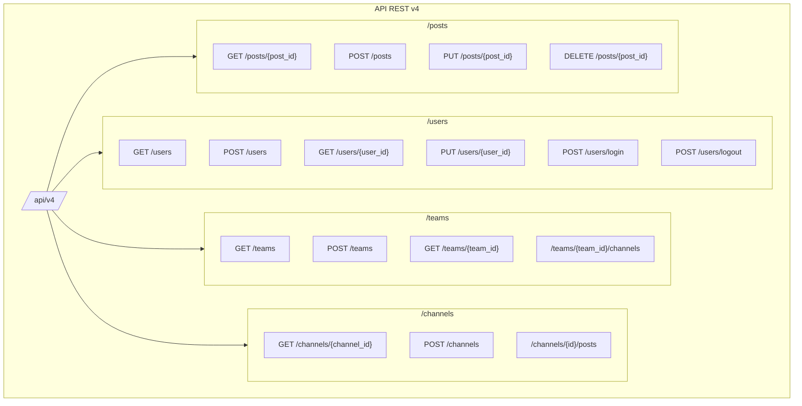
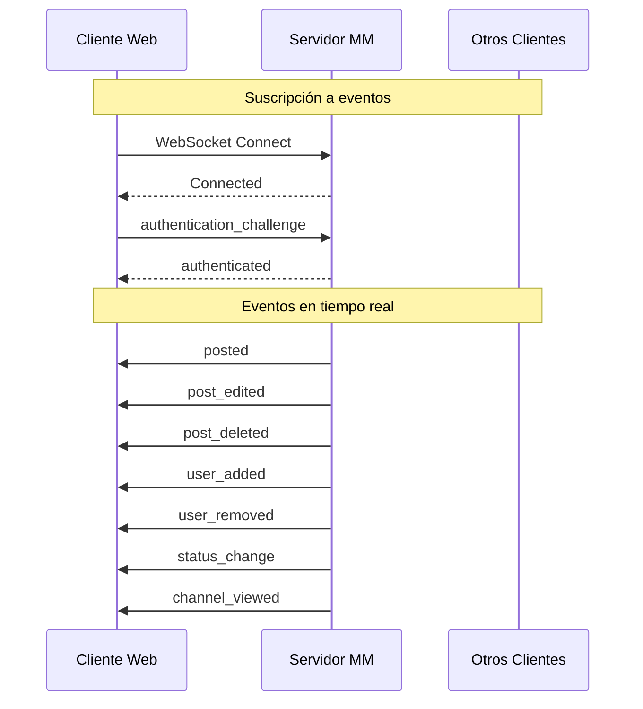

# 06 - APIs y WebSockets

## Visión General

Mattermost expone una API REST completa y un sistema de WebSockets para comunicación en tiempo real. Esta sección documenta todos los endpoints, autenticación, eventos y protocolos de comunicación.

---

## API REST v4

### Base URL

```
https://mattermost.ejemplo.com/api/v4
```

### Estructura de Endpoints



---

## Autenticación

### Métodos de Autenticación

| Método | Endpoint | Descripción |
|--------|----------|-------------|
| **Session Token** | Header `Authorization: Bearer {token}` | Token de sesión obtenido al hacer login |
| **OAuth 2.0** | `/oauth/authorize` | Autenticación mediante OAuth |
| **Personal Access Token** | Header `Authorization: Bearer {pat}` | Token de acceso personal |

### Login

```http
POST /api/v4/users/login
Content-Type: application/json

{
    "login_id": "usuario@ejemplo.com",
    "password": "contraseña123",
    "device_id": "optional-device-id"
}
```

**Respuesta exitosa (200 OK):**
```http
Set-Cookie: MMAUTHTOKEN=abc123; Path=/; Expires=...
Token: abc123

{
    "id": "user_id_26_chars",
    "username": "usuario",
    "email": "usuario@ejemplo.com",
    "roles": "system_user",
    ...
}
```

### Uso del Token

```http
GET /api/v4/users/me
Authorization: Bearer abc123
X-Requested-With: XMLHttpRequest
```

---

## Endpoints Principales

### Users

| Método | Endpoint | Descripción |
|--------|----------|-------------|
| `POST` | `/users` | Crear usuario |
| `GET` | `/users` | Listar usuarios (paginado) |
| `GET` | `/users/{user_id}` | Obtener usuario |
| `PUT` | `/users/{user_id}` | Actualizar usuario |
| `DELETE` | `/users/{user_id}` | Desactivar usuario |
| `POST` | `/users/login` | Iniciar sesión |
| `POST` | `/users/logout` | Cerrar sesión |
| `GET` | `/users/me` | Obtener usuario actual |
| `GET` | `/users/me/teams` | Equipos del usuario |
| `GET` | `/users/me/channels` | Canales del usuario |

**Ejemplo: Crear usuario**
```http
POST /api/v4/users
Content-Type: application/json

{
    "email": "nuevo@ejemplo.com",
    "username": "nuevousuario",
    "password": "contraseñaSegura123",
    "first_name": "Nuevo",
    "last_name": "Usuario"
}
```

### Teams

| Método | Endpoint | Descripción |
|--------|----------|-------------|
| `POST` | `/teams` | Crear equipo |
| `GET` | `/teams` | Listar equipos |
| `GET` | `/teams/{team_id}` | Obtener equipo |
| `PUT` | `/teams/{team_id}` | Actualizar equipo |
| `DELETE` | `/teams/{team_id}` | Archivar equipo |
| `POST` | `/teams/{team_id}/members` | Agregar miembro |
| `GET` | `/teams/{team_id}/channels` | Canales del equipo |
| `POST` | `/teams/{team_id}/invite/email` | Invitar por email |

### Channels

| Método | Endpoint | Descripción |
|--------|----------|-------------|
| `POST` | `/channels` | Crear canal |
| `GET` | `/channels/{channel_id}` | Obtener canal |
| `PUT` | `/channels/{channel_id}` | Actualizar canal |
| `DELETE` | `/channels/{channel_id}` | Archivar canal |
| `POST` | `/channels/{channel_id}/members` | Unirse al canal |
| `GET` | `/channels/{channel_id}/posts` | Posts del canal |
| `GET` | `/channels/{channel_id}/members` | Miembros del canal |

**Ejemplo: Crear canal**
```http
POST /api/v4/channels
Authorization: Bearer {token}
Content-Type: application/json

{
    "team_id": "team_id_26_chars",
    "name": "nuevo-canal",
    "display_name": "Nuevo Canal",
    "type": "O",  // O=Open, P=Private
    "purpose": "Descripción del canal",
    "header": "Encabezado del canal"
}
```

### Posts

| Método | Endpoint | Descripción |
|--------|----------|-------------|
| `POST` | `/posts` | Crear post |
| `GET` | `/posts/{post_id}` | Obtener post |
| `PUT` | `/posts/{post_id}` | Actualizar post |
| `DELETE` | `/posts/{post_id}` | Eliminar post |
| `GET` | `/channels/{channel_id}/posts` | Posts por canal |
| `POST` | `/posts/{post_id}/reactions` | Agregar reacción |
| `GET` | `/posts/{post_id}/reactions` | Listar reacciones |
| `GET` | `/posts/{post_id}/thread` | Hilo del post |

**Ejemplo: Crear post**
```http
POST /api/v4/posts
Authorization: Bearer {token}
Content-Type: application/json

{
    "channel_id": "channel_id_26_chars",
    "message": "¡Hola, equipo! 👋",
    "file_ids": ["file_id_1", "file_id_2"],
    "root_id": ""  // Para respuestas en hilos
}
```

**Respuesta:**
```json
{
    "id": "post_id_26_chars",
    "create_at": 1704067200000,
    "update_at": 1704067200000,
    "edit_at": 0,
    "delete_at": 0,
    "user_id": "user_id_26_chars",
    "channel_id": "channel_id_26_chars",
    "root_id": "",
    "original_id": "",
    "message": "¡Hola, equipo! 👋",
    "type": "",
    "props": {},
    "hashtags": "",
    "pending_post_id": "",
    "reply_count": 0,
    "last_reply_at": 0,
    "participants": null
}
```

### Files

| Método | Endpoint | Descripción |
|--------|----------|-------------|
| `POST` | `/files` | Subir archivo |
| `GET` | `/files/{file_id}` | Obtener información |
| `GET` | `/files/{file_id}/link` | URL temporal |
| `GET` | `/files/{file_id}/preview` | Vista previa |
| `GET` | `/files/{file_id}/thumbnail` | Miniatura |

**Subir archivo:**
```http
POST /api/v4/files?channel_id={channel_id}
Authorization: Bearer {token}
Content-Type: multipart/form-data

--boundary
Content-Disposition: form-data; name="files"; filename="imagen.png"
Content-Type: image/png

[binary data]
--boundary--
```

---

## Paginación

La API utiliza paginación basada en cursor para la mayoría de endpoints de listado:

| Parámetro | Tipo | Descripción |
|-----------|------|-------------|
| `page` | integer | Número de página (0-based) |
| `per_page` | integer | Elementos por página (max 200, default 60) |

**Ejemplo:**
```http
GET /api/v4/channels/{channel_id}/posts?page=0&per_page=30
```

### Paginación de Posts

Para posts, se usa paginación basada en timestamp:

```http
GET /api/v4/channels/{channel_id}/posts?since={timestamp}
GET /api/v4/channels/{channel_id}/posts?before={post_id}&per_page=30
GET /api/v4/channels/{channel_id}/posts?after={post_id}&per_page=30
```

---

## WebSocket API

### Conexión

```javascript
const ws = new WebSocket('wss://mattermost.ejemplo.com/api/v4/websocket');

ws.onopen = () => {
    // Autenticar
    ws.send(JSON.stringify({
        seq: 1,
        action: 'authentication_challenge',
        data: {
            token: 'tu_token_de_sesion'
        }
    }));
};

ws.onmessage = (event) => {
    const message = JSON.parse(event.data);
    console.log('Evento recibido:', message);
};
```

### Mensajes del Cliente al Servidor

#### Autenticación
```json
{
    "seq": 1,
    "action": "authentication_challenge",
    "data": {
        "token": "session_token_here"
    }
}
```

#### Cambio de Canal
```json
{
    "seq": 2,
    "action": "user_channel_join",
    "data": {
        "channel_id": "channel_id_here"
    }
}
```

#### Typing Indicator
```json
{
    "seq": 3,
    "action": "user_typing",
    "data": {
        "channel_id": "channel_id_here",
        "parent_id": ""  // Para respuestas en hilos
    }
}
```

#### Cambio de Estado
```json
{
    "seq": 4,
    "action": "update_status",
    "data": {
        "status": "online"  // online, away, dnd, offline
    }
}
```

### Eventos del Servidor al Cliente



#### Tipos de Eventos

| Evento | Descripción | Datos |
|--------|-------------|-------|
| `posted` | Nuevo mensaje | `channel_id`, `post`, `sender_name` |
| `post_edited` | Mensaje editado | `post`, `mentions` |
| `post_deleted` | Mensaje eliminado | `post_id`, `channel_id` |
| `user_added` | Usuario agregado a canal | `user_id`, `channel_id`, `team_id` |
| `user_removed` | Usuario removido | `user_id`, `channel_id`, `remover_id` |
| `user_updated` | Perfil actualizado | `user` |
| `status_change` | Cambio de estado | `user_id`, `status`, `manual` |
| `typing` | Usuario escribiendo | `user_id`, `parent_id` |
| `channel_created` | Canal creado | `channel_id`, `team_id` |
| `channel_deleted` | Canal eliminado | `channel_id` |
| `direct_added` | DM creado | `channel_id`, `creator_id` |
| `preference_changed` | Preferencia cambiada | `preference` |
| `reaction_added` | Reacción agregada | `reaction` |
| `reaction_removed` | Reacción removida | `reaction` |
| `hello` | Conexión establecida | `server_version`, `connection_id` |

#### Ejemplo: Evento de Nuevo Post

```json
{
    "event": "posted",
    "data": {
        "channel_display_name": "Desarrollo",
        "channel_name": "desarrollo",
        "channel_type": "O",
        "post": "{\"id\":\"post_id\",\"user_id\":\"user_id\",\"channel_id\":\"channel_id\",\"message\":\"Hola!\"}",
        "sender_name": "@usuario",
        "set_online": "true",
        "team_id": "team_id"
    },
    "broadcast": {
        "omit_users": null,
        "user_id": "",
        "channel_id": "channel_id",
        "team_id": "",
        "connection_id": "",
        "omit_connection_id": ""
    },
    "seq": 42
}
```

### Gestión de Reconexión

```javascript
class MattermostWebSocket {
    constructor(url, token) {
        this.url = url;
        this.token = token;
        this.ws = null;
        this.reconnectInterval = 3000;
        this.seq = 0;
    }

    connect() {
        this.ws = new WebSocket(this.url);
        
        this.ws.onopen = () => {
            console.log('WebSocket conectado');
            this.authenticate();
        };
        
        this.ws.onmessage = (event) => {
            const msg = JSON.parse(event.data);
            this.handleMessage(msg);
        };
        
        this.ws.onclose = () => {
            console.log('WebSocket cerrado, reconectando...');
            setTimeout(() => this.connect(), this.reconnectInterval);
        };
        
        this.ws.onerror = (error) => {
            console.error('WebSocket error:', error);
        };
    }

    authenticate() {
        this.send({
            action: 'authentication_challenge',
            data: { token: this.token }
        });
    }

    send(message) {
        this.seq++;
        this.ws.send(JSON.stringify({
            ...message,
            seq: this.seq
        }));
    }

    handleMessage(msg) {
        switch (msg.event) {
            case 'posted':
                this.onNewPost(JSON.parse(msg.data.post));
                break;
            case 'status_change':
                this.onStatusChange(msg.data);
                break;
            // ... más eventos
        }
    }
}
```

---

## Webhooks

### Incoming Webhooks

Permiten enviar mensajes desde sistemas externos a Mattermost.

#### Crear Webhook

```http
POST /api/v4/hooks/incoming
Authorization: Bearer {token}
Content-Type: application/json

{
    "channel_id": "channel_id",
    "display_name": "Webhook de CI/CD",
    "description": "Notificaciones de builds"
}
```

#### Usar Webhook

```http
POST /hooks/{webhook_id}
Content-Type: application/json

{
    "text": "¡Build exitoso! 🎉",
    "username": "CI Bot",
    "icon_url": "https://ejemplo.com/icon.png",
    "attachments": [
        {
            "color": "#36a64f",
            "title": "Build #123",
            "text": "Todos los tests pasaron",
            "fields": [
                {
                    "title": "Duración",
                    "value": "5 min 30 seg",
                    "short": true
                }
            ]
        }
    ]
}
```

### Outgoing Webhooks

Envían eventos de Mattermost a URLs externas.

```http
POST /api/v4/hooks/outgoing
Authorization: Bearer {token}
Content-Type: application/json

{
    "team_id": "team_id",
    "channel_id": "channel_id",
    "display_name": "Webhook Saliente",
    "trigger_words": ["!deploy", "!build"],
    "callback_urls": ["https://ejemplo.com/webhook"]
}
```

### Slash Commands

Comandos personalizados invocados con `/comando`.

**Request enviado a tu servidor:**
```http
POST https://tu-servidor.com/command
Content-Type: application/x-www-form-urlencoded

token=webhook_token
&team_id=team_id
&team_domain=ejemplo
&channel_id=channel_id
&channel_name=town-square
&user_id=user_id
&user_name=usuario
&command=/deploy
&text=production
&response_url=https://mattermost.ejemplo.com/hooks/...
```

**Respuestas posibles:**
```json
{
    "response_type": "in_channel",  // o "ephemeral"
    "text": "Iniciando deploy...",
    "attachments": [...]
}
```

---

## Especificación OpenAPI

Las especificaciones completas de la API están en formato OpenAPI (Swagger):

Ubicación: [`api/v4/source/`](api/v4/source/)

```yaml
# api/v4/source/posts.yaml
/posts:
  post:
    tags:
      - posts
    summary: Create a post
    description: |
      Create a new post in a channel.
    parameters:
      - in: body
        name: post
        schema:
          type: object
          required:
            - channel_id
            - message
          properties:
            channel_id:
              type: string
              description: The channel ID
            message:
              type: string
              description: The message contents
    responses:
      201:
        description: Post created successfully
        schema:
          $ref: '#/definitions/Post'
```

Generar documentación:
```bash
cd api/
make build
```

---

## Rate Limiting

### Headers de Rate Limit

```http
X-RateLimit-Limit: 100
X-RateLimit-Remaining: 99
X-RateLimit-Reset: 1704067200
```

### Códigos de Error

| Código | Descripción |
|--------|-------------|
| `400` | Bad Request - Parámetros inválidos |
| `401` | Unauthorized - Autenticación requerida |
| `403` | Forbidden - Sin permisos |
| `404` | Not Found - Recurso no existe |
| `429` | Too Many Requests - Rate limit excedido |
| `500` | Internal Server Error |
| `501` | Not Implemented - Feature no disponible |

### Formato de Error

```json
{
    "id": "api.context.permissions.app_error",
    "message": "No tienes permisos para realizar esta acción",
    "detailed_error": "",
    "request_id": "abc123",
    "status_code": 403
}
```

---

## SDKs y Clientes

### Cliente Go

```go
import "github.com/mattermost/mattermost/server/public/model"

client := model.NewAPIv4Client("https://mattermost.ejemplo.com")
client.Login("usuario@ejemplo.com", "contraseña")

post := &model.Post{
    ChannelId: channelId,
    Message:   "Hola desde Go!",
}
created, _, err := client.CreatePost(post)
```

### Cliente JavaScript

```javascript
import { Client4 } from '@mattermost/client';

const client = new Client4();
client.setUrl('https://mattermost.ejemplo.com');
await client.login('usuario@ejemplo.com', 'contraseña');

const post = await client.createPost({
    channel_id: channelId,
    message: 'Hola desde JS!'
});
```

---

## Próximos Pasos

Para continuar:

1. **[Autenticación y Seguridad](07-Autenticacion_y_Seguridad.md)** - Mecanismos de seguridad
2. **[Flujos de Negocio](08-Flujos_de_Negocio.md)** - Flujos que usan estas APIs
3. **[Sistema de Plugins](11-Sistema_de_Plugins.md)** - APIs para plugins

---

*Documentación basada en Mattermost API v4*
