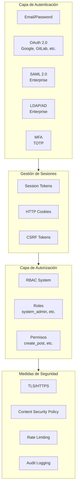
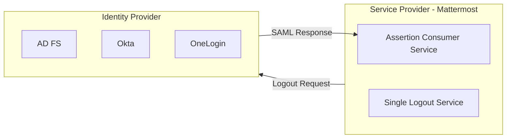
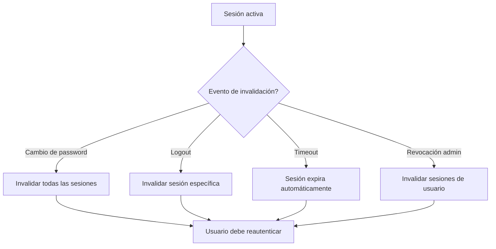
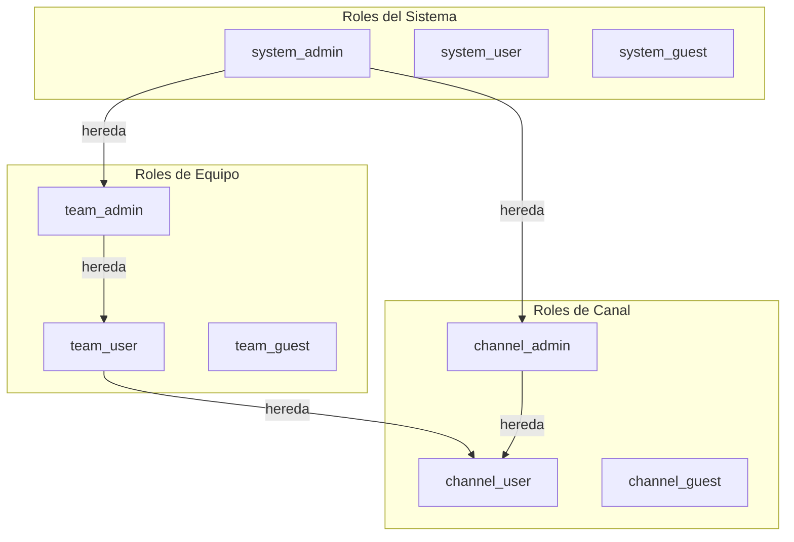

# 07 - Autenticación y Seguridad

## Visión General

Mattermost implementa un sistema de seguridad robusto que incluye múltiples métodos de autenticación, autorización basada en roles (RBAC), cifrado y protección contra ataques comunes.

---

## Arquitectura de Seguridad



---

## Métodos de Autenticación

### 1. Email y Contraseña

#### Hashing de Contraseñas

Mattermost utiliza **bcrypt** con costo adaptativo para el hashing de contraseñas:

```go
// public/model/user.go
import "golang.org/x/crypto/bcrypt"

const BcryptCost = 10  // Costo computacional

func HashPassword(password string) string {
    hash, err := bcrypt.GenerateFromPassword([]byte(password), BcryptCost)
    if err != nil {
        panic(err)
    }
    return string(hash)
}

func ComparePassword(hash, password string) bool {
    err := bcrypt.CompareHashAndPassword([]byte(hash), []byte(password))
    return err == nil
}
```

**Características:**
- Salt automático por contraseña
- Costo configurable (default: 10)
- Resistente a ataques de fuerza bruta
- Compatible con estándares de la industria

#### Políticas de Contraseña

```json
{
    "PasswordSettings": {
        "MinimumLength": 10,
        "Lowercase": true,
        "Number": true,
        "Uppercase": true,
        "Symbol": true
    }
}
```

---

### 2. Autenticación Multifactor (MFA)

#### TOTP (Time-based One-Time Password)

```mermaid
sequenceDiagram
    participant User as Usuario
    cliente as Cliente
    servidor as Servidor
    
    User->>cliente: Activar MFA
    cliente->>servidor: POST /users/{id}/mfa
    servidor->>servidor: Generar secreto TOTP
    servidor->>cliente: Retornar secret + QR
    cliente->>User: Mostrar QR
    User->>App: Escanear QR en app TOTP
    User->>cliente: Ingresar código TOTP
    cliente->>servidor: Verificar código
    servidor->>servidor: Validar TOTP
    servidor-->>cliente: MFA activado
```

**Implementación:**

```go
// Autenticación con MFA
func (a *App) AuthenticateUserForLogin(
    id,
    loginId,
    password,
    mfaToken string,
    ldapOnly bool,
) (*model.User, *model.AppError) {
    
    // 1. Autenticar contraseña
    user, err := a.GetUserForLogin(id, loginId)
    if err != nil {
        return nil, err
    }
    
    if !CheckPasswordHash(password, user.Password) {
        return nil, model.NewAppError("login", "api.user.login.invalid_credentials", ...)
    }
    
    // 2. Verificar MFA si está activo
    if user.MfaActive {
        if mfaToken == "" {
            return nil, model.NewAppError("login", "api.user.login.mfa_required", ...)
        }
        
        ok, err := a.CheckMFA(user, mfaToken)
        if err != nil || !ok {
            return nil, model.NewAppError("login", "api.user.login.invalid_mfa_token", ...)
        }
    }
    
    return user, nil
}
```

---

### 3. OAuth 2.0

#### Proveedores Soportados

| Proveedor | Configuración |
|-----------|---------------|
| GitLab | `GitLabSettings` |
| Google | `GoogleSettings` |
| Office365 | `Office365Settings` |
| OpenID Connect | `OpenIdSettings` |

#### Flujo OAuth

```mermaid
sequenceDiagram
    participant User as Usuario
    participant MM as Mattermost
    proveedor as Proveedor OAuth
    
    User->>MM: Click "Login con Google"
    MM->>MM: Generar state token
    MM->>proveedor: Redirect /authorize
    proveedor->>User: Login en proveedor
    User->>proveedor: Autorizar aplicación
    proveedor->>MM: Callback + code
    MM->>proveedor: POST /token
    proveedor-->>MM: Access token
    MM->>proveedor: GET /userinfo
    proveedor-->>MM: Datos del usuario
    MM->>MM: Crear/actualizar usuario
    MM-->>User: Session token
```

---

### 4. SAML 2.0 (Enterprise)



**Configuración:**

```json
{
    "SamlSettings": {
        "Enable": true,
        "Verify": true,
        "Encrypt": false,
        "IdpURL": "https://idp.ejemplo.com/saml/sso",
        "IdpDescriptorURL": "https://idp.ejemplo.com/",
        "AssertionConsumerServiceURL": "https://mattermost.ejemplo.com/login/sso/saml",
        "IdpCertificateFile": "",
        "PrivateKeyFile": "",
        "PublicCertificateFile": "",
        "FirstNameAttribute": "firstName",
        "LastNameAttribute": "lastName",
        "EmailAttribute": "email",
        "UsernameAttribute": "username",
        "LocaleAttribute": "",
        "NicknameAttribute": ""
    }
}
```

---

### 5. LDAP/Active Directory (Enterprise)

```mermaid
sequenceDiagram
    cliente as Cliente
    servidor as Servidor MM
    ldap as Servidor LDAP/AD
    
    cliente->>servidor: Login con credenciales LDAP
    servidor->>servidor: Buscar usuario en BD local
    servidor->>ldap: Bind + Search
    ldap-->>servidor: User DN
    servidor->>ldap: Bind como usuario (autenticación)
    ldap-->>servidor: Autenticación exitosa
    servidor->>servidor: Sincronizar atributos
    servidor-->>cliente: Session token
```

**Atributos sincronizables:**

| Atributo LDAP | Campo Mattermost |
|---------------|------------------|
| `uid` / `sAMAccountName` | Username |
| `mail` | Email |
| `givenName` | FirstName |
| `sn` | LastName |
| `displayName` | Nickname |

---

## Gestión de Sesiones

### Estructura de Sesión

```sql
CREATE TABLE Sessions (
    Id VARCHAR(26) PRIMARY KEY,
    Token VARCHAR(26) NOT NULL UNIQUE,
    CreateAt BIGINT NOT NULL,
    ExpiresAt BIGINT NOT NULL,
    LastActivityAt BIGINT NOT NULL,
    UserId VARCHAR(26) NOT NULL,
    DeviceId TEXT,
    Roles VARCHAR(256),
    IsOAuth TINYINT(1) DEFAULT 0,
    Props JSON,
    
    INDEX idx_sessions_token (Token),
    INDEX idx_sessions_user_id (UserId),
    INDEX idx_sessions_expires_at (ExpiresAt)
);
```

### Políticas de Sesión

```json
{
    "ServiceSettings": {
        "SessionLengthWebInDays": 30,
        "SessionLengthMobileInDays": 30,
        "SessionLengthSSOInDays": 30,
        "SessionCacheInMinutes": 10,
        "ExtendSessionLengthWithActivity": true
    }
}
```

### Invalidación de Sesiones



---

## Autorización (RBAC)

### Jerarquía de Roles



### Sistema de Permisos

**Definición de permisos:**

```go
// public/model/permission.go
var PermissionCreatePost = &Permission{
    Id:          "create_post",
    Name:        "Create Post",
    Description: "Ability to create posts",
    Scope:       PermissionScopeChannel,
}

var PermissionManageTeam = &Permission{
    Id:          "manage_team",
    Name:        "Manage Team",
    Description: "Ability to manage team settings",
    Scope:       PermissionScopeTeam,
}

var PermissionManageSystem = &Permission{
    Id:          "manage_system",
    Name:        "Manage System",
    Description: "Ability to manage system settings",
    Scope:       PermissionScopeSystem,
}
```

**Scopes de permisos:**

| Scope | Descripción | Ejemplos |
|-------|-------------|----------|
| `system` | Todo el sistema | `manage_system`, `manage_roles` |
| `team` | Dentro de un equipo | `manage_team`, `add_user_to_team` |
| `channel` | Dentro de un canal | `create_post`, `manage_channel` |

### Verificación de Permisos

```go
// Verificar permiso en handler
func createPost(c *Context, w http.ResponseWriter, r *http.Request) {
    // Verificar permiso de crear post en el canal
    if !c.App.SessionHasPermissionToChannel(
        c.AppContext,
        c.AppContext.Session(),
        channelId,
        model.PermissionCreatePost,
    ) {
        c.SetPermissionError(model.PermissionCreatePost)
        return
    }
    
    // Continuar con la creación...
}
```

### Permisos por Rol

| Rol | Permisos Principales |
|-----|----------------------|
| **system_admin** | Todos los permisos (`manage_system`) |
| **system_user** | Crear equipos, unirse a equipos públicos |
| **team_admin** | Gestionar equipo, miembros, canales |
| **team_user** | Crear canales, posts, invitar usuarios |
| **channel_admin** | Gestionar canal, miembros, permisos |
| **channel_user** | Crear posts, reacciones, subir archivos |
| **guest** | Acceso limitado solo a canales asignados |

---

## Seguridad de la Aplicación

### CSRF Protection

Mattermost implementa protección CSRF mediante tokens:

```javascript
// Extracción del token de la cookie
function setCSRFFromCookie() {
    const csrftoken = getCookie('MMCSRF');
    if (csrftoken) {
        window.localStorage.setItem('csrf', csrftoken);
    }
}

// Envío del token en headers
fetch('/api/v4/users', {
    method: 'POST',
    headers: {
        'X-CSRF-Token': localStorage.getItem('csrf'),
        'Content-Type': 'application/json',
    },
    body: JSON.stringify(data),
});
```

### Content Security Policy (CSP)

```http
Content-Security-Policy: 
    default-src 'self';
    script-src 'self' cdn.rudderlabs.com;
    style-src 'self' 'unsafe-inline';
    img-src 'self' data: blob:;
    connect-src 'self' api.github.com;
    font-src 'self' fonts.gstatic.com;
    media-src 'self';
    object-src 'none';
    frame-ancestors 'self';
    base-uri 'self';
    form-action 'self';
```

### Headers de Seguridad

```http
# Strict Transport Security
Strict-Transport-Security: max-age=63072000; includeSubDomains; preload

# XSS Protection
X-XSS-Protection: 1; mode=block

# Content Type Options
X-Content-Type-Options: nosniff

# Referrer Policy
Referrer-Policy: no-referrer

# Frame Options
X-Frame-Options: SAMEORIGIN
```

---

## Cifrado

### Cifrado en Tránsito

- **TLS 1.2+** para todas las conexiones HTTPS
- **WSS** (WebSocket Secure) para comunicación en tiempo real
- Certificados configurables en [`ServiceSettings`](server/config/config.go)

### Cifrado en Reposo

#### Contraseñas
- bcrypt con costo 10 (adaptativo)
- Salt único por contraseña

#### Tokens de Sesión
- Tokens aleatorios de 26 caracteres
- No contienen información sensible

#### Archivos (Enterprise)
- Soporte para cifrado de archivos en almacenamiento
- Claves gestionadas por el administrador

---

## Auditoría y Logging

### Registro de Auditoría

```go
// Crear registro de auditoría
func (a *App) CreatePost(c request.CTX, post *model.Post) (*model.Post, error) {
    // ... lógica de negocio
    
    // Registrar acción
    auditRec := a.MakeAuditRecord("createPost", audit.Fail)
    defer a.LogAuditRecWithLevel(auditRec, appLvl, clientLvl)
    auditRec.AddEventParameter("post", post)
    auditRec.AddEventParameter("channel_id", post.ChannelId)
    auditRec.AddEventParameter("user_id", post.UserId)
    
    // Si tiene éxito
    auditRec.Success()
    
    return post, nil
}
```

### Eventos Auditados

| Categoría | Eventos |
|-----------|---------|
| **Autenticación** | login, logout, mfa_enabled, password_changed |
| **Usuarios** | user_created, user_updated, user_deleted |
| **Equipos** | team_created, team_deleted, member_added |
| **Canales** | channel_created, channel_deleted, member_removed |
| **Posts** | post_created, post_deleted, post_edited |
| **Permisos** | role_created, permission_changed |

---

## Rate Limiting

### Configuración

```json
{
    "RateLimitSettings": {
        "Enable": true,
        "PerSec": 10,
        "MaxBurst": 100,
        "MemoryStoreSize": 10000,
        "VaryByRemoteAddr": true,
        "VaryByUser": false,
        "VaryByHeader": ""
    }
}
```

### Implementación

```go
// Middleware de rate limiting
func (api *API) rateLimiterHandler(next http.Handler) http.Handler {
    return http.HandlerFunc(func(w http.ResponseWriter, r *http.Request) {
        limiter := api.srv.RateLimiter
        
        if limiter != nil {
            limiterID := getLimiterID(r)
            
            // Verificar rate limit
            allowed, context, err := limiter.RateLimit(limitID, limiterID)
            if err != nil {
                http.Error(w, err.Error(), http.StatusInternalServerError)
                return
            }
            
            // Headers informativos
            w.Header().Set("X-RateLimit-Limit", strconv.Itoa(context.Limit))
            w.Header().Set("X-RateLimit-Remaining", strconv.Itoa(context.Remaining))
            w.Header().Set("X-RateLimit-Reset", strconv.Itoa(context.ResetTime))
            
            if !allowed {
                http.Error(w, "Rate limit exceeded", http.StatusTooManyRequests)
                return
            }
        }
        
        next.ServeHTTP(w, r)
    })
}
```

---

## Seguridad de Archivos

### Validación de Archivos

```go
func (a *App) UploadFile(
    c request.CTX,
    data []byte,
    channelId string,
    filename string,
) (*model.FileInfo, *model.AppError) {
    
    // 1. Verificar extensión permitida
    if !a.IsFileExtAllowed(filepath.Ext(filename)) {
        return nil, model.NewAppError("uploadFile", 
            "api.file.upload_file.extension.app_error", nil, "", http.StatusBadRequest)
    }
    
    // 2. Verificar tamaño máximo
    maxFileSize := *a.Config().FileSettings.MaxFileSize
    if int64(len(data)) > maxFileSize {
        return nil, model.NewAppError("uploadFile",
            "api.file.upload_file.too_large.app_error", nil, "", http.StatusRequestEntityTooLarge)
    }
    
    // 3. Detectar tipo MIME real
    mimeType := http.DetectContentType(data)
    
    // 4. Verificar contra tipos permitidos
    if !a.IsMimeTypeAllowed(mimeType) {
        return nil, model.NewAppError("uploadFile",
            "api.file.upload_file.mimetype.app_error", nil, "", http.StatusBadRequest)
    }
    
    // 5. Continuar con upload...
}
```

### Tipos de Archivo Permitidos

```json
{
    "FileSettings": {
        "EnableFileAttachments": true,
        "MaxFileSize": 52428800,
        "AllowFileExtensions": [],
        "RestrictFileExtensions": [".exe",".bat",".sh"]
    }
}
```

---

## Próximos Pasos

Para continuar:

1. **[Flujos de Negocio](08-Flujos_de_Negocio.md)** - Flujos que implementan seguridad
2. **[Infraestructura y Despliegue](09-Infraestructura_y_Despliegue.md)** - Seguridad de infraestructura
3. **[Guía de Desarrollo](10-Guia_de_Desarrollo.md)** - Mejores prácticas de seguridad

---

*Documentación basada en Mattermost v8.x*
