# 08 - Flujos de Negocio Principales

## Visión General

Esta sección describe los flujos de negocio más importantes de Mattermost, incluyendo diagramas de secuencia, estados y procesos clave.

---

## 1. Registro de Usuario

### Diagrama de Secuencia

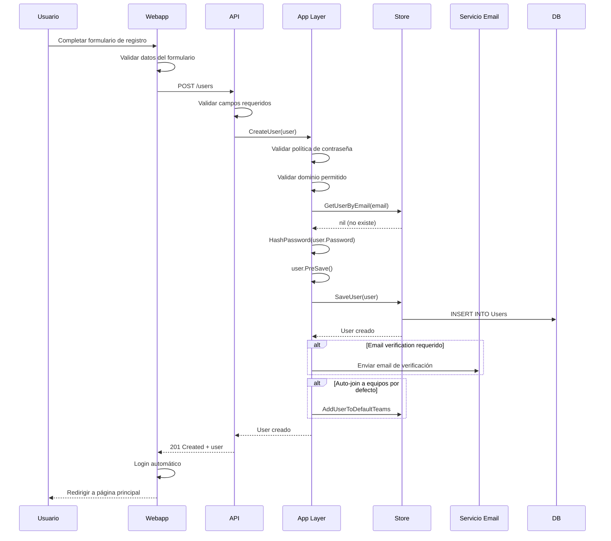

### Estados del Usuario

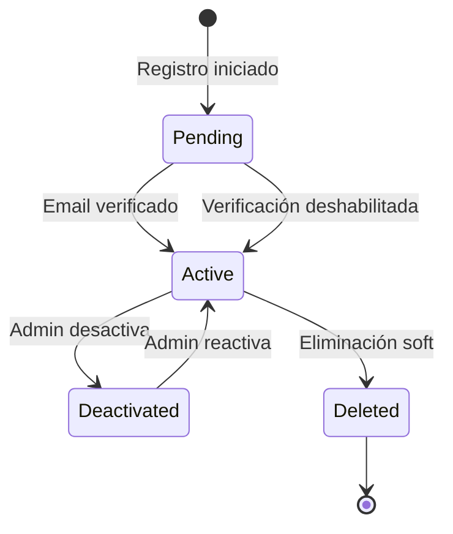

---

## 2. Envío de Mensaje (Post)

### Diagrama de Secuencia Completo

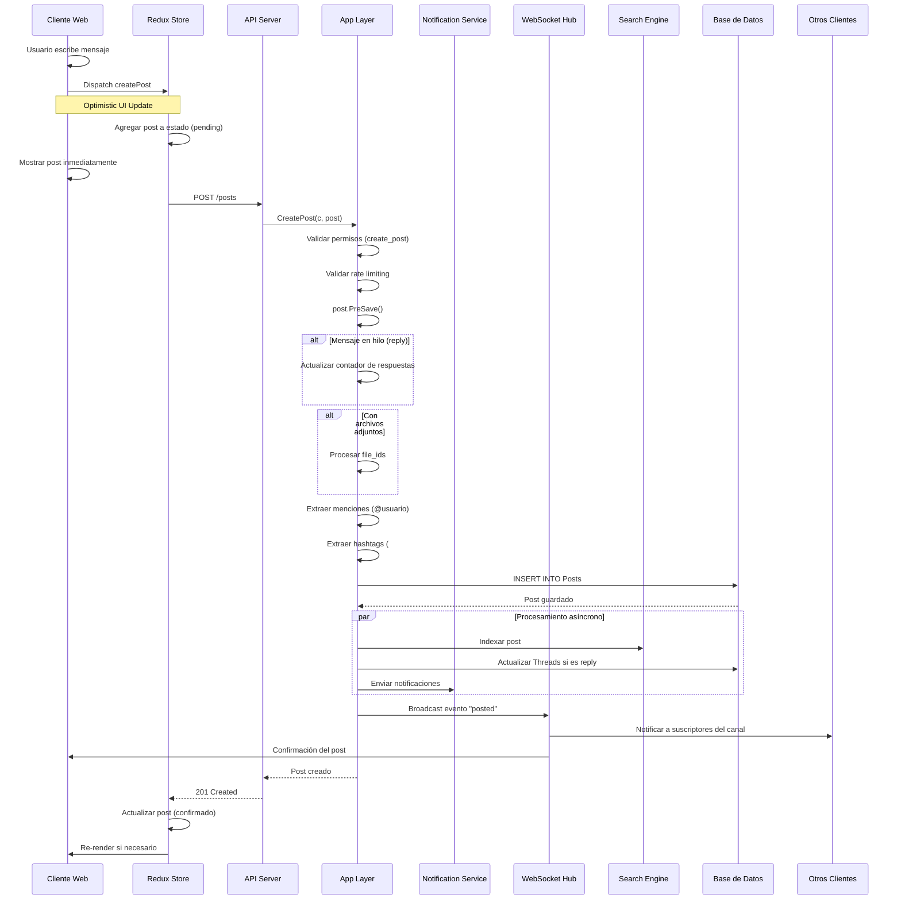

### Ciclo de Vida de un Post

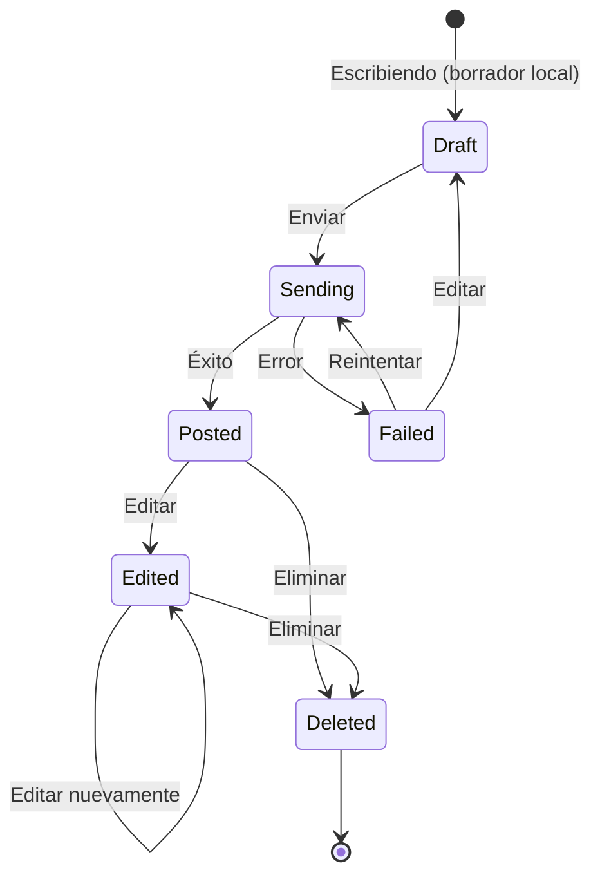

### Procesamiento de Menciones

```go
// Lógica simplificada
func (a *App) parseMentions(text string, channel *model.Channel) []string {
    mentions := []string{}
    
    // Extraer @username
    pattern := `@([a-z0-9_\-.]+)`
    re := regexp.MustCompile(pattern)
    matches := re.FindAllStringSubmatch(text, -1)
    
    for _, match := range matches {
        username := match[1]
        
        // Verificar si usuario existe en canal
        if user, _ := a.GetUserByUsername(username); user != nil {
            mentions = append(mentions, user.Id)
        }
    }
    
    // Menciones especiales: @channel, @here, @all
    if strings.Contains(text, "@channel") || strings.Contains(text, "@all") {
        // Notificar a todos los miembros del canal
    }
    
    if strings.Contains(text, "@here") {
        // Notificar solo a usuarios online
    }
    
    return mentions
}
```

---

## 3. Sistema de Notificaciones

### Arquitectura de Notificaciones

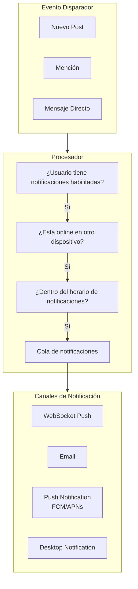

### Flujo de Notificación por Email

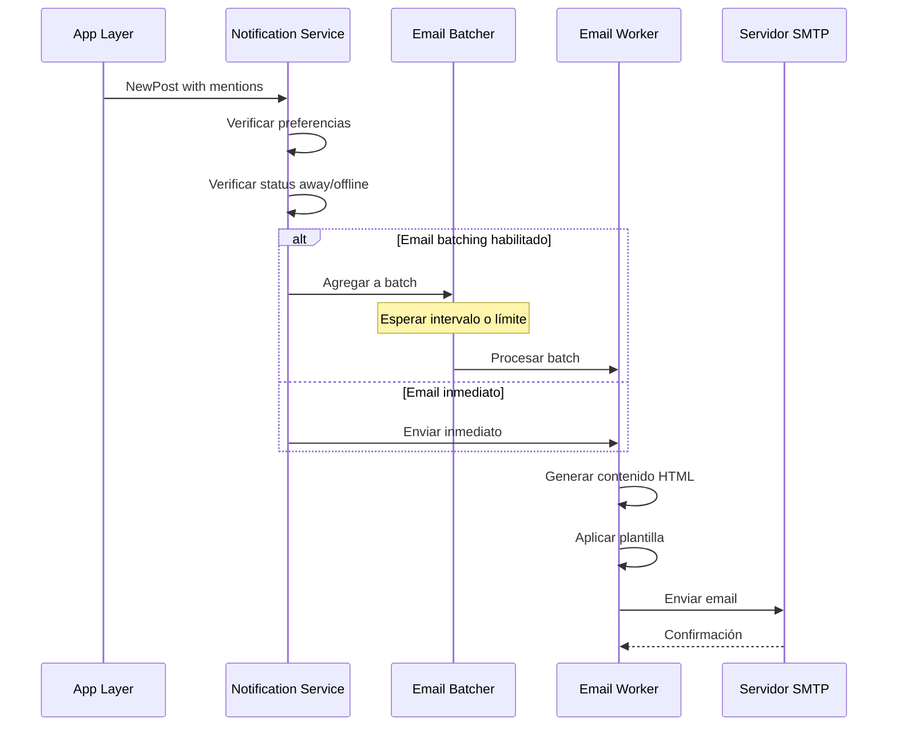

### Preferencias de Notificación

```json
{
    "notify_props": {
        "desktop": "mention",        // all, mention, none
        "desktop_sound": "true",     // true, false
        "email": "true",             // true, false
        "push": "mention",           // all, mention, none
        "push_status": "away",       // online, away, offline
        "comments": "any",           // never, root, any
        "mention_keys": "@usuario,usuario",
        "channel": "true",           // true, false
        "first_name": "false"        // true, false
    }
}
```

---

## 4. Creación de Canal

### Diagrama de Secuencia

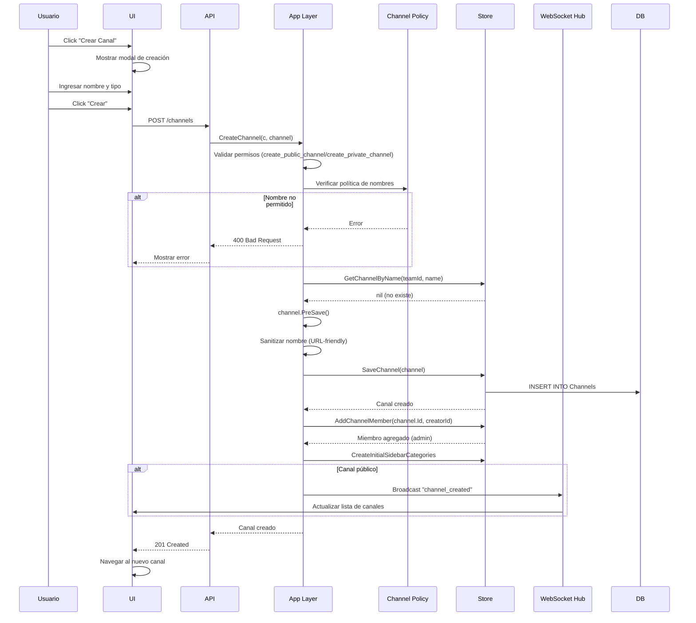

### Tipos de Canales y Creación

| Tipo | Permiso Requerido | Visibilidad |
|------|-------------------|-------------|
| **Público** | `create_public_channel` | Todos en el equipo |
| **Privado** | `create_private_channel` | Solo miembros invitados |
| **Directo** | Auto-creado | 2 usuarios específicos |
| **Grupal** | Auto-creado | 3-8 usuarios específicos |

---

## 5. Subida de Archivos

### Flujo de Subida

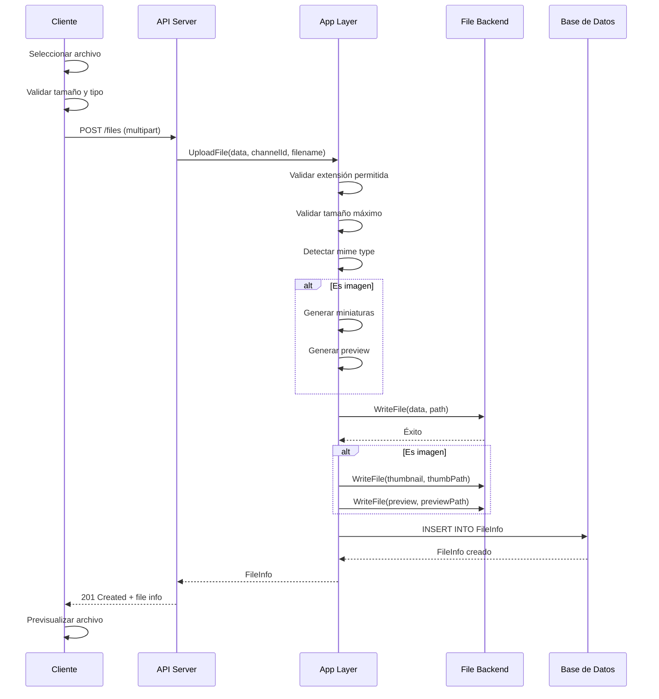

### Almacenamiento de Archivos

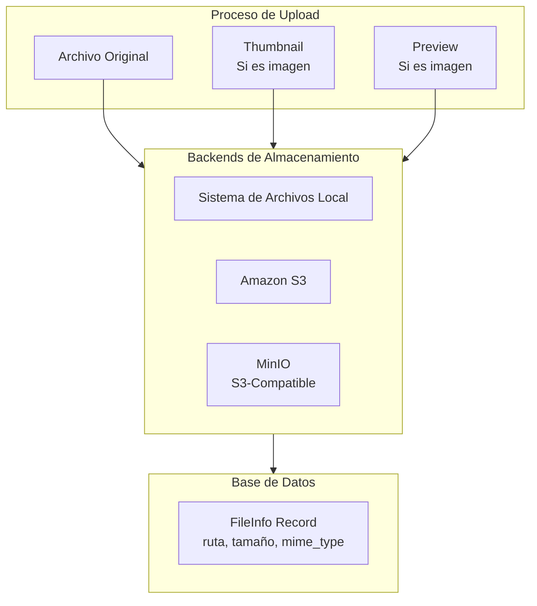

---

## 6. Búsqueda de Contenido

### Flujo de Búsqueda

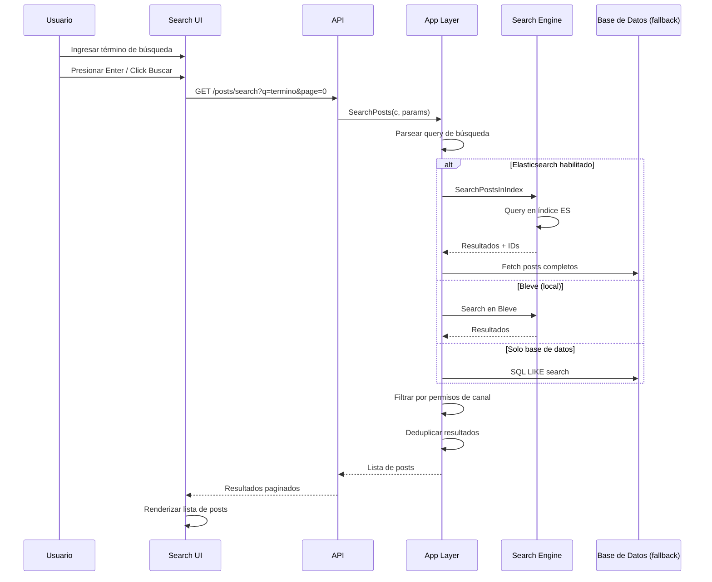

### Operadores de Búsqueda

| Operador | Ejemplo | Descripción |
|----------|---------|-------------|
| `from:` | `from:john` | Posts de usuario específico |
| `in:` | `in:desarrollo` | Posts en canal específico |
| `on:` | `on:2024-01-15` | Posts en fecha específica |
| `before:` | `before:2024-01-01` | Posts antes de fecha |
| `after:` | `after:2024-01-01` | Posts después de fecha |
| `""` | `"exact phrase"` | Búsqueda exacta |
| `*` | `proj*` | Comodín (wildcard) |

---

## 7. Sistema de Hilos (Threads)

### Flujo de Respuesta en Hilo

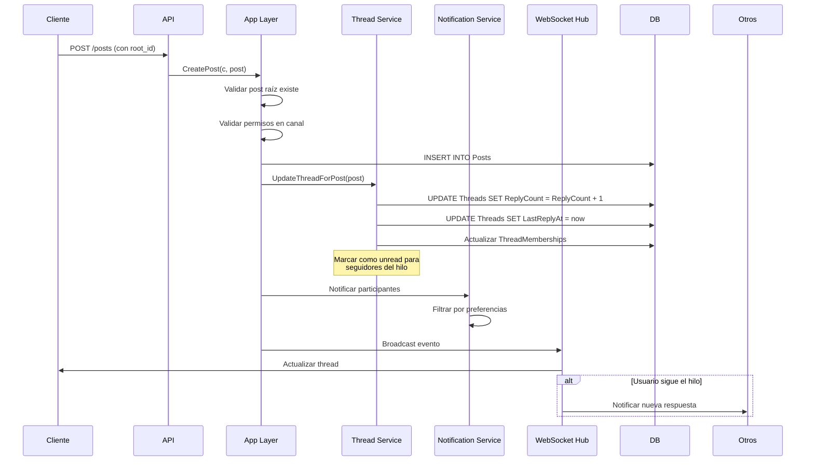

### Estados de Seguimiento de Hilo

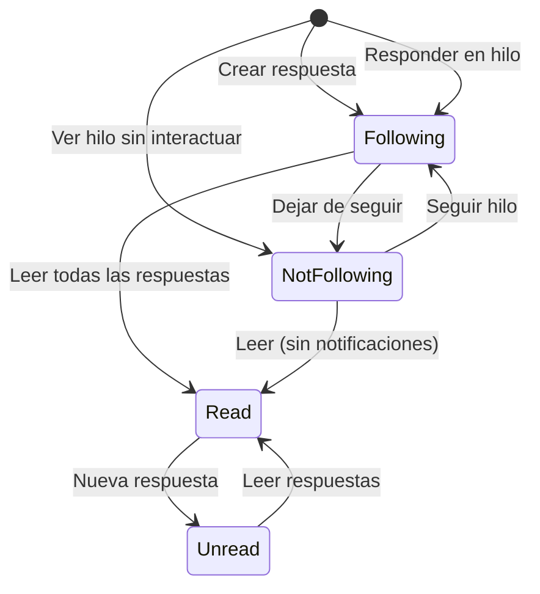

---

## 8. Invitación de Usuarios

### Flujo de Invitación

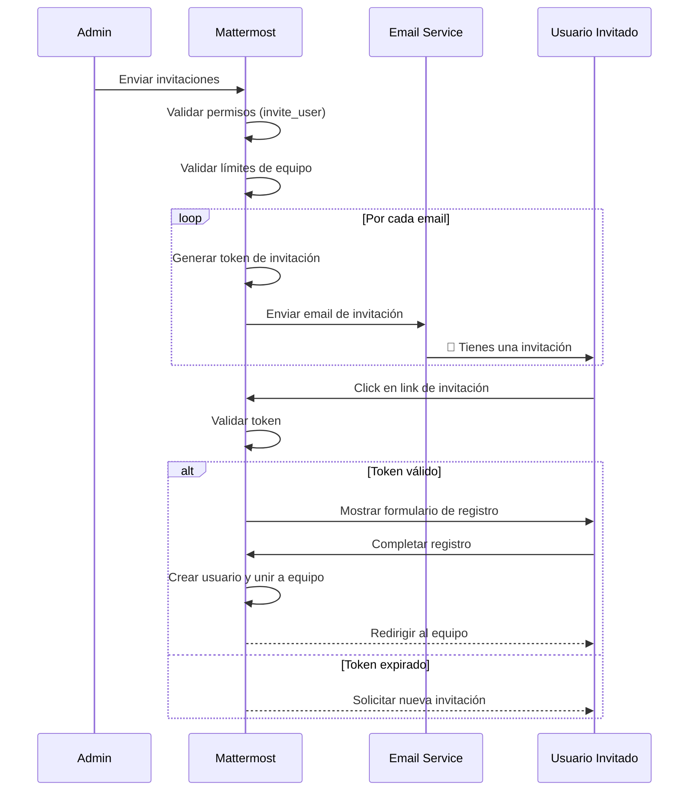

---

## Resumen de Flujos

| Flujo | Complejidad | Componentes Principales |
|-------|-------------|-------------------------|
| **Registro** | Media | Users, Email, Teams |
| **Post** | Alta | Posts, WebSocket, Notifications, Search |
| **Notificaciones** | Alta | Users, Channels, Email, Push |
| **Canal** | Media | Channels, Permissions, WebSocket |
| **Archivos** | Media | FileInfo, FileBackend, Previews |
| **Búsqueda** | Alta | Search Engine, Posts, Permissions |
| **Hilos** | Alta | Posts, Threads, WebSocket |
| **Invitaciones** | Media | Tokens, Email, Users |

---

## Próximos Pasos

Para continuar:

1. **[Infraestructura y Despliegue](09-Infraestructura_y_Despliegue.md)** - Soporte para estos flujos
2. **[Sistema de Plugins](11-Sistema_de_Plugins.md)** - Extensión de flujos
3. **[Guía de Desarrollo](10-Guia_de_Desarrollo.md)** - Implementar nuevos flujos

---

*Documentación basada en Mattermost v8.x*
