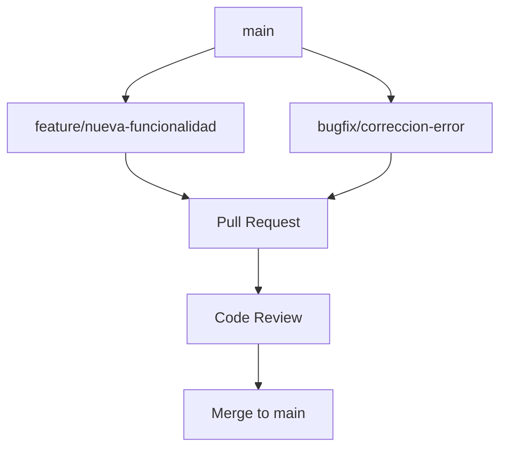

# 10 - Guía de Desarrollo

## Visión General

Esta guía proporciona instrucciones paso a paso para configurar el entorno de desarrollo de Mattermost, compilar el proyecto, ejecutar pruebas y contribuir al código.

---

## Requisitos del Sistema

### Hardware Recomendado

| Componente | Mínimo | Recomendado |
|------------|--------|-------------|
| **CPU** | 2 cores | 4+ cores |
| **RAM** | 8 GB | 16+ GB |
| **Disco** | 20 GB SSD | 50+ GB SSD |

### Software Requerido

| Software | Versión | Propósito |
|----------|---------|-----------|
| **Go** | 1.21+ | Backend |
| **Node.js** | 20.11+ | Frontend |
| **npm** | 10+ | Gestión de paquetes JS |
| **Docker** | 20.10+ | Servicios de soporte |
| **Docker Compose** | 2.0+ | Orquestación |
| **Git** | 2.30+ | Control de versiones |
| **Make** | 4.0+ | Build automation |

---

## Configuración del Entorno

### 1. Instalar Dependencias

**macOS (con Homebrew):**

```bash
# Instalar Go
brew install go@1.21

# Instalar Node.js
brew install node@20

# Instalar Docker
brew install --cask docker

# Verificar instalaciones
go version
node --version
npm --version
docker --version
```

**Ubuntu/Debian:**

```bash
# Instalar Go
wget https://go.dev/dl/go1.21.8.linux-amd64.tar.gz
sudo tar -C /usr/local -xzf go1.21.8.linux-amd64.tar.gz
export PATH=$PATH:/usr/local/go/bin

# Instalar Node.js
curl -fsSL https://deb.nodesource.com/setup_20.x | sudo -E bash -
sudo apt-get install -y nodejs

# Instalar Docker
curl -fsSL https://get.docker.com | sh
sudo usermod -aG docker $USER
```

### 2. Clonar el Repositorio

```bash
git clone https://github.com/mattermost/mattermost.git
cd mattermost

# Inicializar submódulos (si aplica)
git submodule update --init --recursive
```

### 3. Configurar Variables de Entorno

```bash
# Agregar a ~/.zshrc o ~/.bashrc
export GOPATH=$HOME/go
export PATH=$PATH:$GOPATH/bin
export PATH=$PATH:/usr/local/go/bin

# Para desarrollo de Mattermost
export MM_SERVER_PATH=/path/to/mattermost/server
export MM_WEBAPP_PATH=/path/to/mattermost/webapp
```

---

## Configuración del Backend (Server)

### Iniciar Servicios Docker

```bash
cd server/

# Iniciar MySQL, PostgreSQL y otros servicios
make start-docker

# Verificar servicios
docker ps
```

### Compilar y Ejecutar

```bash
cd server/

# Instalar dependencias de Go
make run-server

# O manualmente:
go mod download
go run ./cmd/mattermost/main.go

# El servidor estará disponible en http://localhost:8065
```

### Ejecutar Tests

```bash
cd server/

# Todos los tests (tarda ~30 min)
make test-server

# Tests rápidos
make test-server-quick

# Un test específico
./bin/gotestsum -- -run TestCreateUser ./channels/app

# Tests de una API específica
go test -v ./channels/api4 -run TestCreatePost
```

### Comandos Make Principales

```bash
# Desarrollo
make run                    # Ejecutar servidor + webapp
make run-server             # Solo servidor
make stop-server            # Detener servidor

# Build
make build                  # Compilar binario de producción
make build-server           # Compilar solo servidor
make package                # Crear paquete de distribución

# Testing
make test-server            # Ejecutar todos los tests
make test-server-quick      # Tests rápidos (-short)
make cover                  # Cobertura de tests

# Calidad de código
make golangci-lint          # Ejecutar linter
make vet                    # go vet
make fmt                    # Formatear código

# Generación de código
make store-mocks            # Generar mocks del store
make store-layers           # Generar capas del store
make app-layers             # Generar capas de app
make i18n-extract           # Extraer strings i18n
```

---

## Configuración del Frontend (Webapp)

### Instalar Dependencias

```bash
cd webapp/

# Instalar dependencias de todos los workspaces
npm install

# Verificar instalación
npm run check
```

### Ejecutar en Desarrollo

```bash
cd webapp/

# Modo watch (recomendado)
npm run run

# O usando el servidor de desarrollo
npm run dev-server

# El webapp estará disponible en http://localhost:9005
```

### Ejecutar Tests

```bash
cd webapp/channels/

# Todos los tests
npm test

# Tests en modo watch
npm run test:watch

# Tests con cobertura
npm run test:coverage

# Un test específico
npm test -- --testPathPattern="PostComponent"
```

### Comandos NPM Principales

```bash
# Desarrollo
npm run run                 # Webpack watch mode
npm run dev-server          # Dev server con HMR

# Build
npm run build               # Build de producción
npm run build:dev          # Build de desarrollo

# Testing
npm test                    # Ejecutar tests
npm run test:watch         # Tests en watch mode
npm run test:coverage      # Tests con cobertura

# Calidad de código
npm run check              # ESLint + stylelint
npm run fix                # Auto-fix issues
npm run check-types        # TypeScript check

# i18n
npm run i18n-extract       # Extraer traducciones
```

---

## Flujo de Trabajo de Desarrollo

### Arquitectura de Ramas



### Proceso de Desarrollo

```bash
# 1. Actualizar rama principal
git checkout main
git pull origin main

# 2. Crear rama de feature
git checkout -b feature/nombre-descriptivo

# 3. Desarrollar y commitear
git add .
git commit -m "feat: descripción del cambio"

# 4. Push y crear PR
git push origin feature/nombre-descriptivo
# Crear Pull Request en GitHub
```

### Convenciones de Commits

Formato: `tipo(scope): descripción`

| Tipo | Descripción |
|------|-------------|
| `feat` | Nueva funcionalidad |
| `fix` | Corrección de bug |
| `docs` | Documentación |
| `style` | Cambios de formato (sin cambios de código) |
| `refactor` | Refactorización |
| `test` | Tests |
| `chore` | Tareas de mantenimiento |

Ejemplos:
```
feat(api): add user search endpoint
fix(store): resolve race condition in cache
docs(readme): update installation instructions
```

---

## Base de Datos y Migraciones

### Crear Nueva Migración

```bash
cd server/

# Crear migración para MySQL y PostgreSQL
make new-migration name=agregar_campo_telefono

# Esto creará:
# - channels/db/migrations/mysql/000XXX_agregar_campo_telefono.up.sql
# - channels/db/migrations/mysql/000XXX_agregar_campo_telefono.down.sql
# - channels/db/migrations/postgres/000XXX_agregar_campo_telefono.up.sql
# - channels/db/migrations/postgres/000XXX_agregar_campo_telefono.down.sql
```

### Estructura de Migración

```sql
-- 000XXX_agregar_campo_telefono.up.sql
ALTER TABLE Users ADD COLUMN Phone VARCHAR(20) DEFAULT NULL;
CREATE INDEX idx_users_phone ON Users(Phone);

-- 000XXX_agregar_campo_telefono.down.sql
ALTER TABLE Users DROP COLUMN Phone;
```

### Aplicar Migraciones

```bash
# Las migraciones se aplican automáticamente al iniciar el servidor
# Para forzar re-ejecución:
make reset-database
```

---

## Generación de Código

### Mocks para Testing

```bash
cd server/

# Generar mocks del store
make store-mocks

# Generar mocks de interfaces
make mocks
```

### Capas del Store

```bash
cd server/

# Generar capas de: caché, tracing, reintentos
make store-layers

# Output en:
# - channels/store/localcachelayer/
# - channels/store/opentracinglayer/
# - channels/store/retrylayer/
```

### Serializers

```bash
cd server/

# Generar métodos de serialización para modelos
make gen-serialized
```

### Internacionalización

```bash
# Backend (Go)
cd server/
make i18n-extract

# Frontend (JS/TS)
cd webapp/channels/
npm run i18n-extract
```

---

## Debugging

### Backend (Go)

**Con VS Code:**

```json
// .vscode/launch.json
{
    "version": "0.2.0",
    "configurations": [
        {
            "name": "Launch Server",
            "type": "go",
            "request": "launch",
            "mode": "auto",
            "program": "${workspaceFolder}/server/cmd/mattermost",
            "args": ["server"],
            "env": {
                "MM_SQLSETTINGS_DATASOURCE": "mmuser:mmpassword@tcp(localhost:3306)/mattermost?charset=utf8mb4"
            }
        }
    ]
}
```

**Con Delve (CLI):**

```bash
cd server/

# Iniciar con debugger
dlv debug ./cmd/mattermost/main.go

# En la consola de delve:
# (dlv) break main.main
# (dlv) continue
# (dlv) print variable
# (dlv) locals
```

### Frontend

**Chrome DevTools:**

1. Abrir Chrome DevTools (F12)
2. Ir a Sources
3. Buscar archivos en `webpack://./src/`
4. Setear breakpoints

**React DevTools:**

```bash
# Instalar extensión React Developer Tools en Chrome
# Permite inspeccionar componentes y estado de Redux
```

---

## Testing

### Estructura de Tests

```
server/
├── channels/
│   ├── api4/
│   │   └── *_test.go          # Tests de API
│   ├── app/
│   │   └── *_test.go          # Tests de lógica
│   └── store/
│       └── sqlstore/
│           └── *_test.go      # Tests de store

webapp/
└── channels/src/
    └── components/
        └── */*.test.tsx       # Tests de componentes
```

### Escribir Tests (Go)

```go
// channels/app/user_test.go
package app

import (
    "testing"
    "github.com/stretchr/testify/assert"
)

func TestCreateUser(t *testing.T) {
    th := Setup(t).InitBasic()
    defer th.TearDown()
    
    user := &model.User{
        Email:    "test@example.com",
        Username: "testuser",
        Password: "password123",
    }
    
    created, err := th.App.CreateUser(th.Context, user)
    
    assert.Nil(t, err)
    assert.NotNil(t, created)
    assert.Equal(t, user.Email, created.Email)
    assert.NotEmpty(t, created.Id)
}
```

### Escribir Tests (React)

```typescript
// components/post_view/post/post.test.tsx
import React from 'react';
import { render, screen } from '@testing-library/react';
import { Provider } from 'react-redux';
import configureStore from 'redux-mock-store';

import Post from './post';

const mockStore = configureStore();

describe('Post', () => {
    it('should render post message', () => {
        const store = mockStore({
            entities: {
                users: {
                    currentUserId: 'user_1',
                    profiles: {
                        user_1: { id: 'user_1', username: 'testuser' },
                    },
                },
            },
        });
        
        const post = {
            id: 'post_1',
            message: 'Test message',
            user_id: 'user_1',
            channel_id: 'channel_1',
        };
        
        render(
            <Provider store={store}>
                <Post post={post} teamName="testteam" />
            </Provider>
        );
        
        expect(screen.getByText('Test message')).toBeInTheDocument();
    });
});
```

---

## Contribución al Proyecto

### Antes de Contribuir

1. Leer [CONTRIBUTING.md](../CONTRIBUTING.md)
2. Revisar código de conducta
3. Buscar issues existentes o crear uno nuevo
4. Comentar en el issue para asignación

### Proceso de PR

```bash
# 1. Fork y clone
git clone https://github.com/tu-usuario/mattermost.git

# 2. Crear rama
git checkout -b fix/descripcion-del-fix

# 3. Desarrollar con tests
# ... código ...

# 4. Ejecutar checks locales
make check-style          # Backend
npm run check             # Frontend

# 5. Commit y push
git commit -m "fix: descripción"
git push origin fix/descripcion-del-fix

# 6. Crear Pull Request en GitHub
```

### Checklist de PR

- [ ] Tests pasan localmente
- [ ] Nuevos tests para funcionalidad nueva
- [ ] Documentación actualizada
- [ ] Linter pasa sin errores
- [ ] Commits con mensajes descriptivos
- [ ] Descripción del PR completa

---

## Troubleshooting

### Problemas Comunes

**Error: "connection refused" a base de datos:**
```bash
# Verificar que Docker está corriendo
make start-docker

# Verificar conexión
docker exec -it mattermost-mysql mysql -u mmuser -p
```

**Error: "port already in use":**
```bash
# Matar proceso en puerto 8065
lsof -ti:8065 | xargs kill -9
```

**Error de dependencias de Go:**
```bash
# Limpiar y reinstalar
go clean -modcache
go mod download
```

**Error de dependencias npm:**
```bash
# Limpiar y reinstalar
rm -rf node_modules package-lock.json
npm install
```

**Tests fallan intermitentemente:**
```bash
# Puede ser problema de race condition
go test -race ./...
```

---

## Recursos Útiles

### Documentación

- [Documentación Oficial](https://docs.mattermost.com/)
- [API Reference](https://api.mattermost.com/)
- [Developer Documentation](https://developers.mattermost.com/)

### Comunidad

- [Foro de Desarrolladores](https://forum.mattermost.com/)
- [GitHub Discussions](https://github.com/mattermost/mattermost/discussions)
- [Canal de Community](https://community.mattermost.com/)

### Herramientas Recomendadas

| Herramienta | Uso |
|-------------|-----|
| **VS Code** | Editor con extensiones Go y React |
| **GoLand** | IDE para Go (JetBrains) |
| **Postman** | Testing de APIs |
| **TablePlus** | Gestión de bases de datos |
| **GitHub CLI** | `gh pr create`, `gh issue view` |

---

## Próximos Pasos

Para continuar:

1. **[Sistema de Plugins](11-Sistema_de_Plugins.md)** - Desarrollo de plugins
2. **[Glosario y Referencias](12-Glosario_y_Referencias.md)** - Términos técnicos

---

*Documentación basada en Mattermost v8.x*
