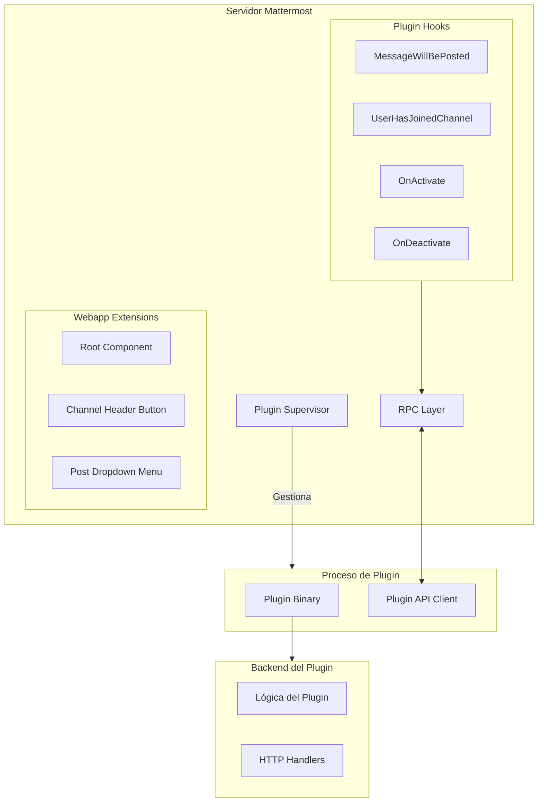

# 11 - Sistema de Plugins

## Visión General

El sistema de plugins de Mattermost permite extender la funcionalidad del servidor y del cliente web sin modificar el código principal. Los plugins se ejecutan como procesos independientes y se comunican con Mattermost mediante RPC.

---

## Arquitectura de Plugins



---

## Tipos de Plugins

### 1. Plugins de Servidor (Go)

**Lenguaje:** Go
**Funcionalidad:**
- Hooks del ciclo de vida del servidor
- HTTP handlers personalizados
- Integraciones con sistemas externos
- Procesamiento de mensajes

### 2. Plugins de Webapp (JavaScript)

**Lenguaje:** JavaScript/TypeScript
**Funcionalidad:**
- Componentes de React
- Integración con UI
- Acciones Redux personalizadas
- WebSocket events

### 3. Plugins Combinados

La mayoría de los plugins incluyen tanto backend como frontend:
```
mi-plugin/
├── server/          # Código Go
│   ├── plugin.go
│   └── go.mod
├── webapp/          # Código JS/React
│   ├── src/
│   └── package.json
└── plugin.json      # Manifest
```

---

## API de Plugins

### Hooks del Servidor

Ubicación: [`server/public/plugin/hooks.go`](server/public/plugin/hooks.go)

```go
type Hooks interface {
    // Ciclo de vida
    OnActivate() error
    OnDeactivate() error
    OnConfigurationChange() error

    // Mensajes
    MessageWillBePosted(c *Context, post *model.Post) (*model.Post, string)
    MessageHasBeenPosted(c *Context, post *model.Post)
    MessageWillBeUpdated(c *Context, newPost, oldPost *model.Post) (*model.Post, string)
    MessageHasBeenUpdated(c *Context, newPost, oldPost *model.Post)

    // Canales
    UserHasJoinedChannel(c *Context, channelMember *model.ChannelMember, actor *model.User)
    UserHasLeftChannel(c *Context, channelMember *model.ChannelMember, actor *model.User)
    ChannelHasBeenCreated(c *Context, channel *model.Channel)

    // Equipos
    UserHasJoinedTeam(c *Context, teamMember *model.TeamMember, actor *model.User)
    UserHasLeftTeam(c *Context, teamMember *model.TeamMember, actor *model.User)

    // Usuarios
    UserHasLoggedIn(c *Context, user *model.User)

    // WebSocket
    WebSocketMessageHasBeenPosted(c *Context, req *model.WebSocketRequest)

    // Archivos
    FileWillBeUploaded(c *Context, info *model.FileInfo, file io.Reader, output io.Writer) (*model.FileInfo, string)
}
```

### Ejemplo: Plugin de Servidor

```go
// server/plugin.go
package main

import (
    "fmt"
    "github.com/mattermost/mattermost/server/public/plugin"
    "github.com/mattermost/mattermost/server/public/model"
)

type HelloWorldPlugin struct {
    plugin.MattermostPlugin
}

func (p *HelloWorldPlugin) OnActivate() error {
    p.API.LogInfo("Plugin activado!")
    return nil
}

func (p *HelloWorldPlugin) MessageHasBeenPosted(c *plugin.Context, post *model.Post) {
    // Ignorar mensajes del sistema
    if post.Type != "" {
        return
    }

    // Responder a "hola"
    if post.Message == "hola" {
        p.API.CreatePost(&model.Post{
            UserId:    p.BotUserID,
            ChannelId: post.ChannelId,
            Message:   "¡Hola! ¿Cómo estás?",
            RootId:    post.Id,
        })
    }
}

func main() {
    plugin.ClientMain(&HelloWorldPlugin{})
}
```

### API del Servidor

```go
// Funciones disponibles vía p.API

// Posts
CreatePost(post *model.Post) (*model.Post, *model.AppError)
GetPost(postId string) (*model.Post, *model.AppError)
UpdatePost(post *model.Post) (*model.Post, *model.AppError)
DeletePost(postId string) *model.AppError

// Canales
GetChannel(channelId string) (*model.Channel, *model.AppError)
GetChannelByName(teamId, channelName string, includeDeleted bool) (*model.Channel, *model.AppError)
GetDirectChannel(userId1, userId2 string) (*model.Channel, *model.AppError)

// Usuarios
GetUser(userId string) (*model.User, *model.AppError)
GetUserByUsername(username string) (*model.User, *model.AppError)
GetUserByEmail(email string) (*model.User, *model.AppError)

// Equipos
GetTeam(teamId string) (*model.Team, *model.AppError)
GetTeamByName(name string) (*model.Team, *model.AppError)

// Archivos
GetFile(fileId string) ([]byte, *model.AppError)
GetFileLink(fileId string) (string, *model.AppError)

// KV Store (almacenamiento del plugin)
KVSet(key string, value []byte) *model.AppError
KVGet(key string) ([]byte, *model.AppError)
KVDelete(key string) *model.AppError

// Configuración
LoadPluginConfiguration(dest interface{}) *model.AppError

// Logging
LogDebug(msg string, keyValuePairs ...interface{})
LogInfo(msg string, keyValuePairs ...interface{})
LogError(msg string, keyValuePairs ...interface{})
LogWarn(msg string, keyValuePairs ...interface{})
```

---

## Manifest del Plugin

### plugin.json

```json
{
    "id": "com.ejemplo.mi-plugin",
    "name": "Mi Plugin",
    "description": "Descripción del plugin",
    "version": "1.0.0",
    "min_server_version": "8.0.0",
    "server": {
        "executables": {
            "linux-amd64": "server/dist/plugin-linux-amd64",
            "darwin-amd64": "server/dist/plugin-darwin-amd64",
            "windows-amd64": "server/dist/plugin-windows-amd64.exe"
        },
        "executable": ""
    },
    "webapp": {
        "bundle_path": "webapp/dist/main.js"
    },
    "settings_schema": {
        "header": "",
        "footer": "",
        "settings": [
            {
                "key": "WebhookURL",
                "display_name": "Webhook URL",
                "type": "text",
                "help_text": "URL del webhook para notificaciones",
                "default": ""
            },
            {
                "key": "EnableNotifications",
                "display_name": "Habilitar Notificaciones",
                "type": "bool",
                "help_text": "Activar o desactivar notificaciones",
                "default": true
            }
        ]
    }
}
```

---

## Desarrollo de Plugins

### Estructura del Proyecto

```bash
mi-plugin/
├── server/
│   ├── go.mod
│   ├── plugin.go           # Implementación principal
│   ├── configuration.go    # Configuración
│   └── activate.go         # Lógica de activación
├── webapp/
│   ├── package.json
│   ├── webpack.config.js
│   └── src/
│       ├── index.tsx       # Entry point
│       ├── components/     # Componentes React
│       └── actions/        # Acciones Redux
├── public/                 # Archivos estáticos
├── plugin.json            # Manifest
├── Makefile               # Build automation
└── README.md
```

### Crear un Plugin desde Cero

```bash
# 1. Crear estructura
mkdir mi-plugin
cd mi-plugin

# 2. Inicializar módulo Go
cd server
go mod init github.com/tuusuario/mi-plugin

# 3. Crear plugin.go
cat > plugin.go << 'EOF'
package main

import (
    "github.com/mattermost/mattermost/server/public/plugin"
)

type Plugin struct {
    plugin.MattermostPlugin
}

func (p *Plugin) OnActivate() error {
    return nil
}

func main() {
    plugin.ClientMain(&Plugin{})
}
EOF

# 4. Crear manifest
cd ..
cat > plugin.json << 'EOF'
{
    "id": "com.ejemplo.mi-plugin",
    "name": "Mi Plugin",
    "version": "1.0.0"
}
EOF

# 5. Crear Makefile
cat > Makefile << 'EOF'
.PHONY: build
build:
    cd server && go build -o dist/plugin-linux-amd64 plugin.go
EOF
```

### Compilar y Distribuir

```bash
# Compilar para múltiples plataformas
make dist

# Genera:
# dist/com.ejemplo.mi-plugin-1.0.0.tar.gz

# Instalar en Mattermost
# 1. System Console > Plugins > Plugin Management
# 2. Upload plugin
# 3. Enable plugin
```

---

## Hooks del Webapp

### Tipos de Extensiones

| Extensión | Descripción |
|-----------|-------------|
| **Root Component** | Componente renderizado en la raíz de la app |
| **Channel Header** | Botón en el header del canal |
| **Post Type** | Renderizador de tipos de post personalizados |
| **Post Dropdown** | Items en el menú de posts |
| **File Preview** | Previsualizador de archivos |
| **Link Tooltip** | Tooltip para enlaces |
| **RHS Component** | Panel lateral derecho |

### Ejemplo: Plugin de Webapp

```typescript
// webapp/src/index.tsx
import {Registry} from 'mattermost-webapp/plugins/registry';

export default class Plugin {
    private registry: Registry;

    initialize(registry: Registry, store: any) {
        this.registry = registry;

        // Registrar componente en el header del canal
        registry.registerChannelHeaderButtonAction(
            // Icono
            <i className='icon fa fa-rocket'/>,
            // Handler
            (channel: Channel) => {
                alert(`Canal: ${channel.display_name}`);
            },
            // Tooltip
            'Mi Botón',
        );

        // Registrar componente en el menú de posts
        registry.registerPostDropdownMenuAction(
            'Acción Personalizada',
            (postId: string) => {
                console.log('Post seleccionado:', postId);
            },
        );

        // Registrar componente de React
        registry.registerRootComponent(MyComponent);

        // Registrar reducer de Redux
        registry.registerReducer(reducer);

        // Registrar acciones
        registry.registerWebSocketEventHandler(
            'custom_event',
            (message: any) => {
                store.dispatch(myAction(message));
            },
        );
    }

    uninitialize() {
        // Limpieza
    }
}
```

### Registry API

```typescript
interface Registry {
    // Componentes
    registerRootComponent(component: React.ComponentType);
    registerChannelHeaderButtonAction(icon: ReactNode, action: (channel: Channel) => void, tooltip: string);
    registerPostDropdownMenuAction(text: string, action: (postId: string) => void);
    registerPostTypeComponent(type: string, component: React.ComponentType);
    registerFilePreviewComponent(override: (fileInfo: FileInfo) => boolean, component: React.ComponentType);
    registerLinkTooltipComponent(match: (href: string) => boolean, component: React.ComponentType);
    registerRHSComponent(component: React.ComponentType, title: string);

    // Redux
    registerReducer(reducer: Reducer);
    registerAction(action: Action);

    // WebSocket
    registerWebSocketEventHandler(event: string, handler: (message: any) => void);

    // Utilidades
    registerTranslations(locale: string, translations: Record<string, string>);
    registerAdminConsoleCustomSetting(key: string, component: React.ComponentType);
}
```

---

## Comunicación Servidor-Webapp

### Usando KV Store

```go
// Server: Guardar datos
func (p *Plugin) handleWebhook(w http.ResponseWriter, r *http.Request) {
    data, _ := io.ReadAll(r.Body)
    
    // Guardar en KV store
    p.API.KVSet("webhook_data", data)
    
    // Notificar a todos los clientes
    p.API.PublishWebSocketEvent("data_updated", map[string]interface{}{
        "timestamp": time.Now().Unix(),
    }, &model.Broadcast{})
}
```

```typescript
// Webapp: Recibir notificación
registry.registerWebSocketEventHandler(
    'custom_com.ejemplo.mi-plugin/data_updated',
    (message: any) => {
        // Cargar datos actualizados
        fetch('/plugins/com.ejemplo.mi-plugin/api/data')
            .then(res => res.json())
            .then(data => {
                store.dispatch(updateData(data));
            });
    },
);
```

### HTTP API del Plugin

```go
// Server: Definir handlers HTTP
func (p *Plugin) ServeHTTP(c *plugin.Context, w http.ResponseWriter, r *http.Request) {
    switch r.URL.Path {
    case "/api/data":
        p.handleGetData(w, r)
    case "/api/config":
        p.handleGetConfig(w, r)
    default:
        http.NotFound(w, r)
    }
}

func (p *Plugin) handleGetData(w http.ResponseWriter, r *http.Request) {
    data, _ := p.API.KVGet("webhook_data")
    w.Header().Set("Content-Type", "application/json")
    w.Write(data)
}
```

```typescript
// Webapp: Consumir API
const response = await fetch('/plugins/com.ejemplo.mi-plugin/api/data');
const data = await response.json();
```

---

## Debugging de Plugins

### Servidor

```bash
# Habilitar debugging de plugins
# En config.json:
{
    "PluginSettings": {
        "EnableUploads": true,
        "AllowInsecureDownloadUrl": false,
        "EnableHealthCheck": true
    }
}

# Logs de plugins
tail -f /opt/mattermost/logs/mattermost.log | grep plugin
```

### Webapp

```javascript
// Console del navegador
// Ver plugins cargados
window.plugins

// Ver registros de plugins
localStorage.setItem('mattermost_webapp_debug', 'true')
```

---

## Marketplace de Plugins

### Publicar un Plugin

1. Crear release en GitHub
2. Subir `.tar.gz` del plugin
3. Agregar al marketplace (proceso de revisión)

### Instalar desde Marketplace

```
System Console > Plugins > Marketplace
```

### Plugins Oficiales Populares

| Plugin | Descripción |
|--------|-------------|
| **GitHub** | Integración con GitHub |
| **GitLab** | Integración con GitLab |
| **Jira** | Integración con Jira |
| **Zoom** | Integración de videollamadas |
| **AWS SNS** | Notificaciones SNS |
| **Autolink** | Auto-enlaces personalizados |
| **Custom Attributes** | Atributos de usuario personalizados |
| **Welcome Bot** | Bot de bienvenida |

---

## Mejores Prácticas

### Seguridad

```go
// Validar input
func (p *Plugin) handleRequest(w http.ResponseWriter, r *http.Request) {
    // Verificar método
    if r.Method != http.MethodPost {
        http.Error(w, "Method not allowed", http.StatusMethodNotAllowed)
        return
    }

    // Verificar permisos
    userID := r.Header.Get("Mattermost-User-Id")
    if userID == "" {
        http.Error(w, "Unauthorized", http.StatusUnauthorized)
        return
    }

    // Validar input
    var data MyData
    if err := json.NewDecoder(r.Body).Decode(&data); err != nil {
        http.Error(w, "Invalid JSON", http.StatusBadRequest)
        return
    }
}
```

### Performance

```go
// Usar goroutines para operaciones asíncronas
func (p *Plugin) MessageHasBeenPosted(c *plugin.Context, post *model.Post) {
    go func() {
        // Procesamiento pesado en background
        p.processMessageAsync(post)
    }()
}

// Cache de datos frecuentes
type Plugin struct {
    plugin.MattermostPlugin
    cache map[string]interface{}
    mutex sync.RWMutex
}
```

### Errores

```go
// Manejo apropiado de errores
func (p *Plugin) OnActivate() error {
    config := p.getConfiguration()
    
    if config.WebhookURL == "" {
        return errors.New("WebhookURL no configurado")
    }

    if err := p.validateConfig(config); err != nil {
        return errors.Wrap(err, "configuración inválida")
    }

    return nil
}
```

---

## Próximos Pasos

Para continuar:

1. **[Glosario y Referencias](12-Glosario_y_Referencias.md)** - Términos técnicos
2. [Developer Documentation](https://developers.mattermost.com/) - Documentación oficial
3. [Plugin Examples](https://github.com/mattermost/mattermost-plugin-examples) - Ejemplos de plugins

---

*Documentación basada en Mattermost v8.x*
