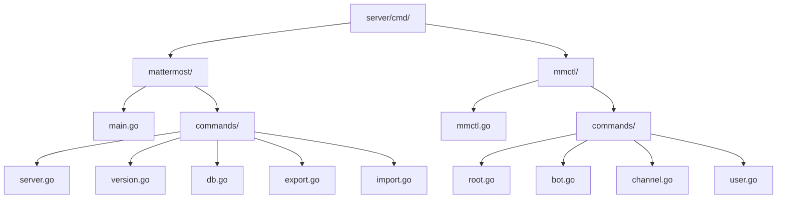
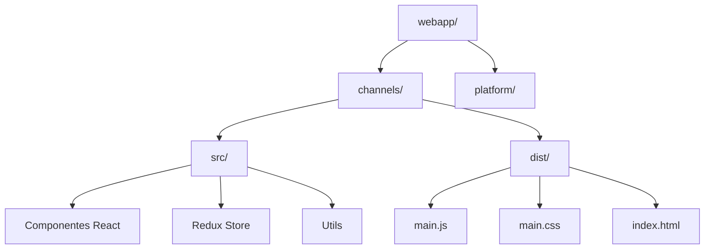
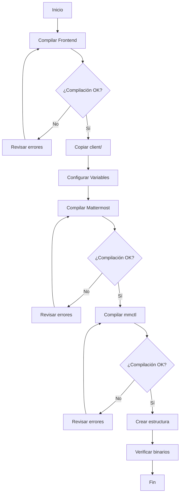

# 13. Compilación del Binario

Este documento describe en detalle cómo compilar los binarios de Mattermost directamente usando `go build`, incluyendo la estructura de entry points, variables de versión, build tags, compilación cruzada y la integración del frontend.

## Tabla de Contenidos

1. [Estructura de Entry Points](#1-estructura-de-entry-points)
2. [Comandos go build](#2-comandos-go-build)
3. [Variables de Versión con ldflags](#3-variables-de-versión-con-ldflags)
4. [Build Tags](#4-build-tags)
5. [Compilación Cruzada](#5-compilación-cruzada)
6. [Inclusión del Frontend](#6-inclusión-del-frontend)
7. [Estructura Mínima de Directorios](#7-estructura-mínima-de-directorios)
8. [Flujo Completo Manual](#8-flujo-completo-manual)
9. [Script de Compilación Manual](#9-script-de-compilación-manual)
10. [Verificación del Binario](#10-verificación-del-binario)

---

## 1. Estructura de Entry Points

Mattermost tiene dos entry points principales ubicados en el directorio [`server/cmd/`](server/cmd/):



### 1.1 Mattermost Server ([`cmd/mattermost/main.go`](../server/cmd/mattermost/main.go))

```go
// Copyright (c) 2015-present Mattermost, Inc. All Rights Reserved.
// See LICENSE.txt for license information.

package main

import (
	"os"

	"github.com/mattermost/mattermost/server/v8/cmd/mattermost/commands"
	// Import and register app layer slash commands
	_ "github.com/mattermost/mattermost/server/v8/channels/app/slashcommands"
	// Plugins
	_ "github.com/mattermost/mattermost/server/v8/channels/app/oauthproviders/gitlab"

	// Enterprise Imports
	_ "github.com/mattermost/mattermost/server/v8/enterprise"
)

func main() {
	if err := commands.Run(os.Args[1:]); err != nil {
		os.Exit(1)
	}
}
```

El entry point del servidor:
- Importa el paquete [`commands`](server/cmd/mattermost/commands/) que contiene todos los subcomandos (server, version, db, etc.)
- Registra automáticamente los slash commands mediante importación con `_`
- Importa providers de OAuth (GitLab, etc.)
- Importa el paquete enterprise (condicional según build tags)

### 1.2 mmctl CLI ([`cmd/mmctl/mmctl.go`](../server/cmd/mmctl/mmctl.go))

```go
// Copyright (c) 2015-present Mattermost, Inc. All Rights Reserved.
// See LICENSE.txt for license information.

package main

import (
	"os"

	_ "github.com/golang/mock/mockgen/model"

	"github.com/mattermost/mattermost/server/v8/cmd/mmctl/commands"
)

func main() {
	if err := commands.Run(os.Args[1:]); err != nil {
		os.Exit(1)
	}
}
```

El CLI de administración:
- Es una herramienta independiente para administrar Mattermost
- Soporta autenticación, gestión de usuarios, canales, equipos, plugins, etc.
- Puede compilarse de forma independiente al servidor

---

## 2. Comandos go build

### 2.1 Comandos Básicos

#### Compilación simple (desarrollo)

```bash
cd server/

# Compilar mattermost server
go build -o bin/mattermost ./cmd/mattermost

# Compilar mmctl
go build -o bin/mmctl ./cmd/mmctl

# Compilar ambos
go build -o bin/ ./cmd/...
```

#### Compilación con optimizaciones (producción)

```bash
# Compilación optimizada para producción
go build -trimpath -ldflags '-s -w' -o bin/mattermost ./cmd/mattermost

# Flags explicados:
# -trimpath: Elimina rutas absolutas de los paths de archivo en los símbolos de debug
# -ldflags '-s -w': Elimina tabla de símbolos y debug info (reduce tamaño del binario)
```

### 2.2 Comandos Avanzados

```bash
# Compilación con todas las optimizaciones
go build \
    -trimpath \
    -tags 'production enterprise' \
    -ldflags '-s -w -X "github.com/mattermost/mattermost/server/public/model.BuildNumber=9.0.0"' \
    -o bin/mattermost \
    ./cmd/mattermost

# Compilación con modo verbose (útil para debugging)
go build -v -x -o bin/mattermost ./cmd/mattermost

# Flags explicados:
# -v: Muestra los paquetes que se están compilando
# -x: Muestra los comandos que se ejecutan
```

### 2.3 Compilación de todo el workspace

```bash
# Compilar todos los paquetes (incluye tests)
go build ./...

# Compilar solo los comandos
go build ./cmd/...

# Compilar solo el servidor (sin mmctl)
go build ./cmd/mattermost
```

---

## 3. Variables de Versión con ldflags

Las variables de build se inyectan en tiempo de compilación usando `-ldflags`. Estas variables están definidas en [`server/public/model/version.go`](../server/public/model/version.go):

```go
var CurrentVersion = versions[0]        // Versión actual (hardcoded)
var BuildNumber string                  // Número de build (ej: 9.0.0.12345)
var BuildDate string                    // Fecha de compilación
var BuildHash string                    // Hash del commit de git
var BuildHashEnterprise string          // Hash del commit enterprise
var BuildEnterpriseReady string         // "true" o "false"
```

### 3.1 Tabla de Variables de Build

| Variable | Package | Descripción | Ejemplo |
|----------|---------|-------------|---------|
| `BuildNumber` | `model` | Número de versión/build | `9.0.0.12345` |
| `BuildDate` | `model` | Fecha UTC de compilación | `2024-01-15 10:30:00 UTC` |
| `BuildHash` | `model` | Hash corto de git | `a1b2c3d4` |
| `BuildHashEnterprise` | `model` | Hash del repo enterprise | `e5f6g7h8` |
| `BuildEnterpriseReady` | `model` | Flag enterprise | `true` / `false` |
| `buildDate` | `mmctl/commands` | Fecha para mmctl | `2024-01-15T10:30:00Z` |

### 3.2 Ejemplos de ldflags

```bash
# Variables básicas
LDFLAGS="-X 'github.com/mattermost/mattermost/server/public/model.BuildNumber=9.0.0'"
LDFLAGS+=" -X 'github.com/mattermost/mattermost/server/public/model.BuildDate=$(date -u)'"
LDFLAGS+=" -X 'github.com/mattermost/mattermost/server/public/model.BuildHash=$(git rev-parse HEAD)'"
LDFLAGS+=" -X 'github.com/mattermost/mattermost/server/public/model.BuildEnterpriseReady=false'"

go build -ldflags "$LDFLAGS" -o bin/mattermost ./cmd/mattermost
```

```bash
# Script completo para extracción de variables
#!/bin/bash

BUILD_NUMBER="${BUILD_NUMBER:-dev}"
BUILD_DATE="$(date -u)"
BUILD_HASH="$(git rev-parse HEAD)"
BUILD_ENTERPRISE_READY="false"
BUILD_HASH_ENTERPRISE="none"

# Detectar si hay enterprise
if [ -d "../../enterprise" ]; then
    BUILD_ENTERPRISE_READY="true"
    BUILD_HASH_ENTERPRISE="$(cd ../../enterprise && git rev-parse HEAD)"
fi

LDFLAGS="-X 'github.com/mattermost/mattermost/server/public/model.BuildNumber=${BUILD_NUMBER}'"
LDFLAGS+=" -X 'github.com/mattermost/mattermost/server/public/model.BuildDate=${BUILD_DATE}'"
LDFLAGS+=" -X 'github.com/mattermost/mattermost/server/public/model.BuildHash=${BUILD_HASH}'"
LDFLAGS+=" -X 'github.com/mattermost/mattermost/server/public/model.BuildHashEnterprise=${BUILD_HASH_ENTERPRISE}'"
LDFLAGS+=" -X 'github.com/mattermost/mattermost/server/public/model.BuildEnterpriseReady=${BUILD_ENTERPRISE_READY}'"

echo "Compiling with ldflags: ${LDFLAGS}"
go build -ldflags "$LDFLAGS" -o bin/mattermost ./cmd/mattermost
```

---

## 4. Build Tags

Los build tags controlan qué código se incluye en la compilación mediante directivas `//go:build`.

### 4.1 Tags Disponibles

| Tag | Descripción | Uso |
|-----|-------------|-----|
| `enterprise` | Incluye características enterprise | Compilación con licencia enterprise |
| `production` | Optimizaciones para producción | Builds de release |
| `sourceavailable` | Incluye código source-available | Desarrollo con código adicional |
| `test` | Código específico para tests | Testing |

### 4.2 Uso de Build Tags

```bash
# Compilación básica (team edition)
go build -tags '' ./cmd/mattermost

# Compilación enterprise
go build -tags 'enterprise' ./cmd/mattermost

# Compilación producción enterprise
go build -tags 'enterprise production' ./cmd/mattermost

# Desarrollo con source available
go build -tags 'sourceavailable' ./cmd/mattermost
```

### 4.3 Ejemplo de Código con Build Tags

```go
//go:build enterprise

package enterprise

// Este archivo solo se compila cuando se usa el tag 'enterprise'

import (
    "github.com/mattermost/mattermost/server/v8/enterprise/ldap"
)

func init() {
    // Registrar características enterprise
    ldap.Register()
}
```

### 4.4 Estructura del Paquete Enterprise

```
server/enterprise/
├── placeholder.go          # Siempre compilado (vacío)
├── local_imports.go        # Imports locales
├── external_imports.go     # Imports externos (enterprise)
├── LICENSE                 # Licencia enterprise
└── metrics/               # Métricas enterprise
    └── metrics.go         //go:build enterprise
```

---

## 5. Compilación Cruzada

Mattermost soporta compilación para múltiples plataformas usando las variables de entorno `GOOS` y `GOARCH`.

### 5.1 Matriz de Plataformas Soportadas

| GOOS | GOARCH | Estado | Notas |
|------|--------|--------|-------|
| `linux` | `amd64` | ✅ Soportado | Principal para producción |
| `linux` | `arm64` | ✅ Soportado | ARM servers (AWS Graviton) |
| `darwin` | `amd64` | ✅ Soportado | macOS Intel |
| `darwin` | `arm64` | ✅ Soportado | macOS Apple Silicon |
| `windows` | `amd64` | ✅ Soportado | Windows Server |

### 5.2 Comandos de Compilación Cruzada

```bash
# Linux AMD64
env GOOS=linux GOARCH=amd64 \
    go build -o bin/linux_amd64/mattermost ./cmd/mattermost

# Linux ARM64
env GOOS=linux GOARCH=arm64 \
    go build -o bin/linux_arm64/mattermost ./cmd/mattermost

# macOS Intel
env GOOS=darwin GOARCH=amd64 \
    go build -o bin/darwin_amd64/mattermost ./cmd/mattermost

# macOS Apple Silicon
env GOOS=darwin GOARCH=arm64 \
    go build -o bin/darwin_arm64/mattermost ./cmd/mattermost

# Windows
env GOOS=windows GOARCH=amd64 \
    go build -o bin/windows_amd64/mattermost.exe ./cmd/mattermost
```

### 5.3 Script de Compilación Cruzada Completo

```bash
#!/bin/bash
# build-cross-platform.sh

VERSION="${1:-dev}"
LDFLAGS="-X 'github.com/mattermost/mattermost/server/public/model.BuildNumber=${VERSION}'"
LDFLAGS+=" -X 'github.com/mattermost/mattermost/server/public/model.BuildDate=$(date -u)'"

PLATFORMS=(
    "linux/amd64"
    "linux/arm64"
    "darwin/amd64"
    "darwin/arm64"
    "windows/amd64"
)

for platform in "${PLATFORMS[@]}"; do
    GOOS=${platform%/*}
    GOARCH=${platform#*/}
    output="bin/mattermost-${GOOS}-${GOARCH}"

    if [ "$GOOS" = "windows" ]; then
        output="${output}.exe"
    fi

    echo "Building for $GOOS/$GOARCH..."
    env GOOS=$GOOS GOARCH=$GOARCH \
        go build -trimpath -ldflags "$LDFLAGS" -o "$output" ./cmd/mattermost
done
```

### 5.4 Compilación Cruzada con Docker

```bash
# Usando imagen oficial de Go
docker run --rm -v "$(pwd):/src" -w /src/server golang:1.21 \
    sh -c 'env GOOS=linux GOARCH=amd64 go build -o bin/mattermost-linux ./cmd/mattermost'
```

---

## 6. Inclusión del Frontend

El frontend de Mattermost es una aplicación React que debe compilarse e incluirse en el directorio `client/`.

### 6.1 Estructura del Frontend



### 6.2 Compilación del Frontend

```bash
cd webapp/

# Instalar dependencias
npm install

# Build de producción
cd channels/
npm run build

# El resultado está en:
# webapp/channels/dist/
```

### 6.3 Integración con el Servidor

El servidor espera encontrar los archivos del frontend en:
- `server/client/` (desarrollo local)
- `client/` (en el directorio de distribución)

```bash
# Copiar frontend al servidor
mkdir -p server/client
cp -r webapp/channels/dist/* server/client/

# O crear symlink (desarrollo)
ln -sf $(pwd)/webapp/channels/dist $(pwd)/server/client
```

### 6.4 Configuración del Servidor para el Frontend

En [`config/config.json`](../server/config/config.json), la ruta del frontend se configura en:

```json
{
    "ServiceSettings": {
        "SiteURL": "http://localhost:8065",
        "StaticDir": "./client"
    }
}
```

---

## 7. Estructura Mínima de Directorios

Para ejecutar Mattermost, se requiere la siguiente estructura mínima:

```
mattermost/
├── mattermost          # Binario principal
├── mmctl              # CLI de administración (opcional pero recomendado)
├── client/            # Frontend compilado
│   ├── index.html
│   ├── main.js
│   └── main.css
├── config/            # Configuración
│   └── config.json
├── data/              # Datos de la aplicación
│   ├── uploads/      # Archivos subidos
│   └── logs/         # Logs del sistema
├── templates/         # Plantillas de email
├── i18n/             # Traducciones
├── fonts/            # Fuentes
├── prepackaged_plugins/  # Plugins pre-instalados
└── logs/             # Directorio de logs
```

### 7.1 Creación de la Estructura

```bash
#!/bin/bash
# setup-minimal-structure.sh

MM_DIR="mattermost-dist"
mkdir -p $MM_DIR/{client,config,data/{uploads,logs},templates,i18n,fonts,logs}

# Copiar binarios
cp server/bin/mattermost $MM_DIR/
cp server/bin/mmctl $MM_DIR/

# Copiar frontend
cp -r server/client/* $MM_DIR/client/

# Copiar archivos estáticos
cp -r server/templates/* $MM_DIR/templates/
cp -r server/i18n/* $MM_DIR/i18n/
cp -r server/fonts/* $MM_DIR/fonts/

# Configuración inicial
cp server/config/config.json $MM_DIR/config/

echo "Estructura mínima creada en $MM_DIR/"
```

---

## 8. Flujo Completo Manual

### 8.1 Diagrama del Flujo de Compilación



### 8.2 Paso a Paso Completo

```bash
# ========================================
# 1. PREPARACIÓN
# ========================================

# Navegar al directorio del proyecto
cd /path/to/mattermost

# Verificar versión de Go
go version  # Requiere Go 1.21+

# Verificar versión de Node
node --version  # Requiere Node 20.11+

# ========================================
# 2. COMPILAR FRONTEND
# ========================================

cd webapp/

# Instalar dependencias
npm install

# Compilar para producción
cd channels/
npm run build

# Verificar que se creó el directorio dist
ls -la dist/

# ========================================
# 3. CONFIGURAR VARIABLES DE BUILD
# ========================================

cd ../../../server/

# Definir variables
export BUILD_NUMBER="9.0.0-manual"
export BUILD_DATE="$(date -u)"
export BUILD_HASH="$(git rev-parse HEAD)"
export BUILD_ENTERPRISE_READY="false"

# Construir LDFLAGS
LDFLAGS="-X 'github.com/mattermost/mattermost/server/public/model.BuildNumber=${BUILD_NUMBER}'"
LDFLAGS+=" -X 'github.com/mattermost/mattermost/server/public/model.BuildDate=${BUILD_DATE}'"
LDFLAGS+=" -X 'github.com/mattermost/mattermost/server/public/model.BuildHash=${BUILD_HASH}'"
LDFLAGS+=" -X 'github.com/mattermost/mattermost/server/public/model.BuildEnterpriseReady=${BUILD_ENTERPRISE_READY}'"

# ========================================
# 4. COMPILAR SERVIDOR
# ========================================

# Compilar mattermost
go build \
    -trimpath \
    -tags 'production' \
    -ldflags "$LDFLAGS" \
    -o bin/mattermost \
    ./cmd/mattermost

# Verificar
ls -lh bin/mattermost

# ========================================
# 5. COMPILAR MMCTL
# ========================================

MMCTL_PKG="github.com/mattermost/mattermost/server/v8/cmd/mmctl/commands"
MMCTL_LDFLAGS="-X '$MMCTL_PKG.buildDate=$(date -u +%Y-%m-%dT%H:%M:%SZ)'"

go build \
    -trimpath \
    -ldflags "$MMCTL_LDFLAGS" \
    -o bin/mmctl \
    ./cmd/mmctl

# Verificar
ls -lh bin/mmctl

# ========================================
# 6. PREPARAR ESTRUCTURA
# ========================================

mkdir -p dist/mattermost/{client,config,data/{uploads,logs},templates,i18n,fonts,logs}

# Copiar binarios
cp bin/mattermost dist/mattermost/
cp bin/mmctl dist/mattermost/

# Copiar frontend
cp -r ../webapp/channels/dist/* dist/mattermost/client/

# Copiar archivos estáticos
cp -r templates/* dist/mattermost/templates/
cp -r i18n/* dist/mattermost/i18n/
cp -r fonts/* dist/mattermost/fonts/

# Configuración inicial
cp config/config.json dist/mattermost/config/

# ========================================
# 7. VERIFICAR
# ========================================

cd dist/mattermost

# Verificar versión
./mattermost version

# Verificar mmctl
./mmctl version

# Probar inicio (modo validate)
./mattermost --help
```

---

## 9. Script de Compilación Manual

### 9.1 Script Completo: `build-mattermost.sh`

```bash
#!/bin/bash
# build-mattermost.sh - Script completo de compilación manual

set -e  # Salir en caso de error

# ========================================
# CONFIGURACIÓN
# ========================================

BUILD_NUMBER="${BUILD_NUMBER:-$(date +%Y%m%d.%H%M%S)}"
BUILD_TYPE="${BUILD_TYPE:-team}"  # team | enterprise
OUTPUT_DIR="${OUTPUT_DIR:-dist}"
SKIP_FRONTEND="${SKIP_FRONTEND:-false}"
CROSS_COMPILE="${CROSS_COMPILE:-false}"

# Colores para output
RED='\033[0;31m'
GREEN='\033[0;32m'
YELLOW='\033[1;33m'
NC='\033[0m' # No Color

# ========================================
# FUNCIONES
# ========================================

log_info() {
    echo -e "${GREEN}[INFO]${NC} $1"
}

log_warn() {
    echo -e "${YELLOW}[WARN]${NC} $1"
}

log_error() {
    echo -e "${RED}[ERROR]${NC} $1"
}

check_prerequisites() {
    log_info "Verificando prerequisitos..."

    # Verificar Go
    if ! command -v go &> /dev/null; then
        log_error "Go no está instalado"
        exit 1
    fi

    GO_VERSION=$(go version | grep -o 'go[0-9]\+\.[0-9]\+' | sed 's/go//')
    log_info "Go version: $GO_VERSION"

    # Verificar Node (si no se salta frontend)
    if [ "$SKIP_FRONTEND" = "false" ]; then
        if ! command -v node &> /dev/null; then
            log_error "Node.js no está instalado"
            exit 1
        fi
        NODE_VERSION=$(node --version)
        log_info "Node version: $NODE_VERSION"
    fi
}

build_frontend() {
    if [ "$SKIP_FRONTEND" = "true" ]; then
        log_warn "Saltando compilación del frontend"
        return
    fi

    log_info "Compilando frontend..."

    cd webapp

    # Instalar dependencias si no existen
    if [ ! -d "node_modules" ]; then
        log_info "Instalando dependencias..."
        npm install
    fi

    # Compilar
    cd channels
    npm run build

    cd ../..

    log_info "Frontend compilado exitosamente"
}

setup_ldflags() {
    log_info "Configurando variables de build..."

    local build_date
    local build_hash
    local build_enterprise_ready="false"
    local build_hash_enterprise="none"

    build_date="$(date -u)"
    build_hash="$(git rev-parse HEAD)"

    if [ "$BUILD_TYPE" = "enterprise" ] && [ -d "../enterprise" ]; then
        build_enterprise_ready="true"
        build_hash_enterprise="$(cd ../enterprise && git rev-parse HEAD)"
    fi

    LDFLAGS="-X 'github.com/mattermost/mattermost/server/public/model.BuildNumber=${BUILD_NUMBER}'"
    LDFLAGS+=" -X 'github.com/mattermost/mattermost/server/public/model.BuildDate=${build_date}'"
    LDFLAGS+=" -X 'github.com/mattermost/mattermost/server/public/model.BuildHash=${build_hash}'"
    LDFLAGS+=" -X 'github.com/mattermost/mattermost/server/public/model.BuildHashEnterprise=${build_hash_enterprise}'"
    LDFLAGS+=" -X 'github.com/mattermost/mattermost/server/public/model.BuildEnterpriseReady=${build_enterprise_ready}'"

    export LDFLAGS
    log_info "LDFLAGS configurados"
}

build_server() {
    local goos="${1:-$(go env GOOS)}"
    local goarch="${2:-$(go env GOARCH)}"
    local output="${3:-bin/mattermost}"

    log_info "Compilando servidor para $goos/$goarch..."

    local tags="production"
    if [ "$BUILD_TYPE" = "enterprise" ]; then
        tags="enterprise production"
    fi

    env GOOS="$goos" GOARCH="$goarch" \
        go build \
        -trimpath \
        -tags "$tags" \
        -ldflags "$LDFLAGS" \
        -o "$output" \
        ./cmd/mattermost

    log_info "Servidor compilado: $output"
}

build_mmctl() {
    local goos="${1:-$(go env GOOS)}"
    local goarch="${2:-$(go env GOARCH)}"
    local output="${3:-bin/mmctl}"

    log_info "Compilando mmctl para $goos/$goarch..."

    local mmctl_pkg="github.com/mattermost/mattermost/server/v8/cmd/mmctl/commands"
    local mmctl_ldflags="-X '$mmctl_pkg.buildDate=$(date -u +%Y-%m-%dT%H:%M:%SZ)'"

    env GOOS="$goos" GOARCH="$goarch" \
        go build \
        -trimpath \
        -ldflags "$mmctl_ldflags" \
        -o "$output" \
        ./cmd/mmctl

    log_info "mmctl compilado: $output"
}

build_all_platforms() {
    log_info "Iniciando compilación cruzada..."

    local platforms=(
        "linux/amd64"
        "linux/arm64"
        "darwin/amd64"
        "darwin/arm64"
        "windows/amd64"
    )

    for platform in "${platforms[@]}"; do
        local goos=${platform%/*}
        local goarch=${platform#*/}
        local suffix="${goos}-${goarch}"
        local mm_output="bin/mattermost-${suffix}"
        local mmctl_output="bin/mmctl-${suffix}"

        if [ "$goos" = "windows" ]; then
            mm_output="${mm_output}.exe"
            mmctl_output="${mmctl_output}.exe"
        fi

        build_server "$goos" "$goarch" "$mm_output"
        build_mmctl "$goos" "$goarch" "$mmctl_output"
    done
}

create_distribution() {
    log_info "Creando estructura de distribución..."

    local dist_dir="$OUTPUT_DIR/mattermost"
    mkdir -p "$dist_dir"/{client,config,data/{uploads,logs},templates,i18n,fonts,logs,prepackaged_plugins}

    # Copiar binarios (usar los de linux_amd64 por defecto)
    cp bin/mattermost-linux-amd64 "$dist_dir/mattermost" 2>/dev/null || cp bin/mattermost "$dist_dir/"
    cp bin/mmctl-linux-amd64 "$dist_dir/mmctl" 2>/dev/null || cp bin/mmctl "$dist_dir/"

    # Copiar frontend
    cp -r webapp/channels/dist/* "$dist_dir/client/"

    # Copiar archivos estáticos
    cp -r server/templates/* "$dist_dir/templates/" 2>/dev/null || true
    cp -r server/i18n/* "$dist_dir/i18n/" 2>/dev/null || true
    cp -r server/fonts/* "$dist_dir/fonts/" 2>/dev/null || true

    # Configuración
    cp server/config/config.json "$dist_dir/config/" 2>/dev/null || true

    log_info "Distribución creada en $dist_dir"
}

verify_binaries() {
    log_info "Verificando binarios..."

    if [ -f "bin/mattermost" ] || [ -f "bin/mattermost-linux-amd64" ]; then
        log_info "✓ mattermost existe"
    else
        log_error "✗ mattermost no encontrado"
        return 1
    fi

    if [ -f "bin/mmctl" ] || [ -f "bin/mmctl-linux-amd64" ]; then
        log_info "✓ mmctl existe"
    else
        log_error "✗ mmctl no encontrado"
        return 1
    fi

    # Verificar que mattermost puede mostrar versión
    local mm_bin="bin/mattermost"
    [ -f "bin/mattermost-linux-amd64" ] && mm_bin="bin/mattermost-linux-amd64"

    log_info "Versión del servidor:"
    "$mm_bin" version 2>/dev/null || log_warn "No se pudo obtener versión"
}

# ========================================
# MAIN
# ========================================

main() {
    log_info "Iniciando compilación de Mattermost..."
    log_info "Build Number: $BUILD_NUMBER"
    log_info "Build Type: $BUILD_TYPE"

    check_prerequisites
    build_frontend

    cd server

    setup_ldflags

    if [ "$CROSS_COMPILE" = "true" ]; then
        build_all_platforms
    else
        build_server
        build_mmctl
    fi

    verify_binaries
    create_distribution

    log_info "Compilación completada exitosamente!"
    log_info "Output: $OUTPUT_DIR/mattermost/"
}

# Ejecutar
main "$@"
```

### 9.2 Uso del Script

```bash
# Compilación básica
./build-mattermost.sh

# Compilación enterprise
BUILD_TYPE=enterprise ./build-mattermost.sh

# Compilación cruzada
CROSS_COMPILE=true ./build-mattermost.sh

# Saltar frontend (si ya está compilado)
SKIP_FRONTEND=true ./build-mattermost.sh

# Con número de versión específico
BUILD_NUMBER=9.0.0 ./build-mattermost.sh
```

---

## 10. Verificación del Binario

### 10.1 Comandos de Verificación

```bash
# Verificar información del binario
./mattermost version

# Verificar ayuda
./mattermost --help
./mattermost -h

# Verificar subcomandos disponibles
./mattermost --help commands

# Validar configuración sin iniciar
./mattermost --config config/config.json
```

### 10.2 Verificación de Build Info

```bash
# Obtener información de build
./mattermost version --format=json

# Salida esperada:
# {
#   "version": "9.0.0",
#   "build_number": "9.0.0-manual",
#   "build_date": "Thu Jan 15 10:30:00 UTC 2024",
#   "build_hash": "a1b2c3d4e5f6...",
#   "build_hash_enterprise": "none",
#   "build_enterprise_ready": "false"
# }
```

### 10.3 Verificación de Dependencias

```bash
# Listar dependencias del binario
go version -m bin/mattermost

# Ver información de build detallada
go tool nm bin/mattermost | grep -i build
```

### 10.4 Prueba de Inicio

```bash
# Probar inicio del servidor (sin base de datos)
./mattermost --help  # Muestra ayuda sin requerir BD

# Verificar que el frontend se sirve correctamente
# (Requiere servidor iniciado)
curl -s http://localhost:8065/static/main.js | head -5
```

### 10.5 Checklist de Verificación

| Verificación | Comando | Resultado Esperado |
|-------------|---------|-------------------|
| Binario existe | `ls -lh mattermost` | Archivo ejecutable |
| Versión correcta | `./mattermost version` | Muestra versión y build info |
| mmctl existe | `ls -lh mmctl` | Archivo ejecutable |
| mmctl funciona | `./mmctl --help` | Muestra ayuda |
| Frontend existe | `ls client/` | Archivos HTML/JS/CSS |
| Templates existen | `ls templates/` | Archivos .html |
| i18n existe | `ls i18n/` | Archivos .json |

---

## Resumen

La compilación manual de Mattermost implica:

1. **Compilar el frontend** con `npm run build` en `webapp/channels/`
2. **Configurar variables** usando `-ldflags` para inyectar metadatos
3. **Compilar el servidor** con `go build` usando los tags apropiados
4. **Compilar mmctl** para la herramienta de administración
5. **Organizar la estructura** de directorios requerida
6. **Verificar los binarios** con los comandos de versionado

Para la mayoría de los casos, usar el Makefile (`make build`) es recomendado, pero entender el proceso manual permite personalizaciones avanzadas y debugging de problemas de compilación.
