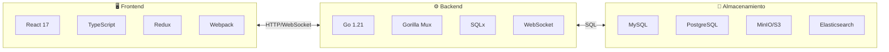
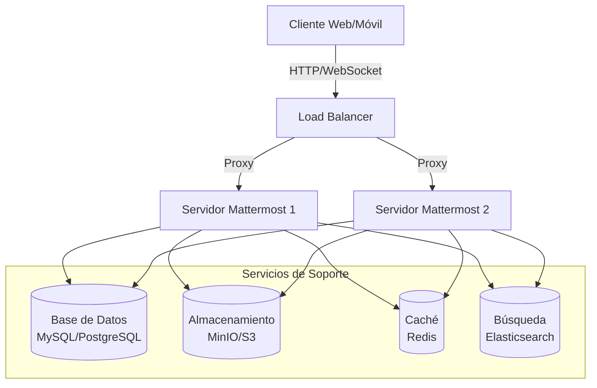

# Documentación Técnica - Mattermost

## Índice General

Bienvenido a la documentación técnica exhaustiva del proyecto **Mattermost**. Esta documentación proporciona una guía completa para entender la arquitectura, desarrollo y despliegue de la plataforma Mattermost.

---

## 📚 Tabla de Contenidos

### Documentación Principal

| # | Documento | Descripción |
|---|-----------|-------------|
| 00 | [Plan de Documentación](00-Plan_de_Documentacion.md) | Plan y estructura de la documentación |
| 01 | [Introducción y Visión General](01-Introduccion_y_Vision_General.md) | ¿Qué es Mattermost? Características y arquitectura general |
| 02 | [Arquitectura del Sistema](02-Arquitectura_del_Sistema.md) | Arquitectura de capas, patrones de diseño y componentes |
| 03 | [Backend Go](03-Backend_Go.md) | Estructura del servidor, APIs, lógica de negocio y almacenamiento |
| 04 | [Frontend React](04-Frontend_React.md) | Aplicación web, Redux, componentes y arquitectura frontend |
| 05 | [Base de Datos](05-Base_de_Datos.md) | Esquema de BD, entidades, relaciones y migraciones |
| 06 | [APIs y WebSockets](06-APIs_y_WebSockets.md) | API REST, WebSockets, webhooks e integraciones |
| 07 | [Autenticación y Seguridad](07-Autenticacion_y_Seguridad.md) | Sistemas de auth, roles, permisos y seguridad |
| 08 | [Flujos de Negocio](08-Flujos_de_Negocio.md) | Procesos principales: mensajes, canales, notificaciones |
| 09 | [Infraestructura y Despliegue](09-Infraestructura_y_Despliegue.md) | Docker, servicios, configuración y escalabilidad |
| 10 | [Guía de Desarrollo](10-Guia_de_Desarrollo.md) | Setup local, comandos, tests y flujo de trabajo |
| 11 | [Sistema de Plugins](11-Sistema_de_Plugins.md) | Arquitectura de plugins, API y desarrollo |
| 12 | [Glosario y Referencias](12-Glosario_y_Referencias.md) | Términos técnicos y referencias externas |

---

## 🏗️ Visión General Rápida

### Tecnologías Principales



### Arquitectura de Alto Nivel



---

## 🚀 Cómo Usar Esta Documentación

### Para Desarrolladores Nuevos
1. Comience con [01-Introducción y Visión General](01-Introduccion_y_Vision_General.md)
2. Lea [02-Arquitectura del Sistema](02-Arquitectura_del_Sistema.md)
3. Siga la [10-Guía de Desarrollo](10-Guia_de_Desarrollo.md) para configurar su entorno

### Para Desarrolladores Backend
- [03-Backend Go](03-Backend_Go.md) - Arquitectura del servidor
- [05-Base de Datos](05-Base_de_Datos.md) - Modelo de datos
- [06-APIs y WebSockets](06-APIs_y_WebSockets.md) - APIs del sistema

### Para Desarrolladores Frontend
- [04-Frontend React](04-Frontend_React.md) - Arquitectura webapp
- [06-APIs y WebSockets](06-APIs_y_WebSockets.md) - Integración con backend

### Para DevOps/Administradores
- [09-Infraestructura y Despliegue](09-Infraestructura_y_Despliegue.md) - Despliegue y configuración
- [07-Autenticación y Seguridad](07-Autenticacion_y_Seguridad.md) - Seguridad del sistema

---

## 📋 Convenciones

### Referencias al Código
Las referencias a archivos de código siguen este formato:
- [`nombre_archivo.ext`](ruta/al/archivo:linea) - Referencia clickeable

### Diagramas
Todos los diagramas utilizan la sintaxis [Mermaid](https://mermaid-js.github.io/mermaid/).

### Bloques de Código
```go
// Ejemplo de código Go
package main
```

```typescript
// Ejemplo de código TypeScript
const example: string = "value";
```

```sql
-- Ejemplo de SQL
SELECT * FROM users;
```

---

## 🔗 Enlaces Rápidos

### Recursos del Proyecto
- [Repositorio GitHub](https://github.com/mattermost/mattermost)
- [Documentación Oficial](https://docs.mattermost.com/)
- [API Reference](https://api.mattermost.com/)
- [Guía de Contribución](../CONTRIBUTING.md)

### Documentación Interna
- [AGENTS.md](../AGENTS.md) - Guía para desarrolladores del proyecto
- [SETUP_DOCUMENTATION.md](../SETUP_DOCUMENTATION.md) - Guía de setup local

---

## 📝 Notas Importantes

> **Nota:** Esta documentación es específica para la estructura del código fuente analizado. Algunos detalles pueden variar según la versión específica del código.

> **Enterprise:** Las funcionalidades marcadas como "Enterprise" requieren la versión con licencia comercial de Mattermost.

---

## 🤝 Contribuir

Si encuentras errores o deseas mejorar esta documentación, por favor:
1. Revisa el [Plan de Documentación](00-Plan_de_Documentacion.md)
2. Sigue las convenciones establecidas
3. Actualiza el índice si agregas nuevos documentos

---

*Última actualización: Marzo 2026*
*Versión del código analizado: v8.x*
