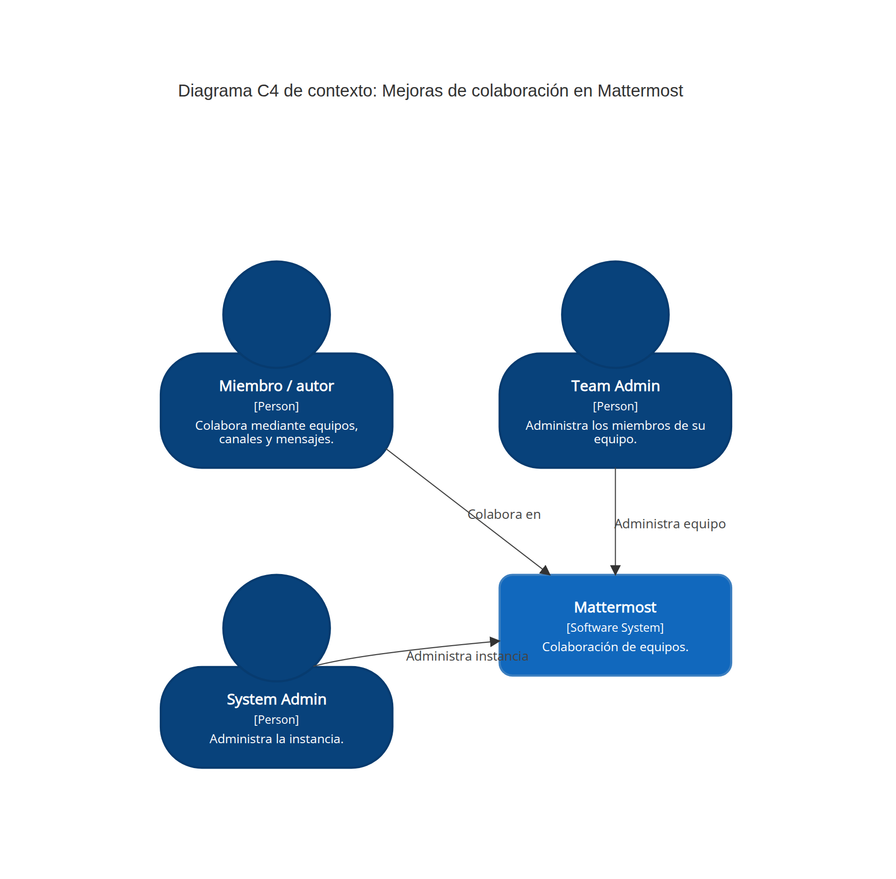

# Entregable 1: Mejoras de identificación y legibilidad en Mattermost

**Universidad CENFOTEC, Maestría Profesional en Ingeniería del Software**\
**Curso:** PSWE-07, Procesos y Administración de Software, C3 2026\
**Docente:** Shirley Ramírez Cordero\
**Grupo:** Grupo 01\
**Integrantes:** Alexander Gatica (`agvor`), José Cisneros (`megachivo`) y Juan Ignacio González (`J-IgnacioGC`)\
**Entrega:** 5 de octubre de 2026

## 1. Título y contexto

**Título del proyecto.** Mejora de la experiencia de colaboración en Mattermost mediante la identificación de administradores y el uso de secciones desplegables.

**Propósito.** Implementar dos mejoras aprobadas para Mattermost y evaluar el proceso de trabajo del equipo. Cada incremento aportará evidencia sobre planificación, coordinación, revisiones, pruebas y retrabajo. La retrospectiva del primero permitirá seleccionar un ajuste de proceso para aplicarlo y medirlo en el segundo [1, 3].

**Dominio y usuarios meta.** Mattermost es una plataforma de colaboración que permite organizar equipos y canales, intercambiar y buscar mensajes, administrar miembros y asignar roles. Las mejoras se dirigen a quienes necesitan identificar a los administradores de su equipo o publicar y consultar información técnica extensa. Los administradores de equipo y de sistema validarán los permisos.

**Estado actual verificado.** El equipo reprodujo ambos problemas en Mattermost Team Edition `12.0.0-dev`, a partir del commit `53211e45b6e63e99a5cc64d1ce1b344e3b64cc51`:

- **[#37406: Add Ability to discover team admin](https://github.com/mattermost/mattermost/issues/37406):** la lista de miembros no identifica a los Team Admins ni permite filtrarlos cuando quien consulta es un miembro ordinario. La búsqueda disponible se limita al texto y la alternativa de la System Console exige privilegios globales. El procedimiento y las capturas están en la [evidencia del estado base](https://github.com/agvor/mattermost/blob/base_entregable_01/pswe-07-grupo01/evidencia-base/issue-37406/README.md) [2, 5].
- **[#38480: Collapse Details of a Mattermost Message](https://github.com/mattermost/mattermost/issues/38480):** las etiquetas `
` y `
` y el atributo `open` se muestran como texto, sin permitir contraer o expandir el contenido. El Markdown admitido se representa correctamente y el resultado es igual para quien publica y quien lee. El procedimiento y las capturas están en la [evidencia del estado base](https://github.com/agvor/mattermost/blob/base_entregable_01/pswe-07-grupo01/evidencia-base/issue-38480/README.md) [2, 6].

## 2. Mejora propuesta y alcance

La docente aprobó abordar ambas incidencias como un solo proyecto. Actualmente, localizar a un Team Admin requiere intervención administrativa o acceso a la System Console; además, la información extensa debe quedar visible por completo o dividirse en varios mensajes. Las mejoras son necesarias para facilitar el acceso a responsables del equipo y comunicar contenido técnico sin afectar la lectura inicial de una conversación. El trabajo se organizará en dos incrementos sobre la misma base de código:

### Incremento 1: identificación de Team Admins (#37406)

Mostrar una identificación visual del rol Team Admin e incorporar un filtro en las vistas web de miembros. El filtro funcionará con la búsqueda y la paginación, reflejará la membresía real del equipo y respetará las autorizaciones actuales. La vista de Channel Admins servirá como referencia de interacción, no de permisos.

### Incremento 2: secciones desplegables en mensajes (#38480)

Incorporar secciones no anidadas en los mensajes web, con un resumen visible y un cuerpo expandible que admita texto, párrafos y bloques de código. El comportamiento será consistente en vista previa, publicación y edición. La sintaxis, inspirada en `details/summary`, no habilitará HTML arbitrario y podrá operarse mediante teclado.

### Alcance máximo y exclusiones

El alcance incluye análisis, diseño, implementación web, pruebas automatizadas, documentación y evidencia del antes y el después de cada incremento. Se excluyen los clientes móviles nativos, el rediseño de la System Console, nuevos roles o permisos, los directorios entre equipos, las secciones anidadas, sus adjuntos, la persistencia del estado abierto o cerrado y la reproducción completa del Markdown de GitHub. La entrega académica no depende de que Mattermost acepte los cambios en su repositorio oficial.

### Criterios de aceptación

Los criterios se agrupan con tres prefijos: **TA** para *Team Admin*, **DT** para *Details* (secciones desplegables) y **RG** para las pruebas de regresión comunes a ambos incrementos.

- **TA-01:** la etiqueta y el filtro representan el rol real dentro del equipo consultado.
- **TA-02:** el filtro encuentra a todos los Team Admins, incluso cuando hay paginación, y funciona en combinación con la búsqueda y con resultados vacíos.
- **TA-03:** un miembro puede identificar a los administradores sin obtener acciones o datos para los que no tiene permiso.
- **DT-01:** una sección válida inicia contraída; puede abrirse y cerrarse conservando el resumen.
- **DT-02:** los párrafos y el código se representan de forma consistente en la vista previa, la publicación y la edición.
- **DT-03:** la variante abierta, el teclado, el foco y el estado accesible funcionan según la regla acordada.
- **DT-04:** la sintaxis incompleta o no admitida produce una salida segura y no ejecuta HTML arbitrario.
- **RG-01:** mensajes y listas sin las nuevas funciones conservan su comportamiento mediante pruebas de regresión.

## 3. Enfoque del proceso y medición

El equipo trabajará en ciclos incrementales con un tablero Kanban: **pendiente → lista para iniciar → implementación → revisión → validación → entregada**. Se limitará a una tarea en implementación y otra en revisión para reducir cambios de contexto y hacer visibles las esperas. Cada tarea tendrá responsable, un revisor diferente y evidencia de validación.

Una tarea estará lista (*Definition of Ready*) al acordar su alcance, criterios de aceptación, dependencias y estimación. Estará terminada (*Definition of Done*) con la revisión aprobada, las pruebas pertinentes exitosas, la evidencia vinculada y la documentación actualizada. Las ramas breves, los *pull requests* y GitHub Actions mantendrán la trazabilidad entre incidencia, tarea, cambio y prueba.

El flujo se analizará como cadena de valor. En GitHub y en el tablero se registrarán la aceptación de la tarea, el inicio y fin de la implementación, la solicitud y el inicio de la revisión, las devoluciones y la validación. Después del primer incremento, la retrospectiva seleccionará una mejora puntual, como refinar antes los criterios o reservar un horario de revisión. Esta se aplicará al segundo incremento. La comparación considerará el tamaño reducido de la muestra y las diferencias técnicas, sin atribuir causalidad cuando falte evidencia [3].

- ***Lead time*:** tiempo desde que se acepta una tarea hasta que se valida, incluidos el trabajo y la espera. Meta inicial: mediana de 5 días hábiles o menos.
- **Espera de revisión:** tiempo desde la solicitud hasta la primera revisión efectiva. Meta inicial: al menos el 80 % en 2 días hábiles o menos.
- **Aceptación sin retrabajo (%CA):** porcentaje de tareas aceptadas en la primera validación. Meta inicial: 80 % o más, con registro de las causas de devolución.

Estas metas son hipótesis iniciales y podrán ajustarse si los datos lo justifican. También se registrarán las estimaciones y las horas-persona reales para analizar el tiempo, el costo y los cambios de alcance en los siguientes entregables.

## 4. Retos técnicos y capacidades

- **Roles, búsqueda y paginación:** se seguirá el recorrido de las membresías desde la API y el estado de la aplicación hasta la interfaz para determinar si el filtro requiere cambios en el servidor. Requiere Go, React/TypeScript, permisos y pruebas por rol.
- **Markdown y sanitización:** se identificarán el analizador y los renderizadores compartidos para definir una extensión mínima y segura. Requiere procesamiento de texto, React y seguridad web.
- **Consistencia y regresión:** se cubrirán la vista previa, la publicación, la edición y las listas sin filtros, reutilizando componentes existentes. Requiere pruebas unitarias, integración y accesibilidad.
- **Coordinación en una base de código amplia:** el trabajo se dividirá en resultados pequeños, con límites al trabajo en curso y revisión previa de dependencias. Requiere Git, revisión de código, CI/CD y comunicación.

Los riesgos iniciales son subestimar los cambios en el servidor o el analizador, introducir diferencias entre renderizadores, causar regresiones de seguridad o accesibilidad, demorar las revisiones y enfrentar cambios en el repositorio oficial. Cada riesgo tendrá una persona responsable, condiciones de activación y acciones de respuesta. El análisis cuantitativo se ampliará en el entregable 2.

## 5. Calendario, hitos y responsables

El plan sigue el calendario oficial: avances en las semanas 6 y 11, y presentación final en la semana 14. Las responsabilidades iniciales podrán rotarse según la carga de trabajo, siempre que el cambio se registre en el tablero. Ningún integrante aprobará una tarea que haya implementado.

| Integrante | Usuario | Coordinación inicial |
|---|---|---|
| Alexander Gatica | `agvor` | Entorno y análisis técnico. |
| José Cisneros | `megachivo` | Interacción y requisitos. |
| Juan Ignacio González | `J-IgnacioGC` | Pruebas, proceso y evidencia. |

- **Semanas 4 y 5, del 21 de septiembre al 4 de octubre:** entorno reproducible, problemas verificados, alcance, aceptación y línea base. Participan los tres integrantes.
- **Semana 6, 5 de octubre:** primer avance con propuesta unificada, base funcional, C4 y coevaluación, sin código nuevo. Juan Ignacio coordina y los tres revisan.
- **Semana 7, del 12 al 18 de octubre:** incorporación de retroalimentación, *backlog*, riesgos, costos y captura automática de eventos. Coordinan José y Juan Ignacio.
- **Semanas 8 y 9, del 19 de octubre al 1 de noviembre:** diseño, implementación, revisión y validación del incremento 1 (#37406). Alexander implementa, José revisa y Juan Ignacio valida.
- **Semana 10, del 2 al 8 de noviembre:** retrospectiva del incremento 1, análisis del flujo y selección de una mejora de proceso. Juan Ignacio coordina y participan los tres.
- **Semana 11, 9 de noviembre:** segundo avance con CI/CD, métricas, riesgos, costos, resultado del incremento 1 y arquitectura actualizada. Participan los tres integrantes.
- **Semana 12, del 16 al 22 de noviembre:** desarrollo y validación del incremento 2 (#38480) con el proceso ajustado. José implementa, Juan Ignacio revisa y Alexander valida.
- **Semana 13, del 23 al 29 de noviembre:** regresión, accesibilidad, medición comparativa, documentación y ensayo de defensa. Participan los tres integrantes.
- **Semana 14, 30 de noviembre:** entrega y presentación final, demostración, resultados y lecciones aprendidas. Participan los tres integrantes.

**Base de planificación.** El calendario es una hipótesis inicial basada en la descomposición del trabajo y en una capacidad de 4 horas semanales por persona, 12 horas-persona en total. Las tareas próximas se estimarán por consenso y el trabajo posterior se detallará gradualmente conforme aumente el conocimiento técnico. Se registrarán la estimación y el esfuerzo real para ajustar el plan. Si la capacidad o el análisis técnico no permiten cumplirlo, se reducirá el alcance mediante las exclusiones previstas, sin eliminar revisiones ni pruebas.

## 6. Versión inicial y arquitectura C4, nivel contexto

**Repositorio del grupo:** https://github.com/agvor/mattermost (fork del repositorio oficial)\
**Base funcional evaluada:** `53211e45b6e63e99a5cc64d1ce1b344e3b64cc51`\
**Guía de ejecución:** [SETUP_MATTERMOST.md](https://github.com/agvor/mattermost/blob/base_entregable_01/pswe-07-grupo01/SETUP_MATTERMOST.md)\
**Evidencia reproducible:** vinculada en la descripción de cada issue.

Código fuente: [arquitectura-c4-contexto.mmd](https://github.com/agvor/mattermost/blob/base_entregable_01/pswe-07-grupo01/entregable01/arquitectura-c4-contexto.mmd).

El diagrama presenta a Mattermost como único sistema de interés. Las personas representan roles, por lo que una misma persona puede actuar como miembro, Team Admin o System Admin. Solo se incluyen relaciones de uso directas. GitHub y CI/CD pertenecen al proceso de desarrollo; Docker y PostgreSQL son detalles internos. Ninguno corresponde a este nivel del modelo C4.

## 7. Coevaluación

| Integrante | Nota | Aporte principal |
|---|---|---|
| Alexander Gatica (`agvor`) | 100 | Entorno y análisis técnico. |
| José Cisneros (`megachivo`) | 100 | Interacción y requisitos. |
| Juan Ignacio González (`J-IgnacioGC`) | 100 | Pruebas, proceso y evidencia. |

## 8. Referencias y uso de IA

1. Ramírez Cordero, S. *Consigna general de entregables 1, 2 y final del proyecto del curso*. C3-PSWE, Universidad CENFOTEC, 2026.
2. Mattermost. Issues #37406 y #38480, consultados en septiembre de 2026.
3. Ramírez Cordero, S. *Fundamentos de procesos*; *Modelado de procesos, VSM, evaluación y medición*; *Enfoques de gestión de proyectos de tecnología*; *Planificación y estimación de proyectos de software*. CENFOTEC, 2026.
4. Mattermost. [Repositorio](https://github.com/mattermost/mattermost) y [guía de desarrollo](https://developers.mattermost.com/contribute/developer-setup/).
5. Grupo 01. [*Evidencia del estado base #37406*](https://github.com/agvor/mattermost/blob/base_entregable_01/pswe-07-grupo01/evidencia-base/issue-37406/README.md), 26 de septiembre de 2026.
6. Grupo 01. [*Evidencia del estado base #38480*](https://github.com/agvor/mattermost/blob/base_entregable_01/pswe-07-grupo01/evidencia-base/issue-38480/README.md), 26 de septiembre de 2026.
7. Brown, S. [*System context diagram, C4 model*](https://c4model.com/diagrams/system-context). Consultado el 28 de septiembre de 2026.

**Uso de IA.** Codex se utilizó como apoyo para analizar la adecuación y el alcance de los issues, contrastar la consigna con la evidencia y revisar la estructura y claridad del documento. Las respuestas se verificaron contra las fuentes del proyecto y las decisiones permanecieron bajo responsabilidad del equipo. El [registro de prompts](https://github.com/agvor/mattermost/blob/base_entregable_01/pswe-07-grupo01/entregable01/PROMPTS_USO_IA.md) contiene versiones normalizadas y reutilizables de las consultas principales.
