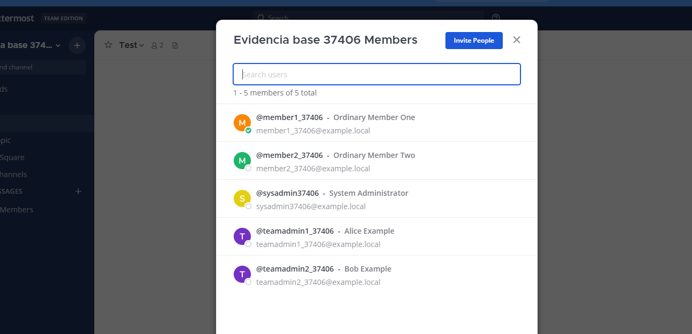
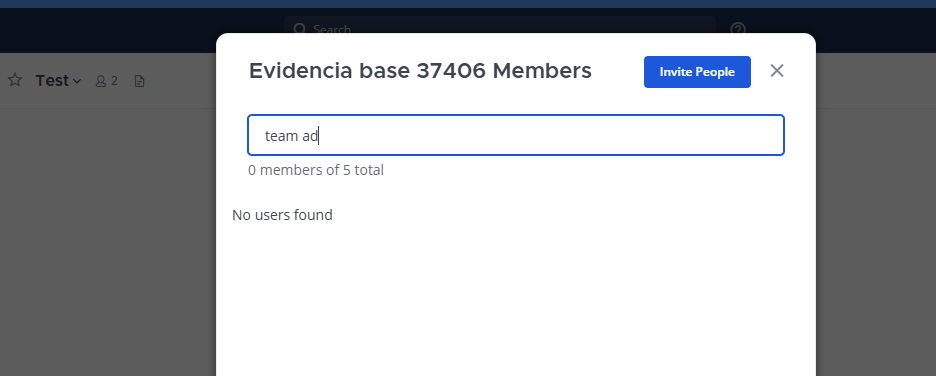
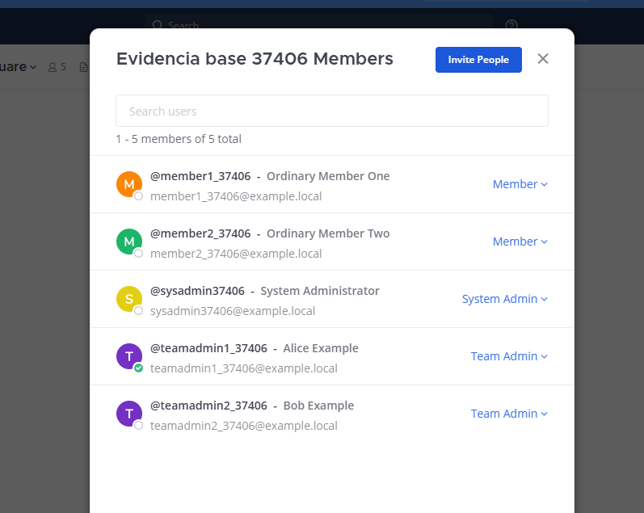
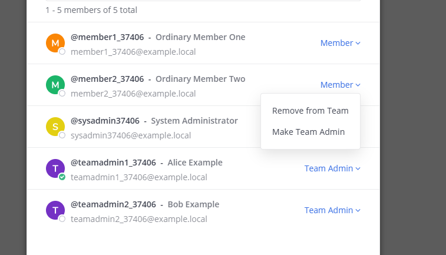
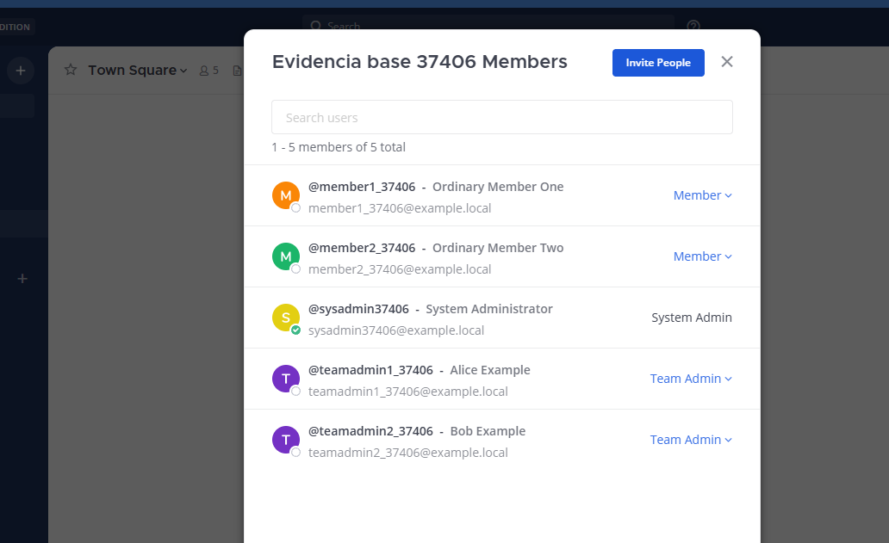
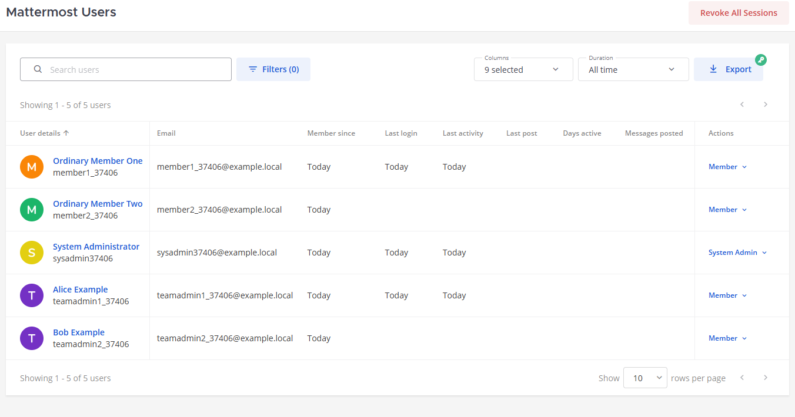

# Evidencia del estado base — Mattermost #37406

Fecha de preparación: **26 de septiembre de 2026**
Issue: [#37406 — Add Ability to discover team admin](https://github.com/mattermost/mattermost/issues/37406)

## 1. Identificación de la base

| Elemento | Valor verificado |
|---|---|
| Repositorio | `https://github.com/agvor/mattermost` |
| Rama | `master` |
| SHA | `53211e45b6e63e99a5cc64d1ce1b344e3b64cc51` |
| Mattermost | `12.0.0-dev` Team Edition |
| Go | `1.26.7 linux/amd64` |
| URL | `http://localhost:8065` |
| Ping | `status: OK` |
| Equipo | `Evidencia base 37406` (`evidencia-37406`) |

La instancia se preparó desde una base vacía: antes del escenario tenía cero usuarios y cero equipos.

## 2. Reproducir el ambiente base

Seguir primero [el setup simplificado](../../SETUP_SIMPLIFICADO_MATTERMOST.md) hasta completar ambos builds. Confirmar el commit y el árbol de trabajo:

```bash
cd "/ruta/al/repositorio/mattermost"
git rev-parse HEAD
git status --short --branch
```

El SHA debe ser `53211e45b6e63e99a5cc64d1ce1b344e3b64cc51`. Desde `mattermost/server`, iniciar Mattermost y conservar esta terminal:

```bash
export PATH="$HOME/.local/go1.26.7/bin:$PATH"
make run-server RUN_SERVER_IN_BACKGROUND=false
```

Esperar a ver `Server is listening on [::]:8065`. En otra terminal:

```bash
curl --fail --silent --show-error \
  http://localhost:8065/api/v4/system/ping
```

No crear el escenario mientras el JSON no contenga `"status":"OK"`. Los comandos siguientes suponen una instancia vacía o que no existen usuarios con esos nombres. No eliminar volúmenes ni datos existentes para repetirlos.

## 3. Crear los usuarios, el equipo y los roles

Instalar `jq` si aún no existe:

```bash
sudo apt update
sudo apt install -y jq
```

Desde `mattermost/server`, solicitar una contraseña local sin imprimirla ni guardarla en archivos:

```bash
read -rsp "Contraseña temporal para evidencia: " MM_EVIDENCE_PASSWORD
printf "\n"
export MM_EVIDENCE_PASSWORD
```

Debe tener al menos ocho caracteres. Crear las cinco cuentas:

```bash
bin/mmctl user create --local \
  --email sysadmin37406@example.local \
  --username sysadmin37406 \
  --password "$MM_EVIDENCE_PASSWORD" \
  --firstname System --lastname Administrator \
  --system-admin --email-verified --disable-welcome-email

bin/mmctl user create --local \
  --email teamadmin1_37406@example.local \
  --username teamadmin1_37406 \
  --password "$MM_EVIDENCE_PASSWORD" \
  --firstname Alice --lastname Example \
  --email-verified --disable-welcome-email

bin/mmctl user create --local \
  --email teamadmin2_37406@example.local \
  --username teamadmin2_37406 \
  --password "$MM_EVIDENCE_PASSWORD" \
  --firstname Bob --lastname Example \
  --email-verified --disable-welcome-email

bin/mmctl user create --local \
  --email member1_37406@example.local \
  --username member1_37406 \
  --password "$MM_EVIDENCE_PASSWORD" \
  --firstname Ordinary --lastname "Member One" \
  --email-verified --disable-welcome-email

bin/mmctl user create --local \
  --email member2_37406@example.local \
  --username member2_37406 \
  --password "$MM_EVIDENCE_PASSWORD" \
  --firstname Ordinary --lastname "Member Two" \
  --email-verified --disable-welcome-email
```

Crear el equipo y agregar las cinco cuentas:

```bash
bin/mmctl team create --local \
  --name evidencia-37406 \
  --display-name "Evidencia base 37406"

bin/mmctl team users add --local evidencia-37406 \
  sysadmin37406 teamadmin1_37406 teamadmin2_37406 \
  member1_37406 member2_37406
```

Autenticarse como el administrador global ficticio y asignar el rol de Team Admin a las dos cuentas correspondientes. Los archivos temporales solo reciben encabezados HTTP y se eliminan al terminar:

```bash
MM_HEADERS="$(mktemp)"

curl --fail --silent --show-error \
  -D "$MM_HEADERS" -o /dev/null \
  -H "Content-Type: application/json" \
  -d "{\"login_id\":\"sysadmin37406\",\"password\":\"$MM_EVIDENCE_PASSWORD\"}" \
  http://localhost:8065/api/v4/users/login

MM_TOKEN="$(awk 'BEGIN{IGNORECASE=1} /^Token:/{gsub("\r",""); print $2}' "$MM_HEADERS")"
MM_TEAM_ID="$(curl --silent --show-error \
  --unix-socket /var/tmp/mattermost_local.socket \
  http://localhost/api/v4/teams/name/evidencia-37406 | jq -r .id)"

for MM_USER in teamadmin1_37406 teamadmin2_37406; do
  MM_USER_ID="$(curl --silent --show-error \
    --unix-socket /var/tmp/mattermost_local.socket \
    "http://localhost/api/v4/users/username/$MM_USER" | jq -r .id)"

  curl --fail --silent --show-error -X PUT \
    -H "Authorization: Bearer $MM_TOKEN" \
    -H "Content-Type: application/json" \
    -d '{"roles":"team_user team_admin"}' \
    "http://localhost:8065/api/v4/teams/$MM_TEAM_ID/members/$MM_USER_ID/roles"
done

unset MM_EVIDENCE_PASSWORD MM_TOKEN MM_USER_ID
rm -f "$MM_HEADERS"
```

Cada actualización debe devolver `{"status":"OK"}`. El escenario válido contiene cinco miembros activos: dos Team Admins y tres miembros ordinarios.

### Modificar los nombres visibles de usuarios existentes

Los nombres visibles deben ser neutrales para que la búsqueda `team ad` no coincida accidentalmente con texto del perfil. El username, correo y rol no necesitan cambiar.

En esta versión, `mmctl user edit` solo permite editar username, correo o datos de autenticación. Para cambiar nombre y apellido mediante el socket local, enviar el objeto completo al endpoint de usuario. Este procedimiento usa `JSON::PP`, incluido con Perl en Ubuntu, y no requiere `jq`:

```bash
cd "$HOME/projects/mattermost/server"

update_display_name() {
  local username="$1"
  local first_name="$2"
  local last_name="$3"
  local user_id

  user_id="$(bin/mmctl user search "$username" --local --json \
    | perl -MJSON::PP -0777 -ne '$u=decode_json($_); print $u->{id}')"

  test -n "$user_id" || {
    printf "No se encontró el usuario %s\n" "$username" >&2
    return 1
  }

  bin/mmctl user search "$username" --local --json \
    | FIRST_NAME="$first_name" LAST_NAME="$last_name" \
      perl -MJSON::PP -0777 -ne '
        $u=decode_json($_);
        $u->{first_name}=$ENV{FIRST_NAME};
        $u->{last_name}=$ENV{LAST_NAME};
        print encode_json($u)
      ' \
    | curl --fail --silent --show-error \
        --unix-socket /var/tmp/mattermost_local.socket \
        -X PUT -H "Content-Type: application/json" \
        --data-binary @- \
        "http://localhost/api/v4/users/$user_id" \
    > /dev/null
}

update_display_name teamadmin1_37406 Alice Example
update_display_name teamadmin2_37406 Bob Example
```

La actualización solo cambia el nombre visible. Los roles `team_user team_admin` permanecen intactos.

## 4. Usuarios y roles

| Usuario | Rol global | Rol en el equipo |
|---|---|---|
| `sysadmin37406` | System Admin | Miembro |
| `teamadmin1_37406` — Alice Example | Miembro | Team Admin |
| `teamadmin2_37406` — Bob Example | Miembro | Team Admin |
| `member1_37406` | Miembro | Miembro |
| `member2_37406` | Miembro | Miembro |

## 5. Evidencia

### Miembro ordinario

La lista muestra los cinco miembros, pero no identifica cuáles son Team Admins.



Al buscar `team ad` con nombres neutrales no aparece ningún resultado. La barra busca texto del perfil, no roles.



### Team Admin

La vista administrativa permite gestionar miembros y acceder a controles de rol. Estas capacidades requieren permisos administrativos y no ayudan a un miembro ordinario a descubrir los Team Admins.





### System Admin

La vista del equipo mantiene la misma limitación para descubrir administradores directamente en la lista.



System Console ofrece administración adicional, pero requiere privilegios globales.



## 6. Referencia: Channel Admins

El panel **Members** de un canal implementa el patrón mencionado en el issue:

- Agrupa `CHANNEL ADMINS` antes de `MEMBERS`.
- Ordena alfabéticamente dentro de cada grupo.
- Permite administrar el rol a usuarios con permisos.

Ruta: abrir un canal → menú del nombre del canal → **Members**.

Es una referencia de UI, no un filtro existente para Team Admins. Team Admin y Channel Admin son roles distintos.

## 7. Resultado

| Perspectiva | Identifica Team Admins | Filtra o agrupa por Team Admin |
|---|---:|---:|
| Miembro ordinario | No | No |
| Team Admin | Mediante controles administrativos | No en la lista general |
| System Admin, vista del equipo | No claramente | No |
| System Console | Sí, con privilegios globales | Alternativa administrativa |

## 8. Conclusión

**Problema reproducido.**

Un miembro ordinario no puede descubrir quiénes son los Team Admins desde **View Members**:

- No hay etiqueta visible de Team Admin.
- No hay filtro, agrupación ni ordenamiento por ese rol.
- La búsqueda `team ad` es textual y no consulta roles.
- System Console requiere permisos de System Admin.

El comportamiento de Channel Admins sirve como referencia para una solución equivalente en la lista de miembros del equipo.
