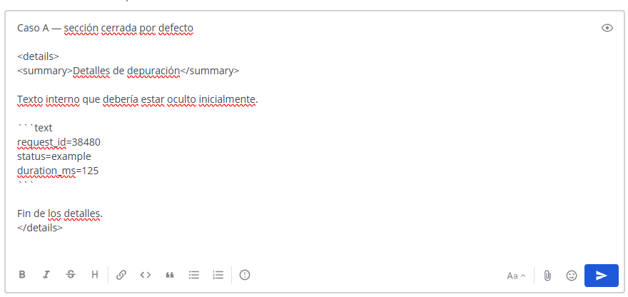
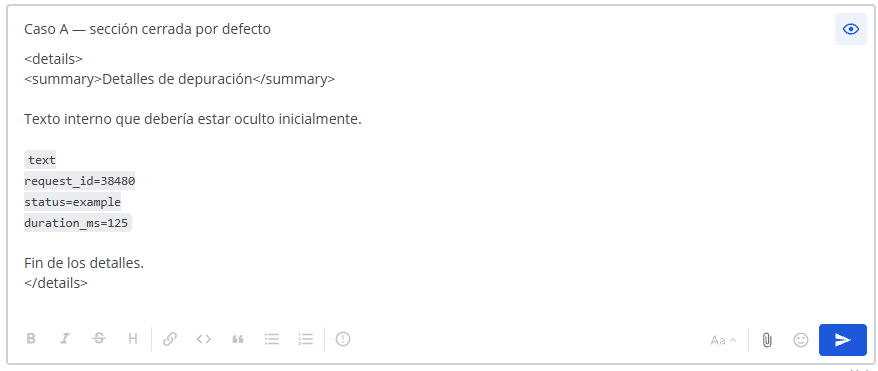
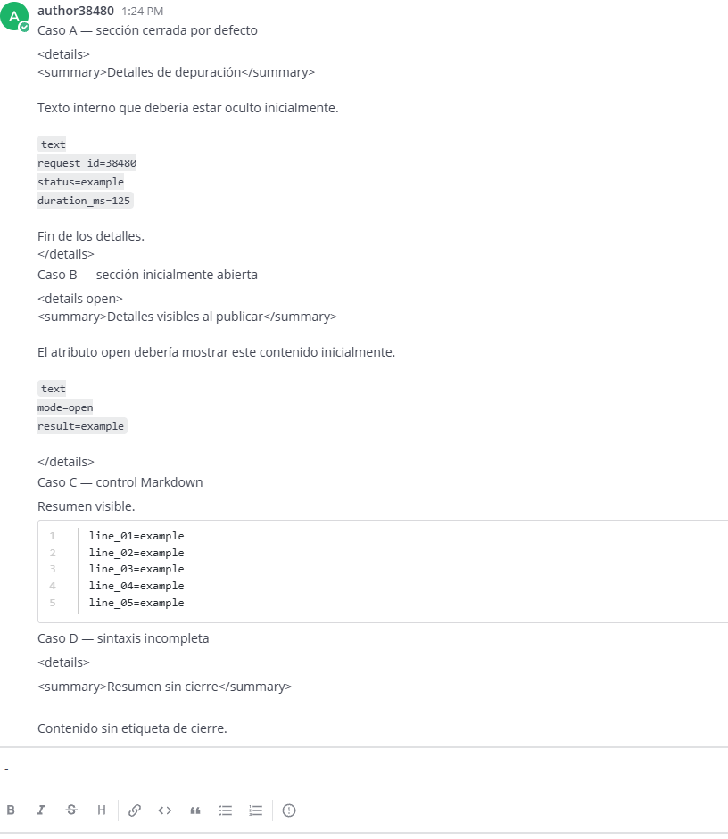
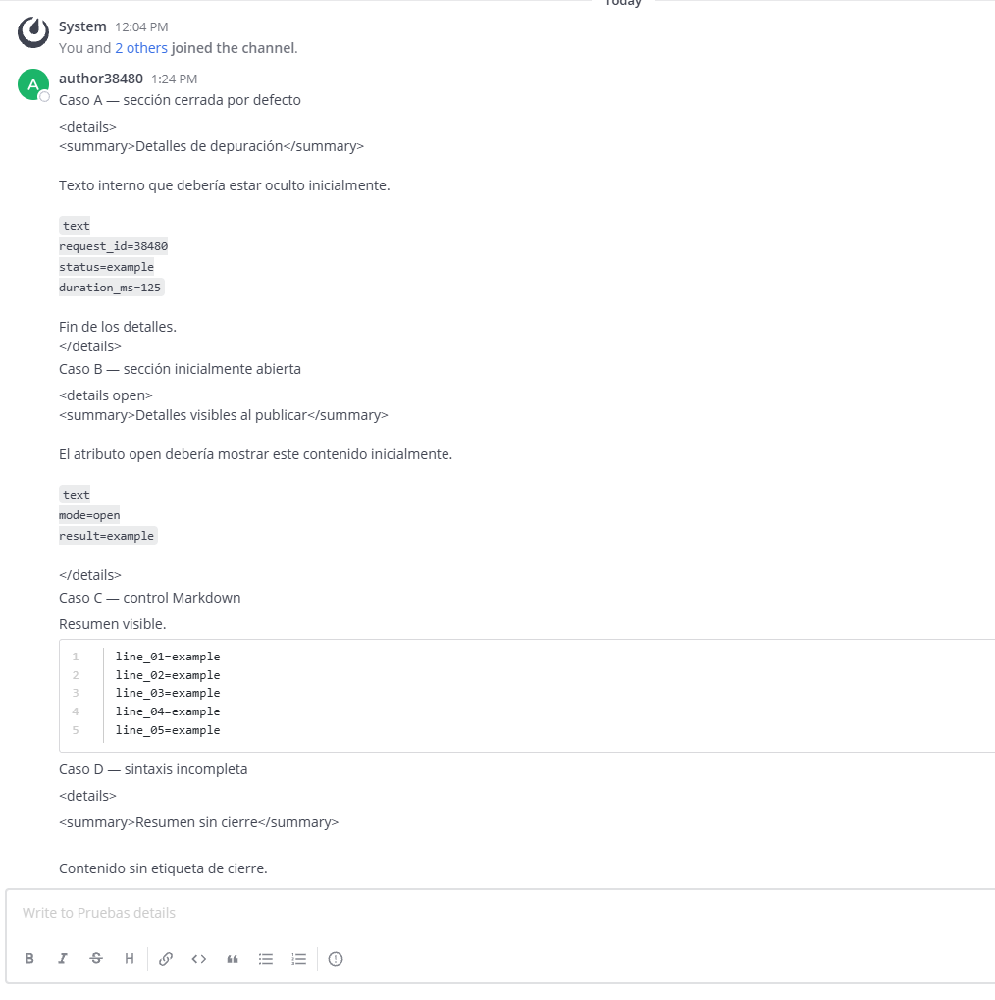

# Evidencia del estado base — Mattermost #38480

Fecha de preparación: **26 de septiembre de 2026**  
Issue: [#38480 — Collapse Details of a Mattermost Message](https://github.com/mattermost/mattermost/issues/38480)

## 1. Objetivo

Comprobar cómo Mattermost representa actualmente secciones HTML `<details>` / `<summary>` dentro de mensajes Markdown.

El issue solicita ocultar por defecto detalles extensos —por ejemplo, información de depuración o bloques de código— y permitir que el lector los expanda. También menciona `<details open>` para una sección inicialmente abierta.

La evidencia debe cubrir:

- Composición y vista previa.
- Mensaje publicado.
- Variante cerrada y variante `open`.
- Contenido con párrafos y bloques de código.
- Comportamiento seguro del HTML no admitido.

## 2. Base utilizada

| Elemento | Valor |
|---|---|
| Repositorio | `https://github.com/agvor/mattermost` |
| Rama | `master` |
| SHA | `53211e45b6e63e99a5cc64d1ce1b344e3b64cc51` |
| Mattermost | `12.0.0-dev` Team Edition |
| Go | `1.26.7 linux/amd64` |
| URL | `http://localhost:8065` |
| Equipo | `Evidencia base 38480` (`evidencia-38480`) |
| Canal | `Pruebas details` (`pruebas-details`) |

Para instalar dependencias, construir y ejecutar Mattermost, seguir el [setup simplificado](../../SETUP_SIMPLIFICADO_MATTERMOST.md).

Confirmar el commit:

```bash
cd "/ruta/al/repositorio/mattermost"
git rev-parse HEAD
git status --short --branch
```

Iniciar el servidor desde `mattermost/server`:

```bash
export PATH="$HOME/.local/go1.26.7/bin:$PATH"
make run-server RUN_SERVER_IN_BACKGROUND=false
```

En otra terminal, comprobar que esté listo:

```bash
curl --fail --silent --show-error http://localhost:8065/api/v4/system/ping
```

Continuar únicamente cuando la respuesta contenga `"status":"OK"`.

## 3. Crear usuarios, equipo y canal

Los comandos suponen que estas cuentas y el equipo todavía no existen. Ejecutarlos desde `mattermost/server`.

Solicitar una contraseña local sin mostrarla ni guardarla:

```bash
read -rsp "Contraseña temporal para evidencia: " MM_EVIDENCE_PASSWORD
printf "\n"
export MM_EVIDENCE_PASSWORD
```

Crear tres usuarios:

```bash
bin/mmctl user create --local \
  --email sysadmin38480@example.local \
  --username sysadmin38480 \
  --password "$MM_EVIDENCE_PASSWORD" \
  --firstname System --lastname Administrator \
  --system-admin --email-verified --disable-welcome-email

bin/mmctl user create --local \
  --email author38480@example.local \
  --username author38480 \
  --password "$MM_EVIDENCE_PASSWORD" \
  --firstname Message --lastname Author \
  --email-verified --disable-welcome-email

bin/mmctl user create --local \
  --email reader38480@example.local \
  --username reader38480 \
  --password "$MM_EVIDENCE_PASSWORD" \
  --firstname Message --lastname Reader \
  --email-verified --disable-welcome-email
```

Crear el equipo y el canal, y agregar los usuarios:

```bash
bin/mmctl team create --local \
  --name evidencia-38480 \
  --display-name "Evidencia base 38480"

bin/mmctl team users add --local evidencia-38480 \
  sysadmin38480 author38480 reader38480

bin/mmctl channel create --local \
  --team evidencia-38480 \
  --name pruebas-details \
  --display-name "Pruebas details" \
  --purpose "Estado base de Mattermost #38480"

bin/mmctl channel users add --local \
  evidencia-38480:pruebas-details \
  sysadmin38480 author38480 reader38480

unset MM_EVIDENCE_PASSWORD
```

## 4. Usuarios del escenario

| Usuario | Rol | Uso |
|---|---|---|
| `author38480` | Miembro | Redactar, previsualizar y publicar |
| `reader38480` | Miembro | Comprobar lo que ve otro lector |
| `sysadmin38480` | System Admin | Preparación y comparación administrativa |

Usar datos ficticios. No incluir contraseñas, tokens, cookies ni información real de depuración en las capturas.

**Estado local verificado (26 de septiembre de 2026):** las tres cuentas, el equipo y el canal fueron creados. Las tres membresías de equipo y canal están activas como miembros ordinarios; `sysadmin38480` conserva además el rol global `system_admin`.

## 5. Caso de prueba

Iniciar sesión como `author38480`, entrar a **Pruebas details** y pegar los cuatro casos en un mensaje. Los casos A y B reproducen la sintaxis solicitada; C controla que Markdown funcione normalmente; D comprueba una entrada incompleta.

````text
Caso A — sección cerrada por defecto

<details>
<summary>Detalles de depuración</summary>

Texto interno que debería estar oculto inicialmente.

```text
request_id=38480
status=example
duration_ms=125
```

Fin de los detalles.
</details>

Caso B — sección inicialmente abierta

<details open>
<summary>Detalles visibles al publicar</summary>

El atributo open debería mostrar este contenido inicialmente.

```text
mode=open
result=example
```

</details>

Caso C — control Markdown

Resumen visible.

```text
line_01=example
line_02=example
line_03=example
line_04=example
line_05=example
```

Caso D — sintaxis incompleta

<details>
<summary>Resumen sin cierre</summary>

Contenido sin etiqueta de cierre.
````

## 6. Evidencia

### Fuente

El compositor conserva las etiquetas y el contenido introducidos por el autor.



### Vista previa

La vista previa no crea controles desplegables. Las etiquetas se presentan como texto y el contenido permanece visible.



### Mensaje publicado

Los casos A y B muestran `<details>` y `<summary>` literalmente. No existe un control para expandir o contraer, y el atributo `open` no cambia el resultado. El caso C confirma que el bloque Markdown ordinario sí se representa como código. El caso D permanece estable y no rompe la vista.



### Vista del lector

`reader38480` observa el mismo resultado que el autor; el comportamiento no depende de permisos administrativos.



## 7. Resultados

| Caso | Resultado observado | ¿Se puede expandir? |
|---|---|---:|
| A — `<details>` | Etiquetas literales y contenido visible desde el inicio | No |
| B — `<details open>` | Igual que el caso A; `open` no tiene efecto | No |
| C — Markdown normal | Bloque de código representado correctamente | No aplica |
| D — sintaxis incompleta | Texto visible sin romper la interfaz | No |

La comparación entre fuente, vista previa, publicación y lector demuestra que Mattermost conserva el mensaje, pero no interpreta esta sintaxis como una sección desplegable.

## 8. Comportamiento solicitado

Una implementación que satisfaga el issue debería:

- Mostrar `summary` como un control visible.
- Iniciar `<details>` contraído y permitir abrirlo y cerrarlo.
- Iniciar `<details open>` expandido.
- Representar párrafos y bloques de código dentro de la sección.
- Tratar sintaxis incompleta de forma segura.
- Ser operable con teclado y comunicar su estado.

No se asume que Mattermost deba habilitar HTML arbitrario; la solución puede ofrecer sintaxis o componentes equivalentes con sanitización apropiada.

## 9. Conclusión

**Problema reproducido.**

En la base seleccionada, Mattermost no ofrece secciones desplegables equivalentes a `<details>` / `<summary>` dentro de mensajes:

- El resumen no funciona como control.
- El contenido no puede ocultarse inicialmente.
- No existe interacción para expandir o contraer.
- `open` no produce un estado inicial diferente.
- Autor y lector observan el mismo comportamiento.

El control Markdown confirma que el renderizador funciona para sintaxis admitida; la diferencia corresponde específicamente a la funcionalidad solicitada por el issue.
