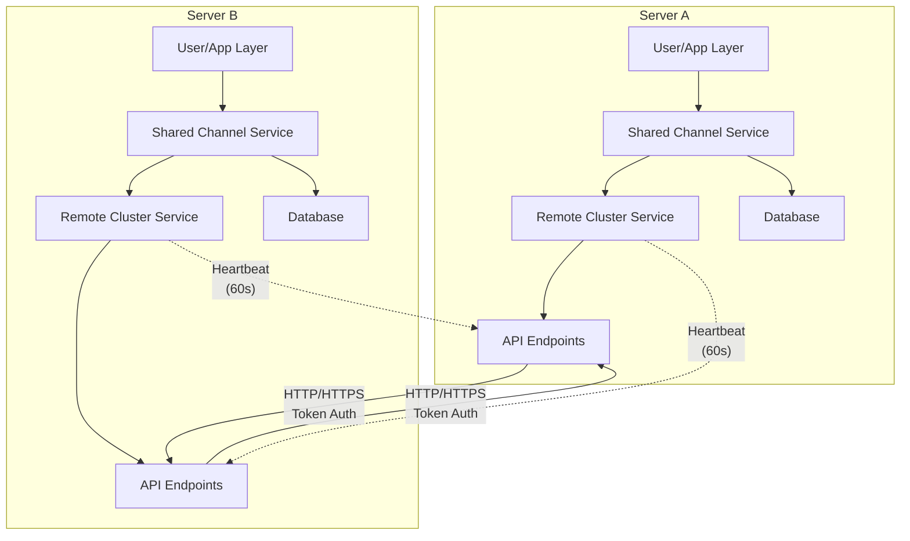
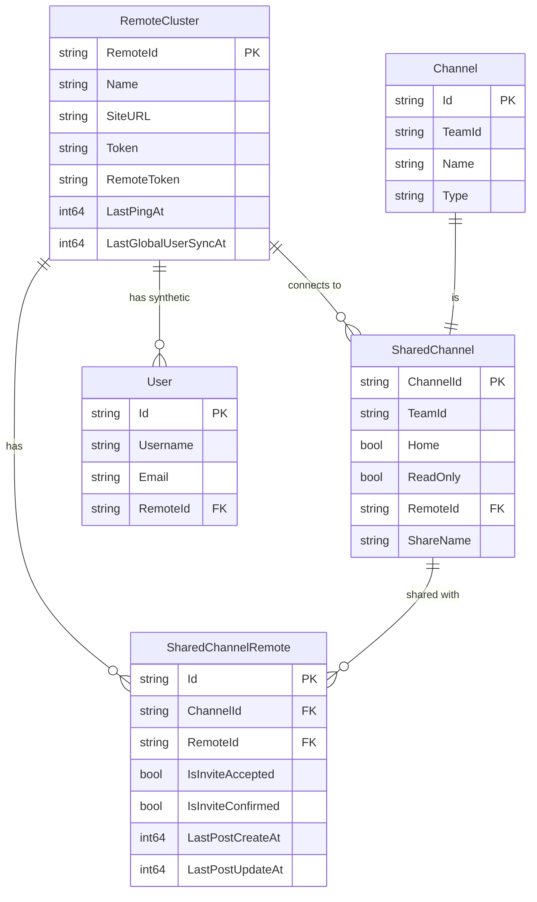
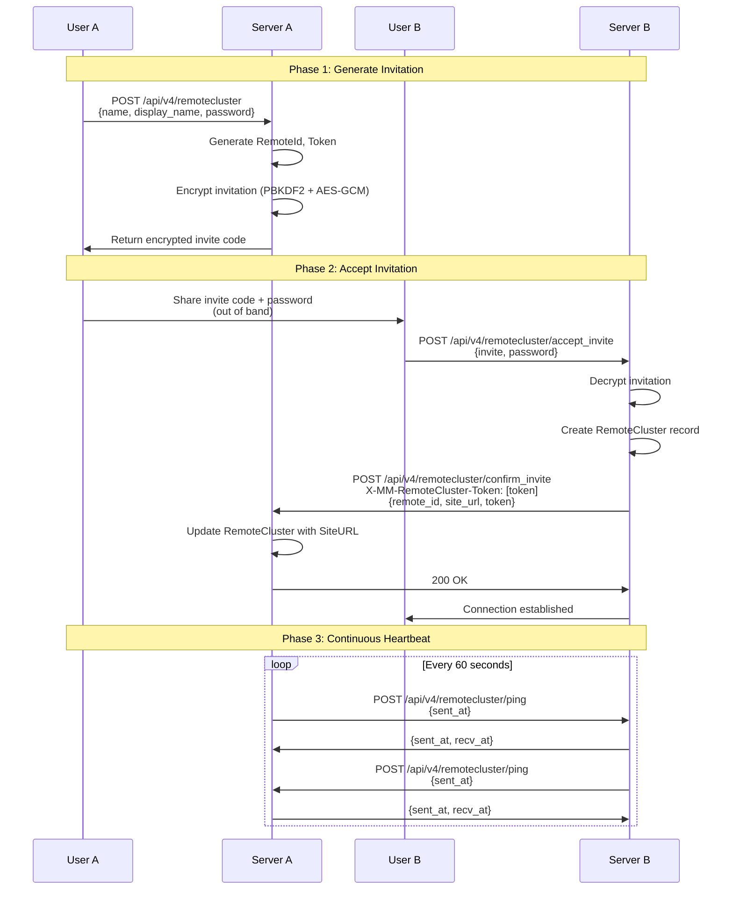
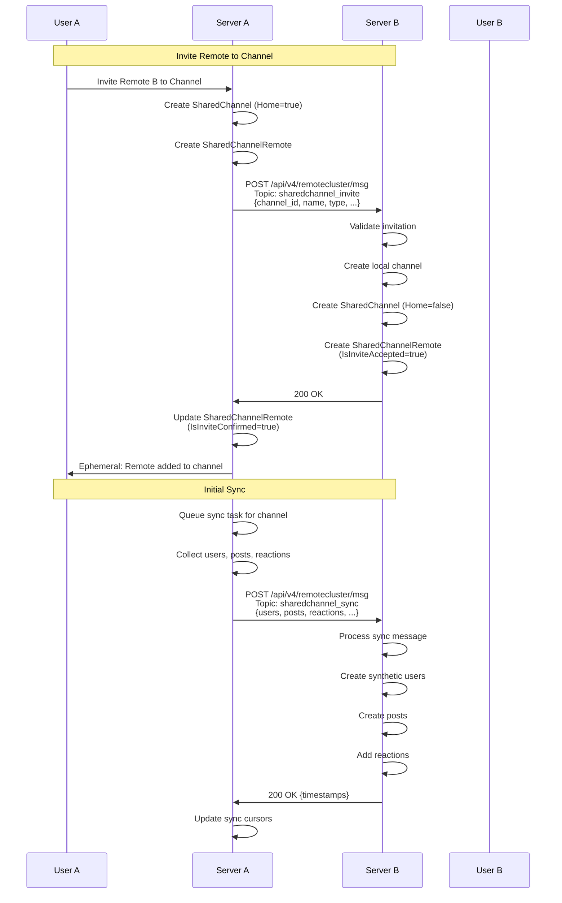
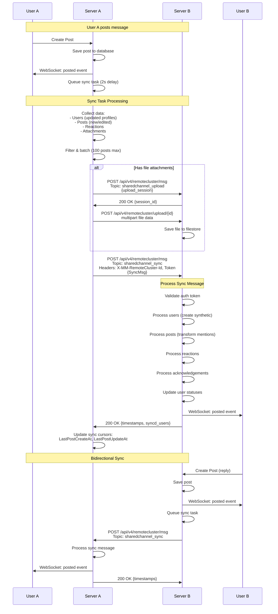
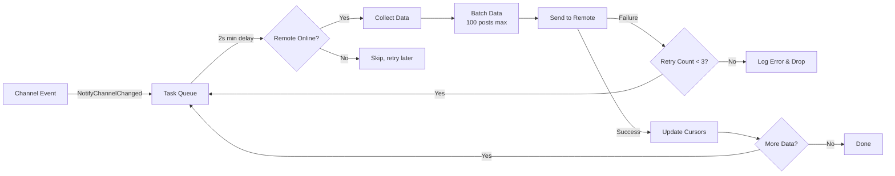
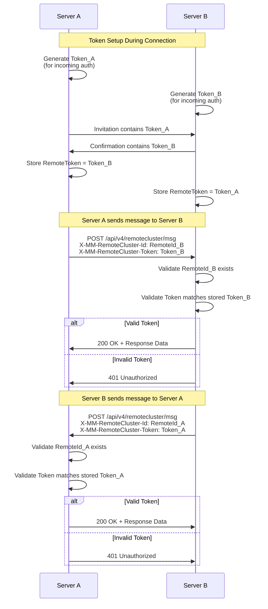

## Shared Channel Service

Package `sharedchannel` implements Mattermost's shared channels functionality, for sharing channel content across Mattermost instances/clusters. Here are the key responsibilities:

### Channel Sharing:

- Allows channels to be shared between different Mattermost instances/clusters
- Handles inviting remote clusters to shared channels
- Manages permissions and read-only status for shared channels

### Content Synchronization:

- Syncs posts, reactions, user profiles, and file attachments between instances
- Handles permalink processing between instances
- Manages user profile images sync
- Maintains sync state and cursors to track what has been synchronized

### Remote Communication:

- Processes incoming sync messages from remote clusters
- Sends updates to remote clusters when local changes occur
- Handles connection state changes with remote clusters
- Manages retry logic for failed sync attempts

### Security:

- Validates permissions for shared channel operations
- Ensures users can only sync content they have access to
- Verifies remote cluster authenticity
- Sanitizes user data during sync

The service acts as a bridge between Mattermost instances, allowing users from different instances to collaborate in shared channels while keeping content synchronized across all participating instances.

This is implemented through a Service struct that handles all the shared channel operations and maintains the synchronization state. It works in conjunction with the RemoteCluster service to handle the actual communication between instances.

---

## API Calls and Flow Between Mattermost Instances

### Overview

Shared channels enable two Mattermost instances to synchronize specific channels. The architecture uses:
- **Remote Cluster Service** - Handles inter-cluster communication
- **Shared Channel Service** - Manages channel synchronization
- **Push-based sync** - Each server pushes changes to remotes
- **Cursor-based tracking** - Timestamps track sync progress



### Key Data Structures



**RemoteCluster** (`server/public/model/remote_cluster.go:56`)
- Connection between two Mattermost instances
- Contains authentication tokens (bidirectional)
- Tracks heartbeat status (`LastPingAt`)

**SharedChannel** (`server/public/model/shared_channel.go:32`)
- Represents a shared channel
- `Home=true`: Hosted locally, `Home=false`: Remote channel
- Contains channel metadata snapshot

**SharedChannelRemote** (`server/public/model/shared_channel.go:102`)
- Junction table linking channels to remote clusters
- Tracks sync cursors (`LastPostCreateAt`, `LastPostUpdateAt`)

### Flow Outline

#### 1. Remote Cluster Connection Setup



**Step 1: Create Invitation (Server A)**
- API: `POST /api/v4/remotecluster`
- Generates encrypted invitation with PBKDF2 encryption
- Returns base64-encoded invite code
- Creates pending RemoteCluster record

**Step 2: Accept Invitation (Server B)**
- API: `POST /api/v4/remotecluster/accept_invite`
- Decrypts invitation using password
- Creates local RemoteCluster record
- Sends confirmation to Server A

**Step 3: Confirm Connection (Server A)**
- API: `POST /api/v4/remotecluster/confirm_invite`
- Receives confirmation from Server B
- Updates RemoteCluster with actual SiteURL
- Connection established

**Step 4: Continuous Heartbeat**
- API: `POST /api/v4/remotecluster/ping`
- Every 60 seconds (default)
- Updates `LastPingAt` timestamp
- Remote considered online if pinged within 5 minutes

#### 2. Channel Sharing



**Step 1: Share Channel (Server A)**
- Internal: `InviteRemoteToChannel()`
- Creates SharedChannel record (`Home=true`)
- Sends invitation message via topic `sharedchannel_invite`
- Contains channel metadata (name, type, permissions)

**Step 2: Receive Invitation (Server B)**
- API: `POST /api/v4/remotecluster/msg` (topic: `sharedchannel_invite`)
- Creates local channel (regular, DM, or GM)
- Creates SharedChannel record (`Home=false`)
- Creates SharedChannelRemote record
- Returns 200 OK

**Step 3: Initial Sync Triggered**
- Server A receives confirmation
- Posts ephemeral notification to channel
- Triggers initial content synchronization

#### 3. Content Synchronization



**Sync Architecture:**
- **Event-driven**: Channel changes trigger sync tasks
- **Batched**: Groups changes for efficiency (100 posts/batch)
- **Ordered**: Users → Attachments → Posts → Reactions → Acknowledgements

**Sync Task Creation:**
Triggered by:
- Post created/edited/deleted
- Reaction added/removed
- User profile updated
- Channel metadata changed
- User status changed
- Membership changed



**Data Collection:**
- Users: 25 per batch (profiles updated since last sync)
- Posts: 100 per batch (new posts first, then edited)
- Reactions: All for synced posts
- Attachments: All for synced posts

**Send Sync Message (Server A → Server B)**
- API: `POST /api/v4/remotecluster/msg` (topic: `sharedchannel_sync`)
- Headers:
  - `X-MM-RemoteCluster-Id`: Remote cluster ID
  - `X-MM-RemoteCluster-Token`: Authentication token
- Body: `RemoteClusterFrame` containing `SyncMsg`

**SyncMsg Structure:**
```json
{
  "channel_id": "channel_123",
  "users": {"user_id": {...}},
  "posts": [{...}],
  "reactions": [{...}],
  "acknowledgements": [{...}],
  "statuses": [{...}],
  "mention_transforms": {"username": "user_id"}
}
```

**Receive Sync Message (Server B)**
- Validates authentication
- Processes users (creates synthetic users with obfuscated emails)
- Processes posts (transforms mentions, handles edits/deletes)
- Processes reactions (adds/removes)
- Processes acknowledgements
- Updates user statuses
- Returns success response with timestamps

#### 4. File Attachment Synchronization

**Upload Flow:**
1. Server A creates upload session
2. Sends upload creation message (topic: `sharedchannel_upload`)
3. Server B creates matching session
4. Server A streams file data: `POST /api/v4/remotecluster/upload/{upload_id}`
5. Server B saves file and creates FileInfo record

#### 5. Profile Image Synchronization

**Upload Flow:**
1. Detect user image update (`LastPictureUpdate` changed)
2. Server A uploads image: `POST /api/v4/remotecluster/{user_id}/image`
3. Server B validates user belongs to remote
4. Saves image and invalidates cache

#### 6. Membership Synchronization

**Feature Flag:** `EnableSharedChannelsMemberSync`

**Incremental Updates:**
- User added/removed from channel
- Sends `MembershipChangeMsg` in SyncMsg
- Receiving server adds/removes user accordingly

**Batch Member Sync:**
- Syncs all channel members in batches of 100
- Triggered on initial share or reconnection
- Only syncs local users (excludes synthetic remote users)

#### 7. Global User Synchronization

**Feature Flag:** `EnableSyncAllUsersForRemoteCluster`

**Purpose:** Sync all local users for better mention support

**Flow:**
1. Triggered on connection establishment or manual request
2. Collects users in batches of 25
3. Sends via topic `sharedchannel_global_user_sync`
4. Empty `channel_id` indicates global sync
5. Updates `LastGlobalUserSyncAt` cursor

### Authentication & Security



**Token-Based Authentication:**
- Each server has `Token` (for incoming requests)
- Each server stores `RemoteToken` (for outgoing requests)
- All inter-server API calls include both in headers

**Invitation Encryption:**
- PBKDF2 key derivation (600,000 iterations)
- AES-GCM encryption
- Base64-encoded invite codes

**User Privacy:**
- Synthetic users with obfuscated data
- Username munged: `alice:remote-workspace`
- Email replaced with UUID
- Original values in Props (not exposed to clients)

### Key API Endpoints

**Remote Cluster Management:**
- `POST /api/v4/remotecluster` - Create remote (generate invite)
- `POST /api/v4/remotecluster/accept_invite` - Accept invitation
- `POST /api/v4/remotecluster/confirm_invite` - Confirm connection
- `POST /api/v4/remotecluster/ping` - Heartbeat
- `POST /api/v4/remotecluster/msg` - Message delivery (all topics)

**Shared Channel Management:**
- `GET /api/v4/sharedchannels/{team_id}` - List shared channels
- `POST /api/v4/channels/{channel_id}/remotes/{remote_id}/invite` - Share channel
- `POST /api/v4/channels/{channel_id}/remotes/{remote_id}/uninvite` - Unshare

**File Operations:**
- `POST /api/v4/remotecluster/upload/{upload_id}` - Upload file
- `POST /api/v4/remotecluster/{user_id}/image` - Upload profile image

### Error Handling & Monitoring

**Retry Logic:**
- Max 3 retries per sync task
- Exponential backoff with 2-second minimum delay
- Post-level retry for specific failures

**Offline Handling:**
- Queues pending invitations when remote offline
- Resumes sync when connection restored
- Notifies users with ephemeral messages

**Metrics:**
- `shared_channels_sync_counter` - Sync attempts
- `shared_channels_queue_size` - Queue depth
- `remote_cluster_msg_sent` - Successful messages
- `remote_cluster_msg_errors` - Failed messages

### Key Files

**Models:** `server/public/model/remote_cluster.go`, `server/public/model/shared_channel.go`

**API:** `server/channels/api4/remote_cluster.go`, `server/channels/api4/shared_channel.go`

**Services:**
- `server/platform/services/remotecluster/` - Connection management
- `server/platform/services/sharedchannel/` - Sync logic

This architecture enables secure, bidirectional synchronization of channels between independent Mattermost instances while maintaining data privacy and consistency.